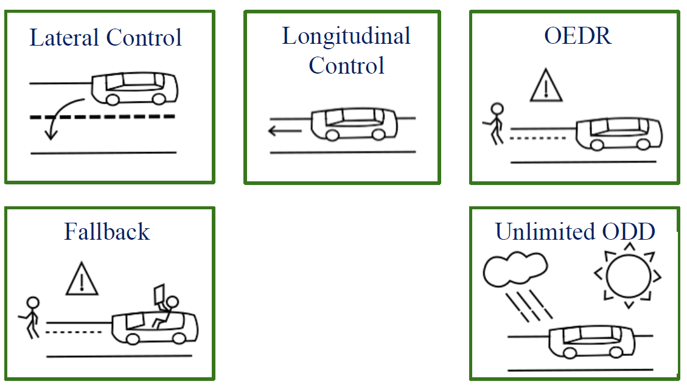
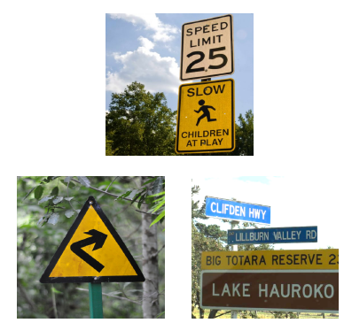
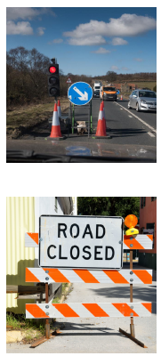
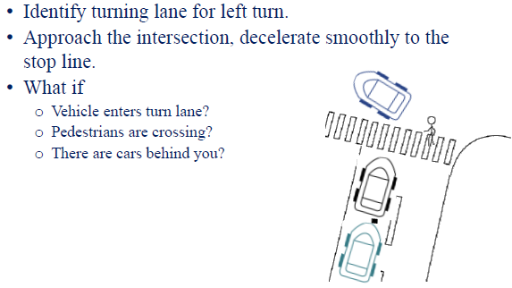

# Module 1：The Requirements for Autonomy

> Self-driving cars present an extremely rich and inter-disciplinary problem. This module introduces the language and structure of the problem definition, defining the most salient elements of the driving task and the driving environment.

### Learning Objectives

* Identify perception, prediction and planning requirements for driving
* Define the environmental elements that influence driving
* Breakdown the task of driving into elemental decisions and actions
* Assess the effects of driving conditions on the driving task

## Lesson 1: Taxonomy of Driving

Welcome to the first module of the Introduction to Self-driving Cars course. Throughout this module you will learn about the main components needed to create a self-driving car and the technical requirements that drive their design. Before we begin, it's important that you understand autonomous vehicle requirements or how we define self-driving for a car.

This first week is meant to give you a high level survey of the terms and concepts that we'll explore more deeply throughout the specialization. So in module one, I will introduce you to the taxonomy for self-driving cars or a system of classification that we use to define driving automation. Next, I'll describe the perception needs for the driving task or those items that we need to be able to identify properly. Finally, we will tackle the question of how to make driving decisions and discuss a few approaches for making choices about how a vehicle moves through the environment. The goal of this first module is to remind you just how many assessments and decisions the driving task truly requires. Hopefully this will help you appreciate just how much complexity we as humans can manage effectively when it comes to staying safe on the road. So, let's begin.

### 1. Introduction

In this video we will cover the basic self-driving terminology, then discuss some requirements leading to a classification system for driving automation levels. Define the task of driving and the various components of driving. Formulate a taxonomy based on our requirements and levels of autonomy needed for a driving task. And finally we will conclude with the limitations of our proposed taxonomy classification system. Let's get started with some technical terms and definitions.

### 2. Terms and Definitions

We will use these throughout the specialization and they're helpful to know, if you're working in this industry. The first term on our list is the driving task. Broadly speaking, the driving task is made up of three sub-tasks.

The first sub-task is **perception, or perceiving the environment that we're driving in**. This includes tracking a car's motion in identifying the various elements in the world around us, like the road surface, road signs, vehicles, pedestrians and so on. We also need to track all moving objects and predict their future motions. So we can drive safely and accurately.

The second sub-task is **motion planning**. This allows us to reach our destination successfully. For example, you may want to drive from your home to your office. So you'll need to consider which roads you should take, when you should change lanes or cross an intersection and how to execute a swerve maneuver around a pothole along the way.

Finally, we need to operate the vehicle itself with **vehicle control.** So we need to take the appropriate steering, break and acceleration decisions to control the vehicle's position and velocity on the road. These three sub-tasks form the main driving task and need to be performed constantly while driving a vehicle.

The next concept I'll introduce, is called the Operational Design Domain or ODD for short. The ODD constitutes the operating conditions under which a given system is designed to function. It includes environmental, time of day, roadway and other characteristics under which the car will perform reliably. Clearly defining the operating conditions for which a self-driving car is designed, is crucial to ensuring the safety of the system. So the ODD needs to be planned out carefully in advance. Now that we know some of the basic terms, let's get to the big question. How do we classify the level of automation in a driving system?

### 3. How to classify driving system automation?

> * Driver attention requirements
> * Driver action requirements
> * What exactly makes up a driving task?

Here are some things to consider. First how much driver attention is needed? For example, can you watch a movie while driving to work? Or do you need to keep your attention on the steering wheel at all times? Driver attention is one of the crucial questions to consider when defining the level of autonomy. Second, how much driver action is actually needed? For example do you need to steer? Does the car take care of the speed or do you control that as well? Do you need to change lanes or can the car stay in the current lane without any intervention? What exactly do we need to expect when we say that the car can automatically drive?

We defined the driving task broadly in the previous slides. But we will need to discuss this in more depth. All of these questions lead us to the autonomous driving taxonomy. The standards are continuously evolving but for the purposes of our classification, we will use the decomposition suggested by the Society of Automotive Engineers in 2014. You can find a link to this resource in the lesson's supplementary reading.

### 4. What makes up a driving task?

Let's now discuss a way to describe the driving task in increasing levels of automation. First, we have lateral control which refers to the task of steering and navigating laterally on the road. Turning left, right, going straight or tracking a curve and so on. Next we have longitudinal control. This is the task where we control the position or velocity of the car along the roadway, through actions like breaking or acceleration. Then we have Object and Event Detection and Response or OEDR for short.

OEDR is essentially the ability to detect objects and events that immediately affect the driving task and to react to them appropriately. OEDR really encompasses a large portion of autonomous driving. So, is used in conjunction with the specific Operational Design Domain to categorize current self-driving systems. Next we have planning. Planning is another important aspect of driving. As immediate response is already part of OEDR, planning is primarily concerned with the long and short term plans needed to travel to a destination or execute maneuvers such as lean changes and intersection crossings. Finally, there are some miscellaneous tasks that people do while driving as well. These include actions like signaling with indicators, hand-waving, interacting with other drivers and so on. Now we have a clear description of what tasks we expect a self-driving car to perform. Let's now discuss the questions that can lead us to the taxonomy for classifying the level of automation in a self-driving car.

### 5. Autonomous Capabilities

First, can this system handle steering tasks or lateral control? Second, can it perform acceleration, braking and velocity manipulation tasks or longitudinal control? Third, can the system perform object and event detection and response and to what degree?

Crucially, can the system handle emergency situations by itself or does it always need a driver to be attentive during emergencies? Finally, can the system perform in all scenarios and all conditions? Or does it have a limited ODD or set of operating conditions that it can handle safely? Based on these questions let's walk through the commonly-used levels of automation defined by the SAE Standard J3 016.

#### 5.1 Level 0 - No Automation

Let's start with full human perception, planning and control and call this level 0. In this level, there is no driving automation whatsoever and everything is done by the driver.

#### 5.2 Level 1 - Driving Assistance

If an autonomous system assist the driver by performing either lateral or longitudinal control tasks, we are in level one autonomy.

Adaptive cruise control is a good example of level one. In adaptive cruise control or ACC, the system can control the speed of the car. But it needs the driver to perform steering. So it can perform longitudinal control but needs the human to perform lateral control. Similarly, lane keeping assist systems are also Level one. In lane keeping assistance, the system can help you stay within your lane and warn you when you are drifting towards the boundaries. Today's systems rely on visual detection of lane boundaries coupled with lane centering lateral control. Let's move on to the next level, the level of partial automation.

#### 5.3 Level 2 - Partial Driving Automation

In level two the system performs both the control tasks, lateral and longitudinal in specific driving scenarios. Some simple examples of level two features are GM Super Cruise and Nissan's Pro Pilot Assist. These can control both your lateral and longitudinal motion but the driver monitoring of the system is always required. Nowadays, many automotive manufacturers offer level two automation products including Mercedes, Audi, Tesla and Hyundai. Next up is level three.

#### 5.3 Level 3 - Conditional Driving Automation

In level three or the level of conditional automation, the system can perform Object and Event Detection in Response to a certain degree in addition to the control tasks. However, in the case of failure the control must be taken up by the driver.

**The key difference between level two and three, is that the driver does not need to pay attention in certain specific situations, as the vehicle can alert the driver in time to intervene.** This is a controversial level of automation as it is not always possible for an autonomy system to know when it is experiencing a failure. An example of level three systems, would be the Audi A Luxury Sedan, which was an automated driving system that can navigate unmonitored in slow traffic.

#### 5.4 Level 4 - High Driving Automation

In the next level, we arrive at highly automated vehicles, where the system is capable of reaching a minimum risk condition, in case the driver doesn't intervene in time for an emergency. Level four systems can handle emergencies on their own but may still ask drivers to take over to avoid pulling over to the side of the road unnecessarily. With this amount of automation, the passengers can check their phone or watch a movie knowing that the system is able to handle emergencies and is capable of keeping the passengers safe. However, level four still permits self-driving systems with a limited ODD. As of fall 2018, only Waymo has deployed vehicles for public transport with this level of autonomy. The Waymo fleet can handle the driving task in a defined geographic area with a nominal set of operating conditions, without the need for a human driver.

#### 5.5 Level 5 - Full Driving Automation

Finally, in level five the system is fully autonomous and its ODD is unlimited. Meaning that it can operate under any condition necessary.

Level five is the point where our society undergoes transformational change. With driverless taxis shuttling people in packages wherever we need them. We don't have any examples for level five yet, but maybe you'll be the one to bring these to reality someday soon. I think to note the levels of autonomy or actually a coarse measure of automation. In fact, it is possible for two car models to claim level four autonomy but have very different capabilities in ODDs. So, let's summarize. In this video we covered various concepts relating to automation. We covered some basic definitions including the Operational Design Domain and the concept of the driving task. And we explored the five levels of driving automation. You can now assess the level of automation in a self-driving system. In the next lesson we will explore the requirements for perception,a crucial aspect for Autonomous System Design.

## Lesson 2: Requirements for Perception

Welcome to the second lesson in this module. In the previous lesson, we learned how to classify automation according to its capabilities and operational design domain. In this lesson, we will start analyzing how a driving task is performed. More specifically, we will go over the many processes of perception. We will first define the perception task, listing out the requirements for perceptions such as what static and dynamic objects we need to identify, and what needs we have for tracking the ego vehicles motion through the environment. Finally, we will conclude with a discussion on some challenges to robust perception. So let's dive in.

### 1. Overview

Very roughly speaking, any driving tasks can be broken down into two components.

First, we need to understand what's happening around us and where we are. So, we need to perceive our surroundings. Secondly, we need to make a driving decision. For example, should we accelerate or stop before a pedestrian about to enter the roadway? Recall from the previous lesson the concept of OEDR or object and event detection and response. Any driving task requires some kind of OEDR, that is, we need some way of identifying objects around us, recognizing events happening near us, and then responding to it.

Recall that the classification of automated systems that we discussed had OEDR as one of the criteria. In other words, if we want to build a self-driving car, we need to be able to perform OEDR. Let's go further and analyze a crucial part of OEDR perception. So, what is perception?

### 2. What is perception

> * We want to make sense of the environment and ourselves
> * Two things:
>   * identification
>   * understanding motion
> * Why?
>   * to inform our driving decisions

As we discussed, we want to be able to make sense of the environment around us and the way we're moving within it. In particular, for any agent or element on the road, we need to first identify what it is; a car, a cyclist, a bus, etc. And second, we want to understand its motion; has it been moving in a certain way that can tell us what it will do next. As humans, we're really good at understanding patterns. However, it's still difficult for computer systems to be able to recognize these same patterns around us as quickly as we do. We can point to a car going straight and say, "Oh, it will be in this position in some amount of time in the future." This is what makes driving possible for us. **So, this ability of predicting the trajectory of a moving object is really important to perception.**

If we can do this prediction correctly, we can make informed decisions. For example, if I know what the car in front of me is going to do next, then I can decide what to do next in such a way that both of our goals are met.

### 3. Goals for perception

#### 3.1 Static objects

Let's discuss the various elements we need to be able to identify for the perception task. First, we need to identify static elements.

These are elements like roads and lane markings, things that segregate regions on the roads like zebra crossings, and important messages such as school up ahead. These are all on the road area. Then there are off-road elements like curbs that define the boundaries within which we can drive. There are the on-road traffic signals that periodically change and signal whether you are allowed to move forward, or left, or right, or just stay stopped. Then there are all kinds of road signs like those telling you the speed limit, indicating direction, whether there is a hospital coming up, or a school coming up, and so on.

Again, these are off-road elements. Finally, there are road obstructions. So, the orange cones that tell you construction is happening or that there is roadblock edge and so on. Also, these are on road elements.

#### 3.2 Dynamic objects（on-road）

Second, let's discuss the dynamic elements that we need to identify for perception. These are the elements whose motion we need to predict to make informed driving decisions. We need to identify other vehicles on the road, so four wheelers like trucks, buses, cars, and so on, and then we also need to identify and predict the motion of two wheelers, like motorcycles, bicycles, and so forth. These are all moving systems with more freedom than four wheelers, and so they are harder to predict.

Finally, we should also be able to identify and predict the motion of pedestrians around us. How pedestrians behave is very different from vehicles as pedestrians are known to be much more erratic than vehicles in their motion because of the inherent freedom that humans have in the way they move. Another crucial goal for perception is ego localization.

We need to be able to estimate where we are and how we are moving at any point in time. Knowing our position and how we are moving in the environment is crucial to making informed and safe driving decisions. The data used for ego motion estimation comes from GPS, IMU, and odometry sensors, and needs to be combined together to generate a coherent picture of our position. The second and third courses of this specialization will dive deeply into these essential perception tasks, starting with ego localization in course two, and followed by on and off road object detection and tracking in course three.

### 4. Challenges to perception

Now that we've discussed the main goals for perception, let's conclude this discussion by going over why perception is also a difficult problem.

First, performing robust perception is a huge challenge. Detection and segmentation can be approached with modern machine learning methods, but there is much ongoing research to improve the reliability and performance to achieve human level capability. Access to large datasets is critical to this effort. With more training data, our segmentation and detection models perform better and more robustly, but collecting and labeling data for all possible vehicle types, weather conditions, and road surfaces is a very expensive and time-consuming process.

Second, perception is not immune to censor uncertainty. There are many times that visibility can be challenging, or GPS measurements get corrupted, or LIDAR and Radar returns are noisy in terms of their position value. Every subsystem that relies on these sensors must take uncertain measurements into account. This is why it is absolutely crucial to design subsystems that can accommodate sensor uncertainty and corrupted measurements in every perception task. Then there are effects such as occlusion and reflection in camera or LIDAR data. These can confuse perception methods with ambiguous information that is challenging to resolve into accurate estimates of object locations. There are also effects such as drastic illumination changes and lens flare, or GPS outages and tunnels which makes some sensor data completely unusable or unavailable.

Perception methods need multiple redundant sources of information to overcome sensor data loss. Finally, there's weather and precipitation that can adversely affect the quality of input data from sensors. So, it is crucial to have at least some sensors that are immune to different weather conditions, for example radar. Let's summarize. In this video, we briefly went through the main tasks for perception. The task of detecting and assessing various types of static and dynamic objects and agents in the environment, and the task of making sense of how the ego vehicle is moving through the environment. Finally, we concluded with a discussion of why perception is a hard problem. That's it for this video. See you in the next video where we will be discussing the decision-making aspects of autonomous driving.

## Lesson 3: Driving Decisions and Actions

Welcome to the third and final video of this week. In this video, we will be discussing decision-making in the self-driving car system. Recall that in the last video, we discussed the perception which forms the first step in performing a driving task. The other steps in driving include decision-making and then, finally, executing the decisions.

In this video, we will categorize planning informally on the basis of the window of time over which the decision has to be made and discuss some examples. Then we will go over a simple intersection scenario and try to list out some of the various decisions needed to complete the driving task successfully. We will then categorize planning formerly based on the type of logic we use to make the decisions. So, is our logic made up of well-defined rules that react only to currently available information about the driving environment? Or is it also dependent on trajectory predictions of other agents? Let's get started

### 1. Overview

Making driving decisions falls under the bigger umbrella of planning. When we make driving decisions, we usually have three kinds of decisions to make. The first type is a long-term planning decision. A question such as, how do I navigate from New York to Los Angeles or from my home to work? By answering this question, we have a mission plan, a high-level plan for the entire driving task. Mapping applications that you use today are able to give you these driving instructions: which roads to take, which lanes to be in, and so on. But driving needs much more than that.

The second type is a short-term driving decision with questions like, is it safe to change lanes now? Or when should I execute a left turn at an intersection? Driving also needs some immediate decisions or reactions. These decisions involve control and trajectory planning and answer questions like, how do I follow my lane on this curved road? What steering input should I apply? Should I accelerate or brake? If so, by how much.

Let's discuss a very simple example of a driving task and try to think about what kind of decisions are involved. Note that throughout this specialization, we will assume right-handed driving for all scenarios. Suppose you are approaching an intersection on your way home. The long-term planning stage requires you to turn left at this intersection. Now, let's look at the intermediate and short-term decisions that need to be made.

### 2. Example：Turning left at an intersection

First, let's assume that the intersection is controlled. That is, it has traffic lights. Since you are turning left, you have to identify if you need to make a lane change into a left turning lane. Then, as you're approaching this intersection, you choose to slow down, and to do so smoothly so that the passengers don't experience discomfort. Nobody likes a jerky driver after all. You then come to a stop just before the stop line, before a pedestrian crossing.

These decisions on lane changes and stopping locations are all short-term planning decisions. But wait! You also need to think and respond to situations that arise along the way. We still need object and event detection and response. What if a vehicle pulls into the turn lane in front of you? You would want to stop earlier to make room for the other vehicle. What if the stop lines weren't marked? You would have to approximately judge where the implied stop line is and stop before the pedestrian crossing. What if there were other vehicles behind you or even stalled in the intersection? How does the decision to execute a left turn change based on the many possible scenarios that can rapidly arise in normal driving?

All of these decisions fall into the immediate decision category and requires safe reactions from the planning system. The end result is an exploding list of possible decisions to evaluate on different timescales, even for a simple left turn scenario.

* This was a simple maneuver, yet it takes 3-4 levels of

  decisions and control to execute

* Consider how many rules would it take to drive
  * safely
  * efficiently
  * following all listed traffic rules
  * only follow those rules everyone else is following
* Driving decision making is complicated!

This amounts to talking about different cases for the same intersection crossing or scenarios. In each scenario, we need a consistent set of choices to be evaluated in real time and updated as new information about the scene becomes available. Furthermore, because decisions to change lanes affect where to drive and which cars to regulate our position relative to, even a seemingly simple driving scenario requires three or four levels of decisions, and must then still be executed with careful vehicle control. This example is really only scratching the surface of the constant stream of decisions needed for motion planning. The bottom line is, driving is complicated.

### 3. Reactive Planning

> Predictive Planning:
>
> * Make predictions about other vehicles and how they are moving,Then use these predictions to inform our decisions.
> * Example:
>   * That car has been stopped for the last 10 seconds. It is going to be stopped for the next few seconds.
>   * Pedestrian is jaywalking.She will enter our lane by the time we reach her.

Let's go ahead and discuss a possible structure to represent these decisions in software. One method to address the challenge of multilevel decision-making is **reactive planning**. In reactive planning, we define sets of rules that take into account the current state of the ego vehicle and other objects in the environment and produce immediate actions. So, these are rules that only consider the current state and not future predictions. Some examples of such rules would be, if there is a pedestrian on the road, stop. Or if the speed limit changes, adjust your speed to match it. In both of these rules, we just observe what is happening right now and make our decision based on immediately available information. But there are other kinds of planning as well.

In predictive planning, we make predictions on how other agents in the environment, like vehicles and pedestrians, will move over time. We use this current state and prediction information to define all of our decisions. Some examples of rules in predictive planning would be, that car has stopped for the last 10 seconds. It's probably going to stay stopped for the next few seconds. So, perhaps there is a way that I can move past it safely. Or a pedestrian is jaywalking. They will enter our lane by the time I get close to them. Let me slow down and give them a chance to cross the road ahead of me. As you can see, this is a more natural way to think, and relates closely to how humans operate vehicles. We predict where other objects on the road will be in the future before we make our decisions. This type of planning, however, relies on accurate predictions of the actions of the other actors in the environment, which adds a significant layer of complexity to the perception tasks.

Nonetheless, predictive planning is the predominant method for self-driving cars, as it greatly expands the scenarios a vehicle can handle safely. We will discuss all aspects of planning in a further detail in course four on planning for self-driving cars, where we will show you the methods to solve long-term, short-term, and immediate-term planning problems.

### 4. Summary

> * Long term,short term,immediate planning
> * Simple intersection "making a left turn" scenario
> * Driving is hard
> * Reactive planning,predictive planning

All right. Let's summarize this video. We discussed the planning problem and the different types of planning based on the window of time over which we have to act. These types are long-term, short-term, and immediate planning. Then we discussed a simple intersection scenario, where we had to make a left turn. We concluded that driving is a really hard problem since we have so many variables and possibilities that result. Then we discussed two different planning approaches: reactive planning and predictive planning. This is just the tip of the iceberg. There's clearly so much more we need to think about before making a decision during the driving task. Once again, we will go through all of these ideas in much greater detail in course four. That brings us to the end of the first week of course one in our self-driving car specialization.

## Module Summary

Let's quickly recap what we learned this week. In this module, we explored the basic autonomous driving terminology that's useful for later weeks of the specialization. We then discussed the levels of automation, and came up with a taxonomy to characterize self-driving capabilities. Then we define the driving task and the major components of driving: perception, planning, and execution. We then listed the elements and agents in the environment we need to identify and track for perception. We also discussed why perception is so hard. Then we discussed planning with its different horizons, and looked at some decision-making approaches. In the next module, we will define the main components of self-driving cars, including both the hardware and software elements that make up a complete system. See you then.
