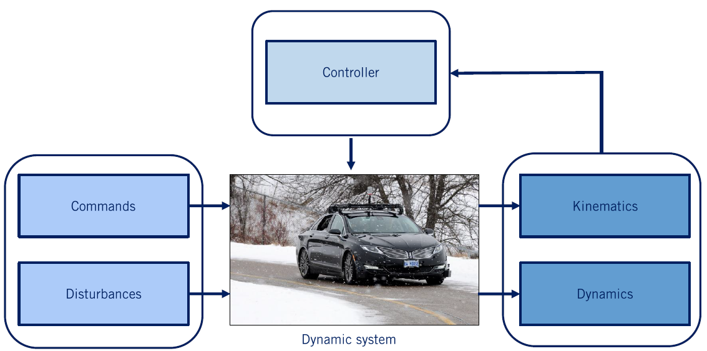
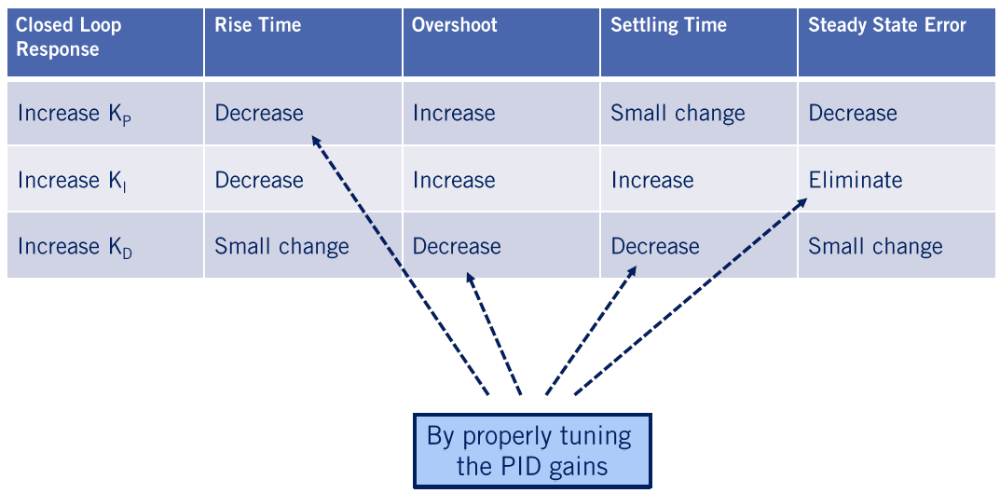
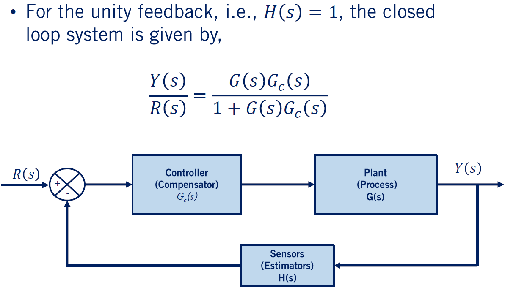
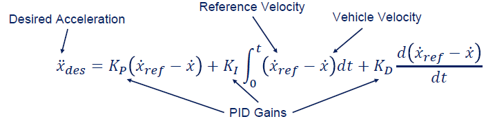
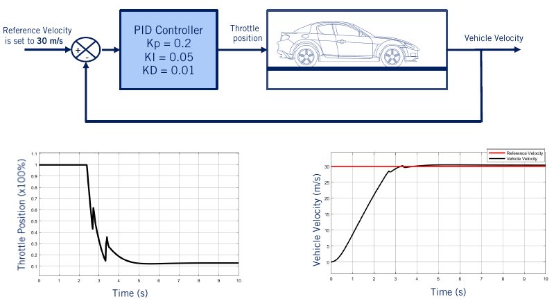
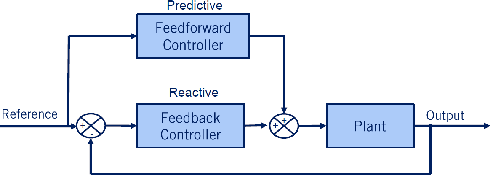
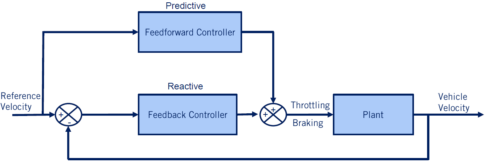
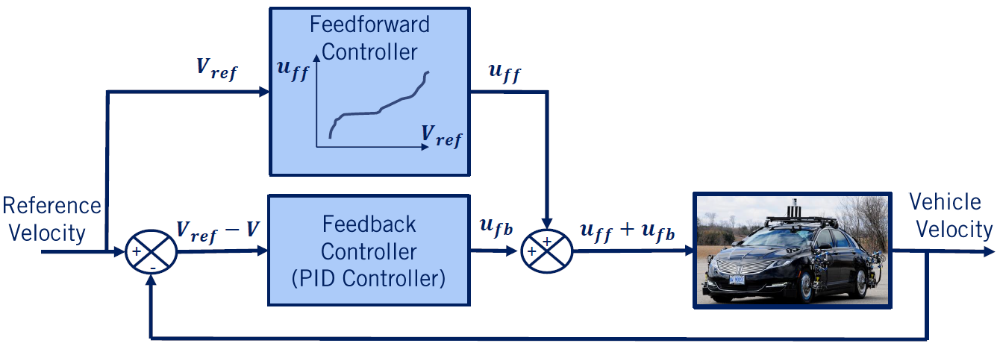
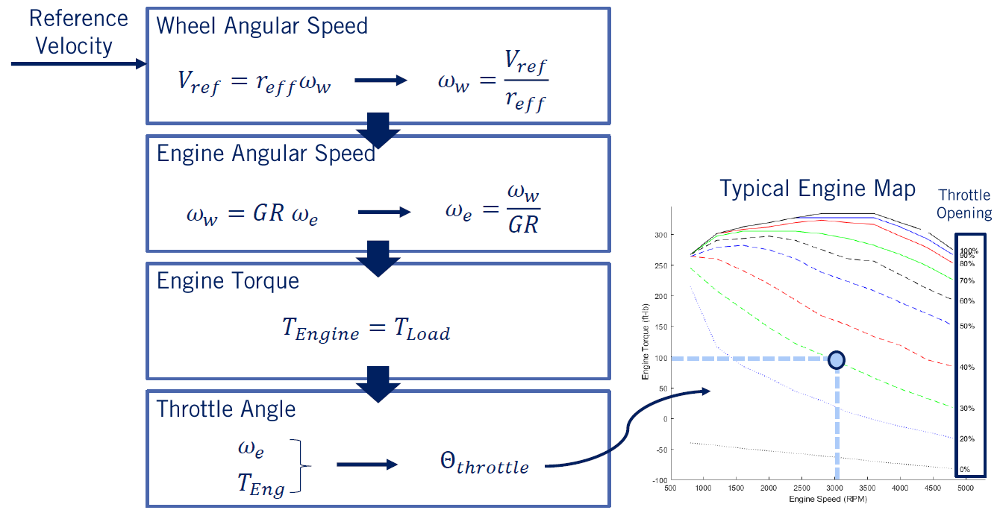

# Module 5：Vehicle Longitudinal Control

## Module 5: Vehicle Longitudinal Control

> Longitudinal control of an autonomous vehicle involves tracking a speed profile along a fixed path, and can be achieved with reasonable accuracy using classic control techniques.This week, you will learn how to develop a baseline controller that is applicable for a significant subset of driving conditions, which include most non-evasive\(不回避\) or highly-dynamic motion.

### Learning Objectives

* Design a PID controller for a linear system
* Decompose a coupled nonlinear vehicle model and extract a linear decoupled longitudinal model\(分解耦合非线性车辆模型并提取线性解耦纵向模型\)
* Develop a feedforward controller for longitudinal vehicle control

## Lesson 1: Proportional-Integral-Derivative \(PID\) Control

Welcome to week five of this course. In the previous module, you learned how to develop vehicle models to capture longitudinal and lateral dynamics. In this module, we will go through **the concepts of longitudinal vehicle control** to regulate the speed of our self-driving car.

Specifically, you’ll

* Review some of the essential concepts from classical linear time-invariant control
* Develop a PID control law for the longitudinal vehicle model
* Combine feedforward and feedback control to improve desired speed tracking.

Design of the longitudinal speed control underpins all vehicle performance on the road and is one of the fundamental components needed for autonomous driving.

In this video, we will briefly review some of the basics of linear time-invariant control and the PID controller. By the end of this video, you’ll be able to design a PID control for a linear time-invariant system. Note that we will have to assume you’re familiar with classical control design including the use of transfer functions and the Laplace domain. So, if you haven’t seen these concepts before, please check out some of the great controls courses on Coursera listed in the supplemental materials. Let’s get started.

### 1. Control Development

In module three of this course, we learned how to develop **the dynamic and kinematic models** for a vehicle based on the **bicycle model**. These models aim to capture how the dynamic system reacts to input commands from the driver such as steering gas and break and how it reacts to disturbances such as wind, road surface and different vehicle loads.

The effects of the inputs and disturbances on the states such as velocity and rotation rate of the vehicle are defined by the kinematic and dynamic models we developed. The role of the controller then is to regulate some of these states of the vehicle by sensing the current state variables and then generating actuator signals to satisfy the commands provided.

### 2. Typical Feedback Control Loop

> Compensator：补偿器Actuators：执行器Plant\(G\(s\)\)：加工Sensors\(H\(s\)\):传感器

For longitudinal control, the controller sensing the vehicle speed and adjust the throttle and break commands to match the desired speed set by the autonomous motion planning system. Let’s take a look at a typical feedback control loop.

The plant or process model takes the actuator signals as the input and generates the output or state variables of the system. These outputs are measured by sensors and estimators are used to fuse measurements into accurate output estimates. The output estimates are compared to the desired or reference output variables and **the difference or error is passed to the controller**.

### 3. Plant System or Process

> System Representation:The plant system could by linear or nonlinearPlant representation : state-space form and transfer functionsLinear time-invariant systems can be expressed using transfer functions

The controller can be seen as a mathematical algorithm that generates actuator signals so that the error signal is minimized and the plant state variables approach the desired state variables. **The plant model be it linear or nonlinear can be represented in several ways.**

Two of the most common ways are **state-space form** which tracks the evolution of an internal state to connect the input to the output and **transfer function** form which models the input to output relation directly. Note that for transfer functions, the system must be linear and time-invariant. **A transfer function G is a relation between inputs U and outputs Y of the system defined in the Laplace domain as a function of S a complex variable.**

$$Y(s) = G(s)U(s) \\ s = \sigma + j\omega$$

We use the Laplace transform to go from the time domain to the S domain **because it allows for easier analysis of an input-output relation and is useful in understanding control performance**.

$$Y(s) = G(s)U(s) = \frac{N(s)}{D{s}}U(s)$$

When working with the transfer functions, the numerator and denominator roots provide powerful insight into the response of a system to input functions. **The zeros of a system are the roots of the numerator and the poles of the system are the roots of its denominator**.

### 4. Controller or Compensator

> Some simple algorithms,widely used in industry

Control algorithm design can vary from simple such as constant gain multiplication, lookup tables and linear equations to more detailed methods based on non-linear functions and optimization over finite prediction horizons. Some of the basic and classic controllers include **lead-lag controllers** and proportional integral and derivative or **PID controllers**.

In the rest of this video, we will go into more detail on the PID control combination as a useful starting point for longitudinal control. More involved control design is also possible and it’s particularly useful for non-linear system models, time-varying models, or models with constraints that limit output selection.

> More complex algorithmsNonlinear method:Feedback linearization,Backstepping,Sliding modeOptimization method:Model predictive control

**Nonlinear methods** such as feedback linearization**,** back stepping and sliding mode control are beyond the scope of this course but can certainly be applied to self-driving vehicle control problem. **Optimization-based methods** are heavily used in autonomous driving and so we’ll look at model predictive control as an example of this group of controllers later on in the course.

### 5. PID Controller

PID control is mathematically formulated by adding three terms dependent on the error function. A proportional term directly proportional to the error E, an integral term proportional to the integral of the error, and a derivative term proportional to the derivative of the error.

$$u(t) = K_Pe(t)+K_I\int_0^1 e(t)dt + K_D\dot{e}(t)$$

The constants Kp, Ki, and Kd are called the proportional integral and derivative gains and govern the response so the PID controller which is denoted U of t as it is the input to the plant model.

$$U(s) = G_c(s)E(s) = (K_P + \frac{K_I}{s}+K_Ds)E(s) = (\frac{K_Ds^2 + K_Ps + K_I}{s})E(s)$$

Taking the Laplace transform of the PID control yields the transfer function Gc of S. Multiplying by S in the Laplace domain is equivalent to taking a derivative in the time domain and dividing by S is equivalent to taking the integral. By adding these three terms of the PID controller together, we get a single transfer function for PID control. Note that not all gains need to be used for all systems. If one or more of the PID gains are set to zero, the controller can be referred to as P, Pd or Pi.

### 6. Proportional-Integral Derivative Controller

The PID transfer function contains a single pole at the origin which comes from the integral term. It also contains a second-order numerator with two zeros that can be placed anywhere in the complex plane by selecting appropriate values for the gains.

PID control design therefore, boils down to selecting zero locations to achieve the desired output or performance based on the model for the plant. There are also several algorithms to tune PID gains, among them, Ziegler Nichols is one of the most popular. Closed loop response denotes the response of a system when the controller decides the inputs to apply to the plant model. For a step input on the reference signal we can define the rise time as the time it takes to reach 90 percent of the reference value. The overshoot as the maximum percentage the output exceeds this reference. The settling time as the time to settle to within five percent of the reference and the steady-state error as the error between the output and the reference at steady-state.

### 7. Characteristics of P,I,and D Gains

The effects of each P, I and D action are summarized in the following table.

For instance, an increase in Kp leads to a stronger reaction to errors and therefore a decrease in rise time in response to a step change in the reference signal. Similarly, since Kd reacts to the rate of change of the error an increased Kd leads to a decrease in overshoot or the rate of change of error is high. It may simultaneously lead to a decrease in oscillations about the reference and a decreased settling time as a result.

Finally, an increase in Ki can eliminate steady-state errors but may lead to increased oscillation in the response. Ultimately, the P, I and D gains must be selected with knowledge of the interaction of their effects to adjust the system response to get the right closed loop performance. You’ll get a chance to see these interactions as you develop your own PID controller as part of the assessment for this course.

### 8. Second Order System

Now, let’s take a look at the well-known second-order spring-mass damper model as shown in the figure.

In this example, we’ll first review the transfer function of the proposed dynamic system and then design a PID controller for it. The dynamics of the spring-mass damper system were derived in an earlier video in this course.

The system is subjected to the input force F and the output of the model is the displacement of the body x. The mass M is connected to a rigid foundation by a spring with spring constant K and a damper with damping coefficient b. Now to transform the equation into the S domain or Laplace domain, we use the Laplace transform and write the second-order equation as follows. This relies on the fact that the derivative in the time domain are multiplications by S in the Laplace domain.

Finally, the transfer function is formed which represents the relation between the output x of s and the input F of S and is defined as the plant transfer function G of s. This is a second-order system with two poles defined by the mass spring constant and damping coefficient.

### 9. Open-Loop Step Response & Closed-Loop Response

To evaluate the system characteristics, we excite the system by using a unit step input. This is normally the first step to evaluate the dynamic characteristics of a plant.

For example, the system response x is plotted here for the parameter values given as m equals 1, b equals 10 and k equals 20. This type of response is easily generated with scientific computing tools such as Matlab recite pi. The input is the unit step F equals one and the output is once again x. **This response is called the open-loop response since there is no controller applied to the system at this point**. If a controller is added to the plant and the output of the model is measured and compared with the desired output or reference signal, then the response of the system is called **the closed loop response.**

For unity feedback, the sensor transfer function is assumed to be one and in general it could be any transfer function. The closed loop transfer function given here can be performed from the transfer functions of the controller and the plant. For those of you who have studied classical feedback control, you’ll know that **the poles of the open-loop system define the characteristics of the closed-loop response.** You may have also seen root locus bodhi and Nyquist design techniques which can be used to select controllers that meet specific output specifications. We’ve left some links to appropriate resources for those who’d like to learn more in the supplemental material.

### 10. Step Response

Let’s look at the step response for a few different PID controllers.

The dashed horizontal line represents the reference or desired output and the controllers goal is to keep the actual output close to this reference. In the first example, the step responses for pure proportional control of the spring-mass damper system. In the P controller response, we see a fast rise time, significant overshoot and prolonged oscillation leading to a long settling time.

Adding derivative control improves the step response in terms of overshoot and settling time but slows down the rise time. Adding the integral term instead maintains a short rise time and is able to reduce oscillations and overshoot leading to a fast settling time as well. The simple Pi control is an excellent design for the spring-mass damper system. Including all three PID terms in the controller, leads to even more flexibility in designing the step response. By carefully tuning the controller gains, we can use the benefits of all three to eliminate overshoot and still maintain very short rise and settling times.

PID controller is given by,

$$G_{PID}(s) = (K_P + K_Ds + \frac{K_I}{s})$$

The closed loop system becomes,

$$G_{CL}(s) = \frac{K_Ds^2 + K_Ps + K_I}{s^3 + (10 + K_D)s^2 + (20 + K_P)s + K_I}$$

As can be seen in the plot, the system approaches the reference at much more quickly without any overshoot with PID control.

### 11. Summary

In this video, we’ve covered the concepts of controller design and why we integrate controllers into a dynamic model. We also reviewed the PID controller and learned how to control the step response of a spring-mass damper system with PID control.

What we have learned from this lesson:

* **Why we employ controller and its importance**
* **PID controller\(simple but useful and applied\) along with the tuning method**

In the next video, you will learn how to apply PID control to regulate the speed of a self-driving car. See you there.

**Question：**

What are the main reasons of using the Laplace transform in control loop systems?

* Having the controlled system components written in Laplace form makes it easier to determine the transfer function of the system
* Laplace transform gives a useful insight into understanding control performance

## Lesson 2: Longitudinal Speed Control with PID

> In the previous video, we briefly reviewed the design of PID controllers and classical controller design. In this video, we’ll apply PID control to our longitudinal vehicle model. So, by the end of this video, you’ll be able to:

* Define the full vehicle planning and control architecture
* Design a PID-based controller for regulating to a set reference speed as in cruise control.

### 1. Architecture of Vehicle Control Strategy

Let’s take a closer look at the vehicle control architecture and how it fits into the overall autonomy software stack. We can divide the structure into four sections. These sections are connected to each other.

**The first section** is the perception of the road and the environment. This perception is captured by sensors and generates the input references for our system. **In the second layer**, we have both path generation and speed profile generation, which in automotive circles is referred to as the drive cycle.

These profiles are generated through the motion planning process, which is the focus of the fourth course of this specialization. The path and the speed profiles are the reference inputs needed by our controllers. For longitudinal control, define the set point’s, acceleration and deceleration that we’d like to be able to track precisely.

For both the lateral and longitudinal control of an autonomous vehicle, the only task that needs to be performed is to follow the plan as precisely as possible, and thereby minimize the error between the actual and reference path and speed. All other tasks required for autonomous driving or done by other parts of the system.

**Finally**, **the controllers generate the input commands or actuator signals for the vehicle**. As we’ve seen in the previous module, these include **the steering for the lateral control** and **the throttle and break commands for longitudinal control**.

### 2. Longitudinal Speed Control

Let’s look at an example of longitudinal vehicle control.

One of the most well-known and commonly available control applications in automotive control is cruise control operating at highway speeds. A cruise control system performs the function of maintaining a fixed reference speed using throttle commands, and accelerating or decelerating to a new reference speed as requested by the driver.

When the vehicle is subjected to different loads and resistances, the throttle angle will be changed by the cruise controller accordingly. Many systems now exist with expanded capabilities such as the adaptive cruise control, which can vary the reference point based on measurements of a lead vehicle and semi autonomous systems, like traffic jam assist, which can operate throughout the vehicle speed range and create spacing gaps for merging vehicles.

These extended examples require additional controller designed to handle the wider range of operating points. This block diagram shows the cruise controller and plant vehicle model as a closed loop system designed to keep the vehicle velocity close to the reference velocity. The controller can be split into two levels:**a high level** and **a low level controller**. Although the low level controller is not essential to the control task.

* **The high level controller takes the difference between the set point velocity and the vehicle actual velocity, and generates the desired vehicle acceleration to close the gap**.
* **The low-level controller gets the vehicle acceleration and generates a throttle or breaking actuation to track the reference acceleration.**

In practice, this two-stage approach allows us to go beyond just PID control and impose limits or profiles directly on the accelerations that are requested of the vehicle in order to maintain speed. It also allows us to separate the use of engine maps we studied in the previous module for generating a desired torque given the engine state from the cruise control input response.

### 3. Upper Level Controller

Let’s take a closer look at the high level controller.

The upper level or high level controller determines how much acceleration is needed at each time step based on the velocity error\(based on the reference and actual velocity\). Let’s apply a PID controller here, which is expressed in the **continuous time domain**. The input to the high level controller is the velocity error, and the output is the vehicle’s desired acceleration.

> 为了在软件中实现这样的控制器，我们将控制器离散化，将积分改变为固定长度时间步长的求和。

In the previous lesson, we learned how to design a PID controller and studied how the different gains affect performance of the controller. **To implement such a controller in software, we discretize the controller, changing the integral to a summation over a fixed length time steps.** The derivative term can be approximated with the finite difference over a fixed time step if either the reference acceleration or the estimated vehicle acceleration is not available.

### 4. Lower Level Controller

In the low-level controller ,throttle input is calculated such that the vehicle track the desired acceleration determined by the upper level controller.In designing a low-level controller, we make some assumptions to simplify our problem.

* **Only throttle actuations is considered\(no braking\)**

  Just only throttle is needed to manage the speed of the vehicle during cruise control, and that the driver will take over if breaking is required to avoid an incident.

* **The torque converter is locked\(gear 3+\)**

  We assume that we are operating in gear three or higher such that the torque converter is locked, meaning that torque from the engine passes directly through the transmission without loss

* **The tire slip is small\(gentle longitudinal maneuvers\)**

  We assume that the tire slip angle and ratio are negligible as cruise control motions are typically gentle

**The low-level controllers** seeks to generate the desired acceleration from the high level controller by increasing or decreasing the torque produced by the engine. **This is controlled by the throttle angle, but is governed by the power train dynamics and the engine map, making it a nonlinear problem that can be a challenge for classic control methods.** Instead, the desired acceleration is translated to a torque demand, and the torque demand is then converted to a throttle angle command.

Recall from the previous module that we developed a second-order ordinary differential equation to describe the acceleration of the vehicle in terms of the difference between the engine torque and the load torque. **We can rearrange this equation to solve for the desired engine torque, given known load torques and the desired acceleration of the vehicle.**

> 在不同操作点测试发动机时产生的稳态发动机图,可用于确定产生所需扭矩需求量所需的节气门角度

Then, the steady-state engine map, which is generated in testing the engine at different operating points can be used to determine the throttle angle needed to produce the amount of torque demand required. In these standard maps, the desired engine torque and the current engine RPM define the required throttle position, and can be interpolated if needed. This approach is a data-driven approximation, but it works quite well in practice. The approximation comes from the fact that the data points in the map are steady-state points while the power train is continuously changing its operating point to meet the current driving conditions.

Finally, we can put the pieces of our vehicle controller together and simulate the control response to a step change in desired speed of our dynamic vehicle models with PID controllers. The PID gains are tuned by trial and error so that the vehicle speeds follow the reference velocity of 30 meters per second or a 108 kilometers per hour.

### 5. Simulation Example

In the results plot, on the left, we see the throttle opening as a percentage, which is the commanded throttle for the vehicle. On the right, we see how the actual velocity evolves over time, and reaches the reference velocity after a settling time. Because of the engine map non-linearity, we see some interesting artifacts in the vehicle response as it closes in on the reference speed. You’ll see even more interesting effects in the simulated vehicles in Carla during your final assessment for this course, with gear changes causing big challenges for pure PID control.

### 6. Summary

In this video, we covered the concept of longitudinal speed control for a cruise control system.

* **Vehicle longitudinal cruise control**
* **High and low-level control structure based on PID and engine maps**

This is the first case in designing a controller for the autonomous car to follow a desired forward speed in this course. We learned the concepts of high-level and low-level controllers and use the combination of PID control and engine maps to regulate vehicle speed. In the next video, you will learn how to apply feed-forward control to improve the performance of a longitudinal control system. See you there.

## Lesson 3: Feedforward Speed Control

In the last lesson, we saw how to build a feedback controller for the longitudinal speed tracking problem that used PID control to generate acceleration commands together, with a low level controller to define throttle and brake inputs.In this final video of the module, we will modify our control architecture to incorporate feedforward commands, which will improve tracking performance, particularly in dynamic maneuvers.Let’s get started.

**Learning Objectives**

* **Integrate both feedforward and feedback control into a combined control architecture**
* **Apply this architecture to longitudinal vehicle control**

### 1. Feedback vs. Feedforward Control

First of all, let’s compare the feedback versus feedforward block diagrams.

**The feedback block diagram** shows the typical closed loop structure, where the current output is compared to a reference signal. And the error between the two is fed into the feedback controller, which generates the input to the plants.

**The feedforward block diagram** shows an open loop structure, where the reference signal is directly fed into the feedforward controller, which again, generates the inputs to the plant. Feedforward controllers create their plant inputs by modeling the plant process, as we have done in module three of these course, and applying the appropriate inputs directly.

### 2. Combined Feedforward and Feedback Control

In many applications, feedforward and feedback loops are combined to improve controller performance. This block diagram shows how a typical feedback, feedforward control structure works.

You can think of feedforward control as providing the necessary inputs expected to keep the plant tracking its reference signal, and the feedback controller correcting for errors that result from either disturbances or inaccuracies in the plant model used by the feedforward controller. The input to the plant is simply the addition of the feedforward and the feedback inputs.

To summarize this concept, **the main reason** **that both feedback and feedforward controllers are used to control a system are** **feedforward controllers provide a predictive response as they produce a reference output to achieve a particular tracking response, particularly when the required inputs are non-zero.** Feedback controllers provide a reactive response, which eliminates control errors due to the disturbances as they occur. The combination of feedback and feedforward control is widely used because of this complementary relationship.

Because autonomous vehicles require non-zero steering commands to maintain a constant radius turn and a constant throttle or brake command to maintain constant speed or deceleration rates, feedforward commands are extremely beneficial in improving tracking performance in automated driving.

### 3. Vehicle Speed Control

Now let’s take a look at the combined feedback and feedforward controllers to generate vehicle actuation for longitudinal speed control.

The reference speed or drive cycle is defined by a higher level planner. And it is desirable that the vehicle follows the reference velocity precisely. The reference velocity is the input to the feedforward block, and the velocity error is the input to the feedback or PID control block. Both controllers produce two vehicle actuation signals, the throttle and the brake commands. Note that there is no low-level controller included in this block diagram, as we had in the pure PID feedback control from the previous video.

### 4. Controller Actuators

The role of the low-level controller achieving the desired acceleration through the use of a mapping from accelerations to engine commands is now going to be handled by the feedforward block.

The feedforward block gets only the reference signal as input, and its primary objective is to accurately set the inputs of the plan. To do this we can convert the entire longitudinal dynamics model into a fixed lookup table or reference map, that maps the reference velocity to the corresponding actuators signals assuming the vehicle is at steady state.

This feedforward approach works well at steady state, but ignores the internal dynamics of the vehicle powertrain. And must also rely on the current vehicle state estimate to resolve some of the forces and dynamic models used.

### 5. Feedforward Table

Let’s look at the steps needed to **develop the actuator commands from a feedforward lookup table**.

In our example, we are interested in following the reference velocity at each time step. Based on the kinematic relationship between the vehicle’s speed and the wheel angular speed, we can calculate the wheel angular speed needed. The wheel angular speed is related to the engine angular speed, or engine RPM, through the gear ratios from the transmission, differential and final drive. So we can now compute the engine RPM corresponding to the required wheel angular speed all through the kinematic relationships defined in the modeling module.

Then assuming steady state operation, the dynamics of the powertrain says that the engine torque must be equal to the total load torque acting on the vehicle. The source of the load torque is aerodynamic resistance, rolling resistance and vehicle gravitational resistance. We can compute the combined load torque using the current state of the vehicle, including its current speed, and the road slope. We now have a required engine torque and can combine that with the current engine operating speed in RPM to define the throttle position needed to generate the required torque. Once again, the engine map is defined for discrete steady state values of engine torque and RPM. And is interpolated as needed, based on the current vehicle operating point.

### 6. Feedforward Simulation Results

Let’s have a look at the comparison between PID control method described in the previous video and the combined feedforward, feedback method we’ve discussed in this video.

We’ve used the same simulation parameters as in the previous video, including the engine map and dynamic model elements. The key difference between the two responses is visible as the reference speed changes. Because the PID controller needs errors to exist before it can correct them, its response lags the feedforward approach, which immediately applies the relevant input reference values. The feedforward tracking is still not perfect, however, as the vehicle response is ultimately governed by its inertia, and the feedforward approach we’ve presented relies on steady state modeling of the car.

As the feedforward model becomes more precise, the feedback components can focus purely on disturbance rejection\(干扰抑制）, and speed profile tracking can be done with consistent precision.

### 7. Summary

In this video, we’ve covered the concept of feedforward controllers and the integrated feedback in feedforward controller to enhance the performance of reference tracking. We also applied the feedback and feedforward loops for autonomous vehicle speed control.

## Conclusion

Congratulations, you’ve now reached the end of this module on longitudinal control for self driving cars. You’ve reviewed the concepts of classical control and defined the PID controller. You’ve built a PID controller for longitudinal control of a car and you’ve applied feedforwad control to improve reference speed tracking. In the next module, we’ll dive into lateral vehicle control design to guide our vehicle along a reference path.

