# Module 6：Vehicle Lateral Control

> This week, you will learn about how lateral vehicle control ensures that a fixed path through the environment is tracked accurately. You will see how to define geometry of the path following control problem and develop both a simple geometric control and a dynamic model predictive control approach.

### 学习目标：

* Define the geometry of the lateral control problem, including heading and cross track errors
* Design a geometric steering controller to track a straight line segment
* Identify the limits of geometric controllers as wheel slip increases
* Explore options for dynamic control, including model predictive control

### Learning Objectives

Welcome to this week's first lesson. In the previous module, we learned some basic longitudinal control for autonomous car controlled development. In this module, we will go through the lateral control. We will cover four lessons this week.

* Explore lateral vehicle control definitions
* Design two geometric path following controllers
* Discuss model predictive control for autonomous driving

In this lesson specifically, we'll introduce the core concepts needed to perform lateral control, and you'll learn how to define different types of reference path and how to compute heading and crosstrack errors relative to those reference paths. So, let's get started.

## Lesson 1: Introduction to Lateral Vehicle Control

### 1. Lateral Control Design

One of the main concerns in autonomous vehicles is ensuring the vehicle can precisely follow a predefined path, executing the motion plan devised in the higher level planning module. This is the main goal of lateral control which must select the steering angle required to correct any errors that accumulate and track changes in the path direction as they appear.

To design the lateral controller, we need to

* Define the error between the vehicle position and the appropriate desired path coordinates
* Select a control design strategy that drives errors to zero while still satisfying steering angle limits
* Consider the dynamic limitations of vehicle and desired ride characteristics such as maximum lateral acceleration and minimum jerk.

Control command must be cognizant of the available tire forces and not exceed the capabilities of the vehicle when correcting for tracking errors.

### 2. The Reference Path

The reference path is a fundamental interface between the planning system in the lateral controller, and can be defined in multiple ways. The easiest approach is to **define a sequence of straight line segments** by requiring a sequence of end point vertices that are connected linearly.

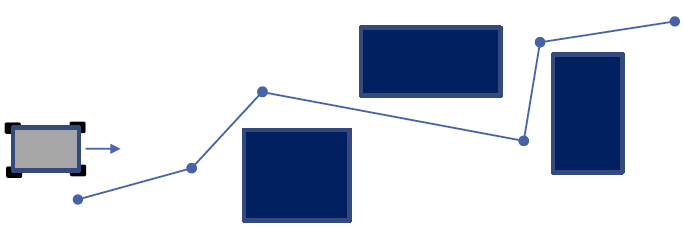

This path definition can be very compact and easy to construct, assuming points are well spaced and the environment allows for mostly straight line motion, as in a Manhattan grid of roadways. However, the path includes heading discontinuities, which make precise tracking a challenge with a steered vehicle.

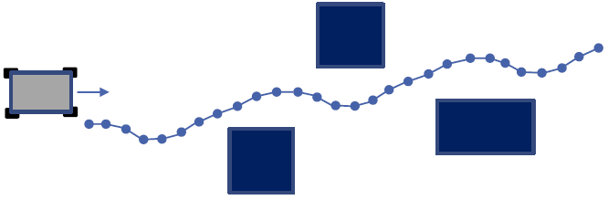

A refinement of the line segment approach is to provide **a series of tightly spaced waypoints**. This spacing is usually fixed in terms of distance or travel time. The relative position of the waypoints can be restricted to satisfy an approximate curvature constraint. Waypoint paths are very common, as they are easy to work with and can be directly constructed from state estimates or GPS waypoints collected in earlier runs of a particular route.

It is also possible to define a path using a sequence of continuous parameterized curves, which can be either drawn from a fixed set of motion primitives or can be identified through optimization during planning. These curves provide the benefit of continuously varying motion, and can be constructed to have smooth derivatives to aid in the consistency of error and error rate calculations.

In all cases of path following, the controller tries to eliminate the offset of the vehicle to the desired path and to align the vehicle heading with the path heading. For each of these paths definitions, the direction of travel along the path is also provided, which can be encoded with the point ordering or curve ordering. We will define these two terms shortly, as they both play a critical role in the design of lateral controllers. Let's now introduced the two main categories of lateral control design, which are widely used in autonomous vehicles.

### 3. Two Types of Control Design

The first category of controllers are **geometric controllers**, which rely on the geometry and coordinates of the desired path and the kinematic models of the vehicle. We'll consider two types of controllers that are geometric controllers:

* **Pure pursuit\(carrot following\)**
* **Stanley controllers.**

We'll look at these in detail in the next lessons in this module. The other category of controllers is called **dynamic controllers**.

* **MPC control**
* **Other control systems**
  * Sliding mode,feedback linearization

The most popular advanced controller in this category is the model predictive controller or MPC, which performs a finite horizon optimization to identify the control command to apply. **MPC is commonly used because of its ability to handle a wide variety of constraints and to identify optimized solutions that consider more than just the current errors.** We'll look at MPC design in the final video in this module.

### 4. Plant Model

Let's now investigate the definitions of errors in path tracking control. We'll use the kinematic bicycle model as our basis for this discussion. So, let's quickly review the important parameters of the bicycle model.

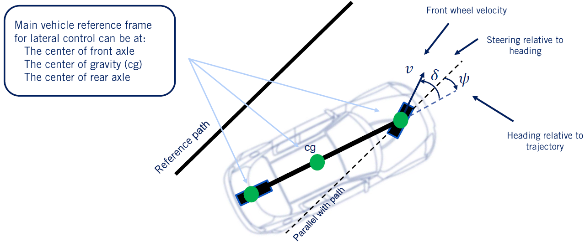

The bicycle model is a suitable control oriented model of a four-wheel vehicle, where the front left and right wheels are combined into a single steerable wheel, and the rear left and right wheels are combined together in a single drive wheel. For this discussion, we'll use a line segment as our reference path, shown as a solid black line in the diagram. A dashed black line that is parallel to the path but runs through the center of the front axle is also visible. **For the purposes of lateral control, we redefine our heading relative to the current path line segment.**

The variable side will be reused to represent the relative heading angle of the vehicle with respect to the path line. The front wheel velocity V and the steering angle relative to the heading direction delta do not change, and are also shown in this diagram. **Note that we can place a reference frame for the vehicle at the center of the rear axle, at the center of the front axle, or at the center of gravity depending on our controller design.**

### 5. Driving Controller

As mentioned in the previous section, we'll introduce two types of error: heading and crosstrack error.

**The heading error** is equal to the difference between path heading and vehicle heading at the reference point along the path. **It is a principal measure of how well the vehicle is aligned with and moving in the direction of the desired path**. The rate of heading error psi dot helps us understand how the heading error evolves over time, and can be computed from the kinematic bicycle model equations. The rate of heading error can be expressed in terms of any of the three vehicle reference points as well.

Here we present the rate of heading error relative to the front axle, as will be used in the Stanley controller presented in the third video in this module. For straight line segments, the desired heading rate of change is zero, and it can be removed. This is because the reference heading is not time-varying for a straight line, and is in fact equal to zero, as we have redefined our heading relative to the current path direction.

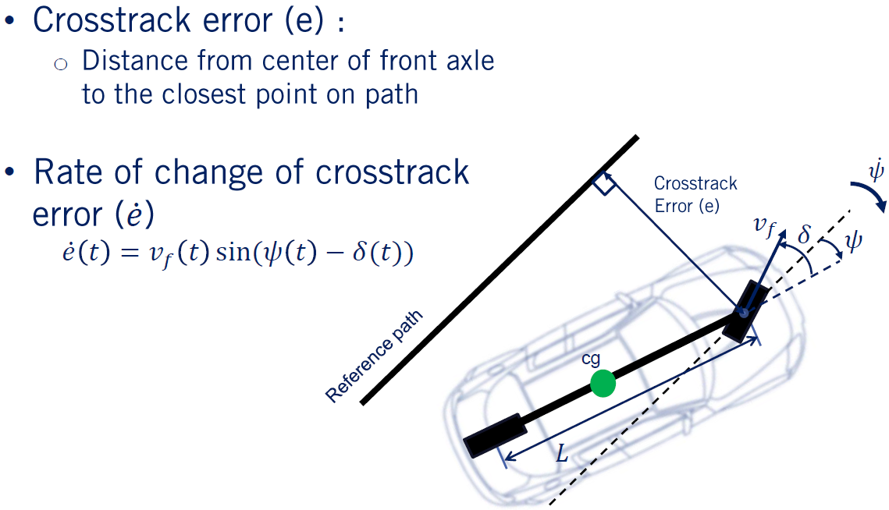

The other type of error is an offset error called the crosstrack error. **The crosstrack error** is the distance between the reference point on the vehicle and the closest point on the desired path. It is the principal measure of how close the vehicle's position is to the desired position along the path.

Both heading error and crosstrack error must converge to zero for the vehicle to be properly tracking the desired path. The line from the vehicle reference point to the path reference point is perpendicular to the path. The rate of change of the crosstrack error can be calculated by extracting the lateral component of the forward velocity. **From this equation, we can see that as the velocity increases, the crosstrack error changes more quickly, meaning that smaller steering angles are needed to correct for the same size crosstrack errors.**

> 将对航向和交叉误差的讨论扩展到弯曲路径会增加一些额外的复杂性，因为不能立即清楚弯曲路径上的参考点应该位于何处。

**Extending this discussion of the heading and crosstrack errors to the curved paths adds some additional complexity, as it is not immediately clear where the reference point on the curved path should lie.** The geometric relations required fall outside the scope of this video. We've nonetheless provided links in the supplemental materials for those interested in error calculations relative to curved paths.

### 6. Summary

Let's summarize our discussion of the lateral control concepts.

* **Three approaches to defining reference paths: line segments, waypoints, and curves.**
* **How to construct error metrics for lateral control, including heading and crosstrack error**

In the next video, we'll use these definitions to construct our first lateral vehicle controller, the pure pursuit controller, to define steering commands that will track our reference path. See you there.

## Lesson 2: Geometric Lateral Control - Pure Pursuit

> 对于无人车轨迹的追踪，目前主流的方法分为两类：基于几何追踪的方法和基于模型预测的方法。本节主要介绍一种广泛使用的基于几何追踪的方法—Pure Pursuit

In the last lesson, we defined important concepts relevant for the lateral vehicle control. In this lesson, we will put these concepts to good use. We'll

* First introduce the concept of a geometric path tracking controller which relies on our kinematic vehicle model for selecting steering commands
* Design a pure pursuit controller for our self-driving cars to track a reference path through the environment. Let's get started.

### 1. Geometric path tracking

What is a geometric path tracking controller? Generically, it is any controller that tracks a reference path using only the geometry of the vehicle kinematics and the reference path. In the case of self-driving cars, a geometric path tracking controller is a **type of lateral controller** that ignores dynamic forces on the vehicles and assumes the no-slip condition holds at the wheels.

> Advantage and disadvantage

It relies on a kinematic bicycle model and the error measures defined in the previous video to construct a steering command rule that achieves path tracking. Because of its simple nature, it is very popular and useful in robotics and autonomous driving. **However, this simple approach has a downside in that its performance suffers when the vehicle motion does not match the no-slip assumption, as is the case in aggressive vehicle maneuvers with high lateral acceleration.**

In these cases, a deeper understanding of the limits of the available tire forces is needed, as are more involved control strategies. When the vehicle is operating in the linear tire region and a tire is not saturated, however, geometric path tracking controllers can work very well. Geometric path tracking controllers rely on a reference point along the desired path, which can be the same reference point used to compute heading and cross track errors, or it can be a look-ahead point some distance in front of the vehicle along the path, an example of which is shown in red here.

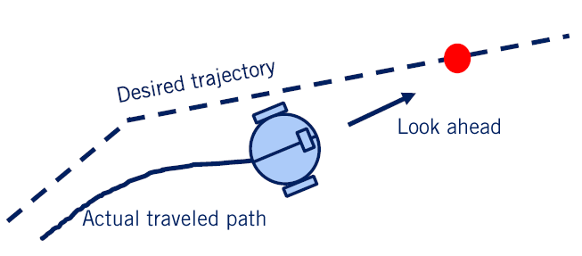

In fact, the pure pursuit controller we're about to derive uses a look-ahead point on the reference path, while the Stanley controller in the next video uses the same reference point as is needed for error calculations. Let's now take a closer look at the pure pursuit controller.

### 2. Pure pursuit

In the pure pursuit method, the core idea is that a reference point can be placed on the path a fixed distance ahead of the vehicle, and the steering commands needed to intersect with this point using a constant steering angle can be computed. As the vehicle turns towards the path to follow this curve, the point continues to move forward, reducing the steering angle and gently bringing the vehicle towards the path.

In this method, the center of the rear axle is used as the reference point on the vehicle, and we define the line that connects the center of the rear axle to the target reference point as a line of fixed distance _ld_, known as the **look-ahead distance**, which is the red dashed line in this figure. The angle between the vehicle's body heading and the look-ahead line is referred to as alpha.

### 3. Pure pursuit - formulation

To construct the pure pursuit controller, we once again turn to the concept of the instantaneous center of rotation. The target point on the trajectory, the center of the rear axle, and the instantaneous center of rotation form a triangle with two sides of length R and one of length ld. We'd like to define the arc that takes the vehicle reference point to the target point on the path. This arc is the part of the ICR circle that covers the angle of two alpha. The angle two alpha can be derived using standard trigonometric identities.

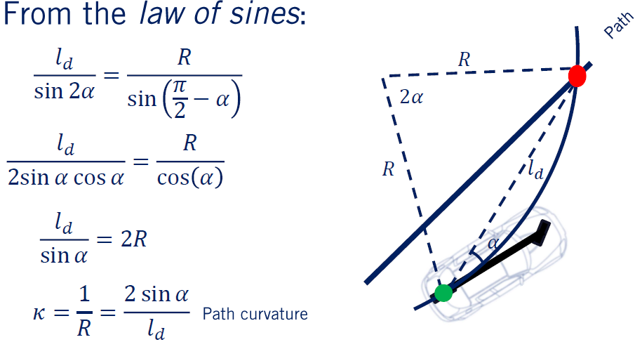

Based on the law of sines, we can write the following equation: ld over the sine of two alpha is equal to r over the sine of pi over two minus alpha. Then using some more trigonometric identities, we can simplify the equations as follows, which leads to the compact expression ld over sine alpha is equal to two R. Finally, the curvature kappa, which is the inverse of the arc radius R, is equal to two sine alpha over ld. Now, let's take a look at the bicycle model to calculate the steering angle needed to track this arc.

Recall that the steering angle defines the arc radius and yields the relation tan delta is equal to the car length l, over the arc radius R. Combining this expression with the expression for R derived earlier, we can now express the steering angle needed to follow the arc in terms of easily computed values. The steering angle delta is set to the inverse tan of 2L sine alpha over ld. This is an easily implemented controller for steering, but how well will it perform? To understand this, we need to dig into how the error values evolve in closed loop.

Crosstrack error\(e\) is defined here as the lateral distance between the heading vector and the target point so:

**For the pure pursuit controller, we can define the cross track error as the distance between the heading vector and the target point.** Once again, we'll use _e_ to denote the cross track error. We now arrive at the expression sine alpha equals e over ld. **Combining this with the expression for curvature shows us that the curvature of the path created by the pure pursuit controller is proportional to the cross track error at the look-ahead reference point.** As the error increases, so does the curvature, bringing the vehicle back to the path more aggressively.

This equation demonstrates that the pure pursuit controller works in a manner similar to proportional control to correct cross track error using path curvature as the output of the controller. The proportional gain depends on two over ld squared. So as the look-ahead distance increases, the proportional gain decreases in a nonlinear manner.

It's important to note that the pure pursuit controller with a fixed value of ld leads to a curvature controller that does not take into account the vehicle speed. This means that the selected steering angle would be the same regardless of whether the vehicle is going 10 kilometers per hour or 100 kilometers per hour, leading to very different lateral acceleration's. A controller tuned for high-speed would be far too sluggish at low speed, and one tuned for low speed would be dangerously aggressive at high speeds.

To overcome this limitation, we add one more modification to our pure pursuit controller. **We can vary the look-ahead distance ld based on the speed of the vehicle.** We define the look-ahead distance to increase proportional to the vehicle forward speed.

$$
l_d = K_{dd}v_f
$$
The addition to the controller takes the form ld is equal to K sub PP, the pure pursuit look-ahead gain, times the forward velocity, vf. Substituting this adjustment into the steering angle command equation, we arrive at the complete pure pursuit controller. The controller selects the steering angle that will form an arc to the look-ahead reference point, and adjusts this look-ahead point to be further away the faster the vehicle is traveling. This design results in steering commands and turn rates that are achievable given available tire forces, although it must be tuned to do so. You now are ready to start building geometric lateral controllers for self-driving cars.

### 4. Summary

Let's summarize. In this lesson, we defined the class of geometric path tracking controllers and derived the pure proceed controller, which is one of two geometric path following controllers that we'll study in this course. In the next video, we'll explore the second geometric path tracking controller, the Stanley controller. We'll see you there.

## Lesson 3: Geometric Lateral Control - Stanley

Welcome back. In the last lesson, we derived the pure pursuit controller, a geometric path tracking controller that defined steering input based on a look ahead reference point.

In this lesson, we will cover a second geometric path tracking controller, **the Stanley controller**. This controller was used by the Stanford racing team to win the second Darpa Grand Challenge event. Specifically in this video, you will

* **Derive the Stanley geometric controller**
* **Analyze the evolution of its steering commands for small and large errors**
* **Evaluate the control performance in the form of convergence to the desired path from arbitrary starting conditions**

Let's get started.

### 1. Stanley Controller Approach

The Stanley controller is a geometric path tracking controller which is simple but useful for autonomous robotics and autonomous cars.

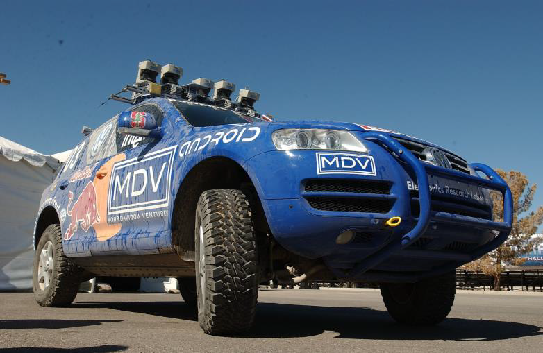

The method was originally developed by Gabe Hoffman, a fellow lab-mate of mine at Stanford University as his contribution to the winning teams entry, and is named after the vehicle Stanley. The main concept that went into the creation of the Stanley controller was that a change in the reference position could lead to different, possibly more desirable properties of the control.

Dr. Hoffman was seeking a control law with global convergence to the path and predictable decay of the errors that would be independent of vehicle speed. So, one day in a fit of inspiration, Dr. Hoffman switched the vehicle reference point used for the controller to the center of the front axle instead of either the CG or the rear axle to see how this new controller might behave. The next modifications he added were to consider both heading alignment and cross track error without a look-ahead distance, but directly at the reference point. Finally, the Stanley controller caps its outputs to fall within the limits of the maximum steering angle. In all these three considerations formed the basis for the resulting control law.

**Couclusion:**

* Use the center of the front axle as a reference point
* Look at both the error in heading and the error in position relative to the closest point on the earth
* Define an intuitive steering law to
  * Correct heading error
  * Correct position error
  * Obey max steering angle bounds

### 2. Heading control law

Let's define each of the terms of the Stanley controller.

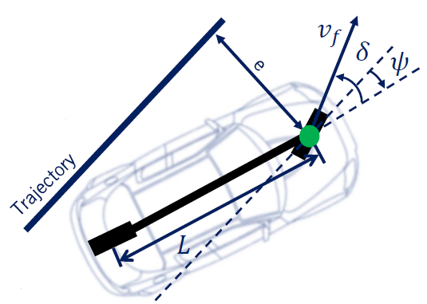

In this diagram, you can see the slight modifications to the relevant terms based on the Stanley assumptions. The cross track error is measured relative to the front axle, and the reference point on the path has no look ahead distance associated with it. Let's make each of the three components of the Stanley controller more concrete.

First, to eliminate heading error relative to the path, **the steering angle is set equal to the heading directly.**

$$\delta(t) = \psi(t)$$

Then to eliminate cross track error, a proportional control is added, whose gain is scaled by the inverse of the forward velocity. The control is then passed through an inverse tan function which maps the proportional control signal to the angular range of minus Pi to Pi.

* **Essentially proportional to error**
* **Inversely proportional to speed**
* **Limit effect for large errors with inverse tan**
* **Gain k determined experimentally**

  $$\delta(t) = tan^{-1}(\frac{ke(t)}{v_f(t)})$$

Finally, the steering angle command is kept to fall within the minimum and maximum steering angles, Delta min and Delta max, which are usually symmetric about 0.

$$
\delta(t)\in[\delta_{min},\delta_{max}]
$$
The similarities with the pure pursuit controller are not surprising, as both are seeking to perform the same task with the same kinematic model. **The Stanley controller scales its gains by the forward speed in the same way as pure pursuit control, and also has the same inverse tangent of the proportional control signal.** However, the independent penalization of heading and cross track errors and the elimination of the look-ahead distance make this a different approach from pure pursuit.

### 3. Combind steering law

The final control law simply combines these three elements to set the steering angle of the car as follows.

$$\delta(t) = \psi(t) + tan^{-1}(\frac{ke(t)}{v_f(t)}), \delta(t)\in[\delta_{min},\delta_{max}]$$

Let's now take a look at what's steering angle is requested for different error signals. For heading error, the steering command points in the opposite direction to the heading error, causing the vehicle to turn to correct the misalignment with the path. For large heading errors, for example, if the heading error exceeds the maximum steering angle, this part of the controller requests the maximum steering command until alignment falls back within the available balance.

For large positive cross track error, ke over vf becomes large and the inverse tangent approaches Pi over 2. So we can approximate the Stanley control law as the heading error plus Pi over 2.

$$tan^{-1}(\frac{ke(t)}{v_f(t)})\approx\frac{\pi}2$$

This large value clamps the steering command to the maximum and the vehicle turns towards the path. The effect of this term is to increase the heading error in the opposite direction, and so the steering command will drop to 0 once the heading error reaches minus Pi over 2.

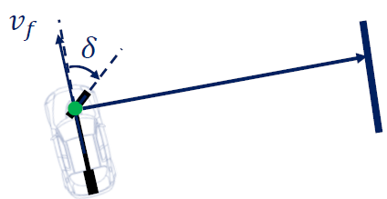

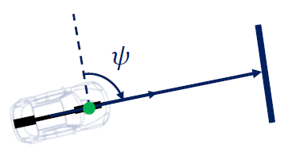

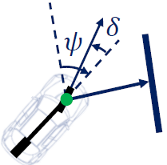

The vehicle then proceeds straight to the path until the cross track error decreases. At this point, the heading term starts correcting the alignment with the path again and ultimately, the vehicle starts to track the path more closely. But how does this control actually converge to the path?

### 4. Error Dynamics

As it turns out, it's possible to use our expression for the cross track aerodynamics defined in the first video of this module to get a sense for the convergence characteristics of the Stanley controller.

Recall that the rate of change of the cross track error for a front axle reference point is equal to minus the forward velocity, times the sine of the heading minus the steering angle. If we substitute in the Stanley control law without limits, we get the final expression in this equation. Using a trigonometric identity for simplifying the sign of the inverse of 10, we can find that the rate of change of the cross track error evolves according to minus the gain k times the cross track error, divided by the square root of 1 plus ke over vf squared.

For small cross track errors, we can simplify the denominator of this expression by assuming the quadratic term is negligible.

$$\dot{e}(t)\approx-ke(t)$$

This leads to the realization that the cross track error evolution follows a first-order differential equation, and the solution for this ODE is an exponential. Since k is positive, we see that the error decays exponentially to 0. The most interesting aspect of this investigation is that the decay rate is completely independent of the speed. So faster vehicles will travel farther while converging to the path, but will converge to the path at the same time as slower moving vehicles.

### 5. Case Study

Let's now dive into a simulation example of the error dynamics for the Stanley controller to observe its convergence characteristics.

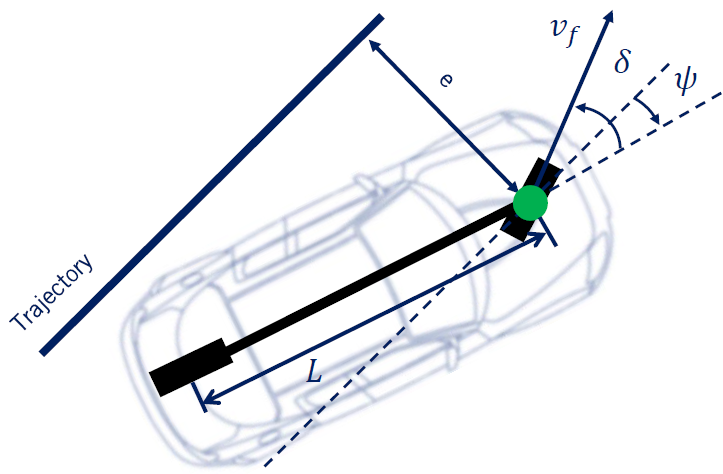

In this example, let's take a look at two extreme scenarios, large initial cross track error and large initial heading error.

**In the first case**, for large initial cross track error, let's assume the initial cross track error is five meters, and that the maximum allowable steering angle is 25 degrees and the forward velocity is five meters per second.

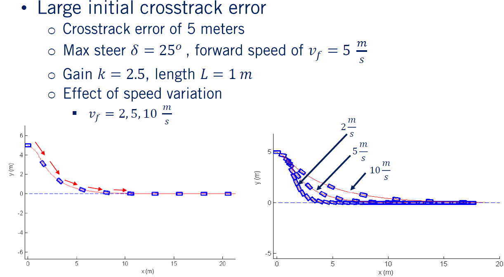

We'll set the vehicle wheel base length to one meter for simplicity and the gain k will be set to a value of 2.5. This was selected based on chosen parameters for the simulation and some trial and error testing. The simulation shows how the Stanley controller corrects for a large cross track error and converges to the desired path. The large initial error leads to a large steering command that quickly turns the vehicle towards the path. The heading error and cross track error terms then reach an equilibrium, and the vehicle continues in a straight line towards the path. As the cross track error decreases, the exponential decay to the path becomes visible.

Finally, the vehicle safely tracks the path in the final stages of the simulation. We can also run the same simulation at different forward velocities. So, let's try speeds of two, five and 10 meters per second. The results show the main characteristics of the Stanley controller. In all cases, the turn towards the path, straight line progress and then exponential decay to the path are visible. The higher the speed, the further the car travels before reaching the path. But the final convergence for small cross track errors takes the same amount of time in each case.

**In the second case**, the simulation can be regenerated for the scenario at a large initial heading error. The parameters are the same as the previous case but the vehicle starts out on the path pointing very much in the wrong direction.

The simulation results show the heading error is corrected by the Stanley control law. First, the steering command is up against its limit as the heading error is corrected. Then as the cross track error starts to grow, the steering commands continue to correct the heading of the car beyond the alignment with the path. Finally, the car enters the exponential convergence segment as before. These simulation results give us a good idea of the ability of the Stanley controller to correct arbitrarily large errors.

In fact, it comes with a global stability proof, meaning that no matter what the initial conditions, the controller will guide the car back to its path. In practice however, the Stanley controller is still a geometric path tracking controller, and as such does not consider many different aspects of real self-driving car. For example, it does not consider noisy measurements, actuator dynamics or tire force effects, all of which can cause undesirable ride characteristics during maneuvers. It is possible, however, to make a few adjustments to the geometric path tracking controllers that help mitigate some of these most undesirable effects.

### 6. Adjustment

During low-speed operation, the pure pursuit and Stanley controllers can behave quite aggressively when confronted with noisy velocity estimates.

Since the velocity term is in the denominator of the fraction inside the inverse tangent, errors in low speed estimates tend to get amplified in the steering command. This leads to wild swings in the steering wheel, which is not desirable for rider comfort. So to get rid of this issue and to increase the stability of our solution at low speeds, we add a positive softening constant that ensures the denominator always has a minimum value. This softening constant can be tuned in the field.

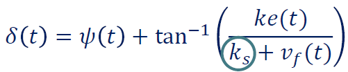

At higher speeds, we have the issue that steering commands need to vary slowly to ensure lateral forces are not excessive. Even with this scaling on speeds, Stanley's response was overly aggressive at high speeds, and so a damping term on heading rate was also added. This essentially converts the heading error control portion to a PD controller, and the same idea can be applied to the pure pursuit control of curvature as well.

Finally, for curved paths with high curvature, the controller fails to track them well as the reference dynamics were not considered in the derivation of the geometric controllers. It is also possible as we saw in longitudinal control to enhance the performance and drive errors to 0 more quickly by adding a feed forward term to the controller. In this case, it is sufficient to simply include the steering angle required to maintain the curvature of the desired path. With these modifications, the Stanley controller becomes a useful tool for moderate driving tasks as long as the vehicle avoids exiting the linear tire region. We'll look more at defining paths that are safe to track in the fourth course of this specialization.

### 7. Summary

In this lesson, you learned how to apply the Stanley controller as a geometric path tracking controller, what the convergence properties are for the Stanley controller and how to add further enhancements that improve the controllers real-world performance. In the next video, we'll introduce the model predictive control method and advanced model-based control method that can overcome many of the limitations of geometric controllers. See you next time.

## Lesson 4: Advanced Steering Control - MPC

Welcome back. In the last video, we studied the Stanley controller for lateral path tracking control. In this video, we will explore an advanced applied control strategy, known as Model Predictive Control or MPC, to understand how to incorporate dynamic modeling into controller design.

Specifically in this video, we will

* **Describe the MPC architecture and the concept of receding horizon control**
* **Formulate an MPC optimization problem for both linear and nonlinear models**
* **Apply MPC to joint longitudinal and lateral vehicle control.**

Let's dive in.

### 1. Model predictive control

First, let's quickly go through the key aspects of Model Predictive Control. **MPC refers to the control design approach that numerically solves an optimization problem at each time-step**. Because solving an optimization problem at each time step can take time, MPC was originally applied to slow processes such as industrial chemical processing.

However, the ever-improving performance of today's computing hardware has made MPC a viable approach even on embedded hardware. More and more automotive applications are turning to MPC as a way to improve performance and expand operating range for a suite of different embedded controllers, from traction control and stability control, to emission reduction, and idle speed control.

[模型預測控制 - 维基百科，自由的百科全书](https://zh.wikipedia.org/wiki/模型預測控制)

Longitudinal and lateral control for autonomous vehicles is another extremely suitable application for MPC. **Model Predictive Control is often interchangeably referred to as Receding Horizon Control**, since the controller generates an actuator signal based on a fixed finite length horizon at each time-step which receives as time moves forward. The key advantages to solving online optimizations as part of the controller are as follows:

> Advantages

The formulation of an MPC controller is straightforward requiring the definition of an objective function and relevant constraints that are then optimized using well-established solvers. The states and control signals can be constrained to stay within safe operating bounds and controls can be selected to maximize multiple objectives simultaneously. Both hard constraints and soft penalties can be employed, leading to a rich set of solutions for constrained control problems.

> Disadvanges

As many automotive subsystems have rigid actuator constraints and diverse performance objectives, MPC has emerged as a major tool for vehicle control. **The controller can be explicitly applied to the linear or non-linear models of the vehicle and its subsystems, meaning that we can use the same approach even as our models change or improve over time.** The trade-off these advantages must be weighed against, is that MPC requires significantly more computational resources than a Static Control Law.

It is certainly possible to create optimization formulations that are too expensive to compute at the high update rates required for smooth vehicle control. Careful implementation is needed to avoid overloading processors.

### 2. Receding horizon Control

Before we start designing MPC controllers, let's take a closer look at the concept of Receding Horizon. Receding Horizon Control solves a fixed size optimization at each time-step, which identifies optimal control inputs to apply from the current time to the end of the horizon based on the objectives constraints and current state of the vehicle. One issue that arises in implementation however, is that because optimization can take some amount of time, the state of the vehicle when starting the optimization, will be different from the state of the vehicle when completing the optimization.

As a results, we must use a predicted state in the optimization for the time at which the control input will actually be applied. Let's step through the process and clarify the notation needed.

First, we define the receding horizon length t. Then, we set the initial state for the optimization to be the predicted state at the end of the optimization x at time t. Next, we solve the optimization as the vehicle moves from its current state at time t minus one to x of t using the control input identified in the previous optimization. Although we won't exactly arrive at the predicted state at time t due to disturbances, we do expect to be reasonably close if the time interval is short. Finally, we apply the control signal from the first time step of the receding horizon optimization and repeat the process for the next time step.

### 3. MPC structure

We can visualize the Receding Horizon or MPC Algorithm, using the following block diagram for a control.

We have two main blocks, an optimizer block, which is the core MPC component or a Receding Horizon Control component, and the dynamic model. The model takes in the past inputs and state from time t minus one and takes in the output of the optimizer which is the current sequence of inputs U at each time step in the horizon. The model then outputs predicted states at the next time-step, which are compared to the reference trajectory and passed into the optimizer as the future or predicted error.

The optimizer also receives updated constraints and the cost function to use, which can be fixed in advanced or varied based on changing operating modes. The optimizer then solves its optimization and the process repeats.

### 4. Linear MPC formulation

Now, let's take a look at the linear MPC design in particular. We use the state space formulation which represents a motion model in discrete form. The future states are linearly related to the current states and the actuator signals. Note that, A and B are the coefficient matrices and are assumed to be time-invariant.

$$x_{t+1} = Ax_t + Bu_t$$

MPC seeks to find a control policy U of inputs over a finite horizon.

$$U = \{u_{t|t},u_{t+1|t},u_{t+2|t},···\}$$

If all the states are to be driven to zero, the objective function or cost function when we minimize, can be defined as follows:

$$J(x(t),U) = \sum_{j=t}^{t+T-1}x^{T}_{j|t}Qx_{j|t}+u^T_{j|t}Ru_{j|t}$$

with quadratic error on both deviations of the state from zero and on non-zero control inputs. This is similar to the optimization problem of optimal control theory and trades off control performance and input aggressiveness. Note that, the matrices Q and R are called weight matrices and can be selected to achieve a particular type of response.

If instead we need to track a reference signals such as a desired trajectory, we modify the formulation to include the error delta x relative to the desired state.

$$\delta x_{j|t}=x_{j|t,des}-x_{j|t} \\ J(x(t),U) = \sum_{j=t}^{t+T-1}x^{T}_{j|t}Qx_{j|t}+u^T_{j|t}Ru_{j|t}$$

### 5. Linear MPC SOLUTION

This is a famous optimization formulation and has a closed form solution, the Linear Quadratic Regulator or LQR. The closed form solution uses full state feedback, meaning that all states are used in the control response. **The LQR solution defines a control gain matrix K**, which can be computed from the A and B matrices of the state-space model and the Q and R matrices of the cost function.

We've included links in the supplemental materials to this fascinating result of states-pace control theory.

Linear quadratic regulator,provides a closed form solution

* Full state feedback : u\_t = - K x\_t
* Control gain K is a matrix
* Refer to supplemental materials

### 6. \(Non\)Linear MPC formulation

In the more general case, the objective function is any differentiable non-linear function of a state and inputs over the receding horizon. The constraints imposed on the optimization can include; non-linear dynamic models of motion, state and input bounds that capture things like maximum steering angles, and any other inequality constraints g are equality constraints h that affect our system.

For such a general optimization problem however, no closed form solution exists. So, we must rely on numerical optimization to find a solution. Even the kinematic bicycle model falls into this category. So, **almost all MPC controllers for autonomous driving will be solved numerically**.

### 7. Vehicle Lateral Control

Let's now look at the implementation of an MPC controller for trajectory tracking on a self-driving car.

MPC will be used in the same feedback structure presented earlier, but we include the conversion from the tire forces to throttle, break, and steering commands as a low level controller inside the loop. The inputs to the MPC block or the reference trajectory, which include the reference path and velocity, as well as the vehicle states at each time step. The outputs of the MPC block are the lateral and longitudinal forces needed to follow the desired trajectory. These forces are then translated into throttle, breaking, and steering commands, as the output of the low-level control. Finally, the actuation signals are applied to the vehicle at each time-step, and a new vehicle state is achieved closing the feedback loop.

### 8.Model Predictive Controller

The MPC optimization will be set up as follows to perform a double lane change maneuver. First, we define a cost for tracking the desired trajectory, which includes deviation from the desired trajectory and minimization of control command magnitude. Next, we define motion constraints on the vehicle, which rely on the lateral and longitudinal models developed in earlier videos. We also impose maximum limits on the tire forces to restrict them to fall within the linear tire region to avoid extreme responses to control our errors.

These costs and constraints define the optimization used in our example, which then gets converted into actual vehicle commands by the low-level controller. It is also possible to incorporate the low-level control into the MPC optimization, which would involve including as constraints, the engine map, full vehicle dynamic models, actuator forces, and tire force models. The result is a large optimization problem that may be challenging to solve in real time, but let's have a look at the results.

### 9. Simulation : Vehicle trajectory\(double lane change\)

This simulation is done for the double lane change scenario, where the vehicle first accelerates to a steady-state speed of 17 meters per second or 60 kilometers per hour, then maneuvers four meters to the left, and returns four meters to the right immediately thereafter.

The following plots show the results of the simulated maneuver with MPC control, with the reference trajectory in blue and the actual vehicle trajectory in red. We can see that the tracking performance with the MPC controller is excellent, lagging slightly, but without overshoot or oscillation. This is perhaps not surprising as the simulation and MPC use the same model and parameters. The output of model predictive controllers, the lateral and longitudinal forces, can be seen to be smoothly varying and well-behaved.

Also, the vehicle yaw rate during the double lane change maneuver is plotted, revealing precise tracking throughout the states of a vehicle. MPC shows a lot of promises a control technique for autonomous driving and can be used without modification for a wide range of operating conditions and a large variety of scenarios. This flexibility and convenience comes at the cost of increased computational requirements and relies on the availability of robust optimization solvers to always return feasible solutions in the available time window.

Let's summarize what we've discussed in this video. We first explored the definition of Model Predictive Control and the Receding Horizon and constructed the closed loop block diagram for an MPC system. We then define the costs and constraints used in MPC. Finally, we applied MPC to the trajectory tracking problem for self-driving cars.

## End of the module

Congratulations, you've made it to the end of the module. In this module, you learned how to define the lateral path tracking problem, applied two geometric path tracking controllers, the pure pursuit and Stanley controllers to the path tracking problem, and defined a Model Predictive Controller for joint, lateral, and longitudinal control. In the final module in this course, you'll get your first hands on look at the Carlos simulator where you'll design lateral and longitudinal controllers to navigate a vehicle around a race track.

