# Module 2 - State Estimation - Linear and Nonlinear Kalman Filters

Any engineer working on autonomous vehicles must understand the Kalman filter, first described in a paper by Rudolf Kalman in 1960. The filter has been recognized as one of the top 10 algorithms of the 20th century, is implemented in software that runs on your smartphone and on modern jet aircraft, and was crucial to enabling the Apollo spacecraft to reach the moon. This module derives the Kalman filter equations from a least squares perspective, for linear systems. 

The module also examines why the Kalman filter is the best linear unbiased estimator (that is, it is optimal in the linear case). The Kalman filter, as originally published, is a linear algorithm; however, all systems in practice are nonlinear to some degree. Shortly after the Kalman filter was developed, it was extended to nonlinear systems, resulting in an algorithm now called the ‘extended’ Kalman filter, or EKF. The EKF is the ‘bread and butter’ of state estimators, and should be in every engineer’s toolbox. This module explains how the EKF operates (i.e., through linearization) and discusses its relationship to the original Kalman filter. The module also provides an overview of the unscented Kalman filter, a more recently developed and very popular member of the Kalman filter family.

### 学习目标

- Describe the relationship between least squares and the linear Kalman filter
- Explain the (in)sensitivity of the Kalman filter to new data and the need for process noise
- Describe how the linear Kalman filter can be extended to nonlinear systems via linearization
- Describe how the EKF uses first-order linearization to turn a nonlinear problem into a linear one
- Contrast the linearization approach of the EKF with that of the UKF, and explain why the UKF is superior for many problems
- Assess the performance of the extended Kalman filter and its variants

---

## Lesson 1: The (Linear) Kalman Filter

> 线性卡尔曼滤波器，可参考[博客](<https://zhuanlan.zhihu.com/p/59622824>)

### 1. Overview

Welcome back. In module two, we'll learn about one of the most famous algorithms in all of engineering; the Kalman filter. In today's world of advanced machine learning, the Kalman filter remains an important tool to fuse measurements from several sensors to estimate in real-time the state of a robotic system such as a self-driving car. In this module, we'll learn some of the history of the Kalman filter and introduce its basic linear formulation. We'll present why the Kalman filter is the best linear unbiased estimator and then extend the linear formulation to nonlinear systems through linearization. Discuss limitations of this linearization approach, and finally, present a modern alternative to linearization through the unscented transform. 

By the end of this lesson, you'll be able to 

- Describe the common filter as a state estimator that works in two stages：（1）prediction（2）correction. 

- Understand the difference between motion and measurement models

- Use the Kalman filter formulation in a simple 1D localization example. 

---

### 2. History

Let's begin with a bit of history. The Kalman filter algorithm was published in 1960 by Rudolf E. Kalman, a Hungarian born professor and engineer who was working at the Research Institute for Advanced Studies in Baltimore Maryland. Years later in 2009, American President Barack Obama awarded Kalman the prestigious National Medal of Science for his work on the Kalman filter and other contributions to the field of control engineering. 

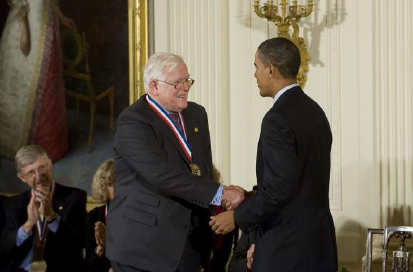

After its publication in 1960, the Kalman filter was adopted by NASA for use in the Apollo guidance computer. It was this ground-breaking innovation that played a pivotal role in successfully getting the Apollo spacecraft to the moon, and to our first steps on another world. The filter helped guide the Apollo spacecraft accurately through its circumlunar orbit. 

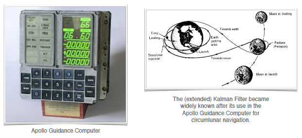

The engineers at NASA's Ames Research Center, adopted Kalman's linear theory and extended it to nonlinear models. We'll look at this specific extension in upcoming module. But first, let's talk about the basic linear Kalman filter. 

---

### 3. The Kalman Filter | Prediction and Correction

> 卡尔曼滤波器与我们前面讨论过的线性递归最小二乘滤波器非常相似。 但是递归最小二乘更新**静态参数**的估计，而卡尔曼滤波器能够更新和估计不断变化的状态。 卡尔曼滤波器的目标是对该状态进行概率估计并使用两个步骤实时更新它：**预测和纠正**。

The Kalman filter is very similar to the linear recursive least squares filter we discussed earlier. While recursive least squares updates the estimate of a static parameter, but Kalman filter is able to update and estimate of an evolving state. **The goal of the Kalman filter is to take a probabilistic estimate of this state and update it in real time using two steps; prediction and correction.** To make these ideas more concrete, let's consider a problem of estimating the 1D position of the vehicle. 

Starting from an initial probabilistic estimate at time k minus 1, our goal is to use a motion model which could be derived from wheel odometry or inertial sensor measurements to predict our new state. 

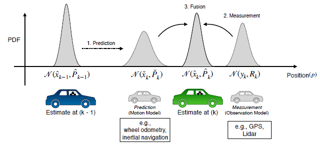

Then, we'll use the observation model derived from GPS for example, to correct that prediction of vehicle position at time k. Each of these components, the initial estimate, the predicted state, and the final corrected state are all random variables that we will specify by their means and covariances. In this way, we can think of the Kalman filter as a technique to fuse information from different sensors to produce a final estimate of some unknown state, taking into account, uncertainty in motion and in our measurements. 

---

### 4. The Kalman Filter | Linear Dynamical System

For the Kalman filter algorithm, we had been able to write the motion model in the following way; the estimate at time step k is a linear combination of the estimate at time step k minus 1, a control input and some zero-mean noise. 

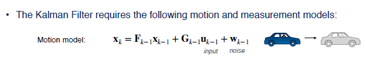

The input is an external signal that affects the evolution of our system state. In the context of self-driving vehicles, this may be a wheel torque applied to speed up and change lanes, for example. Next, we will also need to define a linear measurement model. 

Finally, we'll need a measurement noise as before and a process noise that governs how certain we are that our linear dynamical system is actually correct, or equivalently, how uncertain we are about the effects of our control inputs. 

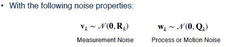

---

### 5. The Kalman Filter | Recursive Least Squares + Process Model

Once we have our system in hand, we can use an approach very similar to that we discussed in the recursive least squares video. The Kalman filter is a recursive least squares estimator that also includes a motion model.

Except this time, we'll do it in two steps. First, we use the process model to predict how our states, remember, that we're now typically talking about evolving states and non-state parameters evolved since the last time step, and will propagate our uncertainty. 
$$
\begin{aligned} \check{\mathbf{x}}_{k} &=\mathbf{F}_{k-1} \mathbf{x}_{k-1}+\mathbf{G}_{k-1} \mathbf{u}_{k-1} \\ \check{\mathbf{P}}_{k} &=\mathbf{F}_{k-1} \hat{\mathbf{P}}_{k-1} \mathbf{F}_{k-1}^{T}+\mathbf{Q}_{k-1} \end{aligned}
$$
Second, we'll use our measurement to correct that prediction based on our measurement residual or innovation and our optimal gain. 
$$
\mathbf{K}_{k}=\check{\mathbf{P}}_{k} \mathbf{H}_{k}^{T}\left(\mathbf{H}_{k} \check{\mathbf{P}}_{k} \mathbf{H}_{k}^{T}+\mathbf{R}_{k}\right)^{-1}
$$
Finally, we'll use the gain to also propagate the state covariance from our prediction to our corrected estimate. 
$$
\begin{aligned} \hat{\mathbf{x}}_{k} &=\check{\mathbf{x}}_{k}+\mathbf{K}_{k}\left(\mathbf{y}_{k}-\mathbf{H}_{k} \check{\mathbf{x}}_{k}\right) \\ \hat{\mathbf{P}}_{k} &=\left(\mathbf{1}-\mathbf{K}_{k} \mathbf{H}_{k}\right) \mathbf{P}_{k} \end{aligned}
$$
In our notation, the hat indicates a corrected prediction at a particular time step. Whereas a check indicates a prediction before the measurement is incorporated. 

If you've worked with the Kalman filter before, you may also have seen this written with plus and minus signs for the corrected and predicted quantities, respectively. 

---

### 6. The Kalman Filter | Prediction & Correction

Let's recap. We start with a probability density over our states and also maybe parameters at time step k minus 1, which we represent as a multivariate Gaussian. We then predict the states at time step k using our linear prediction model and propagate both the mean and the uncertainty; the covariance, forward in time. 

Finally, using our probabilistic measurement model, we correct our initial prediction by optimally fusing the information from our measurement together with the prior prediction through our optimal gain matrix k. Our end result is an updated probabilistic estimate for our states at time step k. The best way to become comfortable with the Kalman filter is to use it. Let's look at a simple example. Consider again the case of the self-driving vehicle estimating its own position. Our state vector will include the vehicle position and its first derivative velocity. 

Our input will be a scalar acceleration that could come from a control system that commands our car to accelerate forward or backwards. For our measurement, we'll assume that we're able to determine the vehicle position directly using something like a GPS receiver. Finally, we'll define our noise variances as follows: 

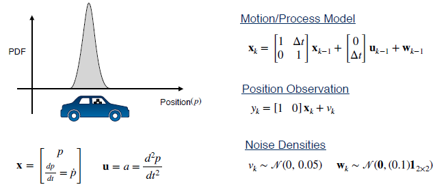

Given this initial estimate and our data, what is our corrected position estimate after we perform one prediction step and one correction step using the Kalman filter? Here's, how we can use these definitions to solve for our corrected position and velocity estimates. 

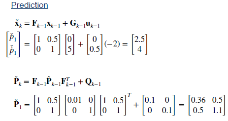

Pay attention to the fact that our final corrected state covariance is smaller. That is we are more certain about the car's position after we incorporate the position measurement. 

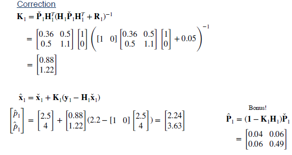

This uncertainty reduction occurs because our measurement model is fairly accurate. That is, the measurement noise variance is quite small. Try increasing the measurement variance and observe what happens to the final state estimate. 

---

### 7. Summary

> 进一步了解可参考[博客](https://www.cnblogs.com/leexiaoming/p/6852483.html)

To summarize, the Kalman filter is similar to recursively squares, but also adds a motion model that defines how our state evolves over time. The Kalman filter works in two stages: 

First, predicting the next state using the motion model, and second, correcting this prediction using a measurement. But how can we be sure that the Kalman filter is giving us an accurate state estimate? In the next video, we'll discuss a few appealing theoretical properties of the Kalman filter that have made it such a staple in the engineering field.

---

## Lesson 2: Kalman Filter and The Bias BLUEs

Now, we've introduced the Kalman Filter, let's discuss little bit about what makes it such an appealing estimation method. By the end of this lesson, you'll be able to define a few terms that are important in state estimation. 

- **Define bias**
- **Define consistency**
- **Explain why the Kalman filter is the Best Linear Unbiased Estimator(BLUE)**

---

### 1. Bias in State Estimation

Let's dive in. First, let's discuss bias. Let's consider our Kalman Filter from the previous lesson and use it to estimate the position of our autonomous car. If we have some way of knowing the true position of the vehicle, for example, an oracle tells us, we can then use this to record a position error of our filter at each time step k. Since we're dealing with random noise, doing this once is not enough. We'll need to repeat this same process over and over and record our position error at each time step(由于我们处理的是随机噪声，这样做一次是不够的。 我们需要反复重复这个过程，并在每个时间步记录我们的位置错误) 

Once we've collected these errors, if they average to zero at a particular time step k, then we say the Kalman Filter estimate is unbiased at this time step. 

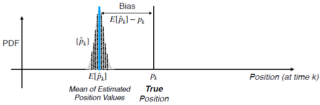

Graphically, this is what the situation may look like. Say the particular time step, we know that the true position is the following. We build a histogram of the positions that our filter reports over multiple trials, and then compute the difference between the average of these estimates and the true position. If this difference does not approach zero, then our estimate is biased. However, if this difference does approach zero as we repeat this experiment many more times, and if this happens for all time intervals, then we say that our filter is unbiased. 

This filter is an unbiased if for all k
$$
E\left[\hat{e}_{k}\right]=E\left[\hat{p}_{k}-p_{k}\right]=E\left[\hat{p}_{k}\right]-p_{k}=0
$$
Although we could potentially verify this lack of bias empirically, what we'd really like are some theoretical guarantees. Let's consider the error dynamics of our filter. 

- Predicted state error：$\check{\mathbf{e}}_{k}=\check{\mathbf{x}}_{k}-\mathbf{x}_{k}$
- Corrected estimate error : $\hat{\mathbf{e}}_{k}=\hat{\mathbf{x}}_{k}-\mathbf{x}_{k}$

Defining our predicted and corrected state errors, we can then use the common filter equations to write the following relations. 
$$
\begin{aligned} \check{\mathbf{e}}_{k} &=\mathbf{F}_{k-1} \check{\mathbf{e}}_{k-1}-\mathbf{w}_{k} \\ \hat{\mathbf{e}}_{k} &=\left(\mathbf{1}-\mathbf{K}_{k} \mathbf{H}_{k}\right) \check{\mathbf{e}}_{k}+\mathbf{K}_{k} \mathbf{v}_{k} \end{aligned}
$$
For the Kalman Filter, we can show the expectation value of these errors is equal to zero exactly. For this to be true, we need to ensure that our initial state estimate is unbiased and that our noise is white, uncorrelated, and zero mean. 

While this is a great result for linear systems, remember that this doesn't guarantee that our estimates will be error free for a given trial, only that the expected value of the error is zero. 

---

### 2. Consistency in State Estimation

Kalman Filters are also what is called consistent. By consistency we mean that for all time steps k, the filter co-variants $P_k$ matches the expected value of the square of our error. 

For scalar parameters, this means that the empirical variance of our estimate should match the variance reported by the filter. 

The filter is consistent if for all k,
$$
E\left[\hat{e}_{k}^{2}\right]=E\left[\left(\hat{p}_{k}-p_{k}\right)^{2}\right]=\hat{P}_{k}
$$
Practically, this means that our filter is neither overconfident, nor underconfident in the estimate it has produced. A filter that is overconfident, and hence inconsistent, will report a covariance that is optimistic. That is, the filter will essentially place too much emphasis on its own estimate and will be less sensitive to future measurement updates, which may provide critical information. 

One can also show (with more algebra!) that for all k,
$$
E\left[\mathbf{è}_{k} \check{\mathbf{e}}_{k}^{T}\right]=\check{\mathbf{P}}_{k} \quad E\left[\hat{\mathbf{e}}_{k} \hat{\mathbf{e}}_{k}^{T}\right]=\hat{\mathbf{P}}_{k}
$$
Consistent predictions !

Provided,
$$
E\left[\hat{\mathbf{e}}_{0} \hat{\mathbf{e}}_{0}^{T}\right]=\check{\mathbf{P}}_{0} \quad E[\mathbf{v}]=\mathbf{0} \quad E[\mathbf{w}]=\mathbf{0}
$$
It's easy to see how an overconfident filter might have a negative or dangerous effect on the performance of self-driving car. Showing the consistency property formally is outside of the scope of the course. You can take my word that it is indeed true for a common filter. So long as our initial estimate is consistent, and we have white zero mean noise, then all estimates will be consistent. 

---

### 3. The Kalman Filter is the BLUE | Best Linear Unbiased Estimator

Putting everything together, we've shown that given white uncorrelated zero mean noise, the Kalman Filter is unbiased and consistent. 

In general , if we have white ,uncorrelated zero-mean noise ,the Kalman filter is the best (i,e.., lowest variance ) unbiased estimator that uses only a linear combination of measurements

Because of these two facts, we say that the Kalman Filter is the BLUE, the best linear unbiased estimator. It produces unbiased estimates with the minimum possible variance. 

---

### 4. Summary

To summarize, in this lesson we've defined the terms bias and consistency, and showed that the Kalman Filter is unbiased, consistent, and the Best Linear Unbiased Estimator, or BLUE. Remember that best here refers to the fact that the Kalman Filter minimizes the state variance. Although this is a fantastic result, most real systems are not linear. For self-driving cars, we'll generally need to estimate non-linear quantities like vehicle poses, position, and orientation in 2D and 3D. To do this, we'll need to extend the linear Kalman Filter into the non-linear domain. We'll do this in the next lesson.

---

## Lesson 3 - Going Nonlinear - The Extended Kalman Filter

So far in this module, you've learned how to use the linear Kalman filter for state estimation and you also saw that the Kalman filter is the best linear unbiased estimator or blue. However, the linear Kalman filter cannot be used directly to estimate states that are nonlinear functions of either the measurements or the control inputs. For example, the pose of the car includes its orientation which is not a linear quantity, orientations in 3D live on a sphere, in fact. So, we need to look for something else. In this video, we'll be learning about one important and widely used variation of a Kalman filter called the Extended Kalman Filter or EKF. 

The EKF is designed to work with nonlinear systems and it's often considered one of the workhorses of state estimation because it's used in all sorts of applications including self-driving cars. By the end of the video, you'll be able to 

- **Describe how the EKF uses first-order linearization to turn a nonlinear problem into a linear one**
- **Understand the role of Jacobian matrices in the EKF and how to compute them**
- **Apply the EKF to a simple nonlinear tracking problem.** 

---

### 1. Recap | The Linear Kalman Filter

The filter works by first predicting the mean and co-variance of the updated state estimate at some time step k based on the previous state and any inputs we give to the system, such as the position of the accelerator pedal. 

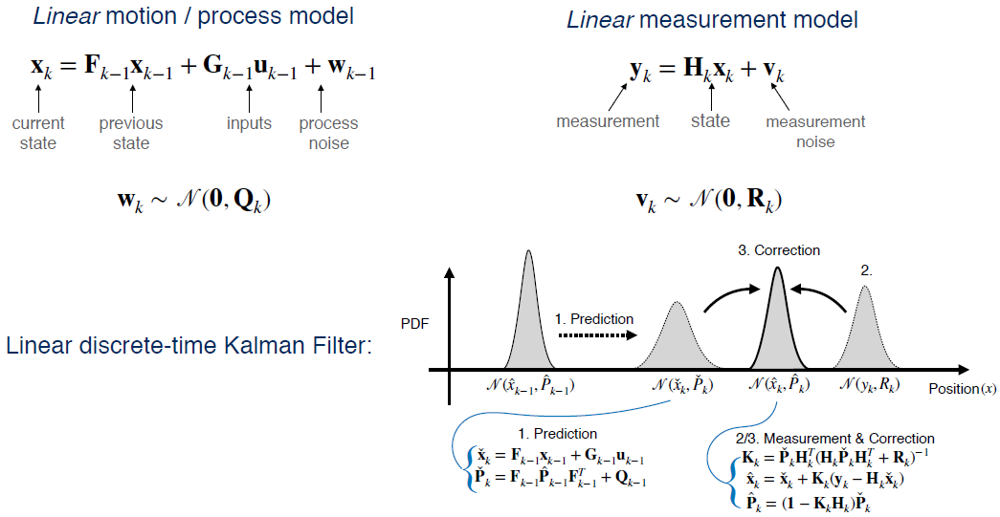

The filter then uses a measurement model to predict what measurements should arrive based on the state estimate and compares these predictions with the measurements that actually arrive from our sensors. **The Kalman gain tells us how to weight all of these pieces of information**, so that we can optimally combine them into a corrected estimate, that is, a new state and an updated co-variance. This is sometimes called a predictor-corrector architecture. 

---

### 2. Nonlinear Kalman Filtering

As we saw in the last video, the Kalman filter is actually the best of all possible estimators for linear systems. Unfortunately, there is a catch. Linear systems don't exist in reality. Even a very simple system like a resistor with a voltage applied isn't truly linear, at least not all the time. 

For a certain range of voltages, the current is a linear function of the voltage and follows Ohm's Law. But as the voltage gets higher, the resistor heats up which alters the resistance in a nonlinear way. Since the systems that we encounter in practice are nonlinear, this raises an important question. Can we still use the Kalman filter for nonlinear systems? If so, how? 

---

### 3. EKF | Linearizing a Nonlinear System

> 进行一阶泰勒公式展开

The key concept in the Extended Kalman Filter is **the idea of linearizing a nonlinear system.** 

For this reason, the EKF is sometimes referred to as the Linearized Kalman filter. Linearizing a system just means picking some operating point a and finding a linear approximation to the nonlinear function in the neighborhood of a. In two dimensions, this means finding the tangent line to the function f of x when x equals a. 

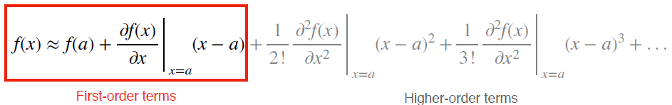

Mathematically, we do this by taking the Taylor series expansion of the function. Thinking back to your calculus courses, you may remember that the Taylor series expansion is a way of representing a function as an infinite possibly, some whose terms are calculated from the function's derivatives at a single point. **For linearization, we're only interested in the first order terms of the Taylor series expansion highlighted in red.** Let's return to our general nonlinear motion and measurement models and try to linearize them. 

> 对于EKF，我们选择上一个最优状态估计（即近似平均值）进行线性化。

What should we choose as the operating point for our Taylor's expansion? Ideally, we would like to linearize the models about the true value of the state but we can't do that because we already knew the true value of the state, we wouldn't need to estimate it. So instead, let's pick the next best thing, the most recent estimate of the state. 

For our emotion model, we'll linearize about the posterior estimate of the previous state and for the measurement model, we'll linearize about our prediction of the current state based on the motion model.

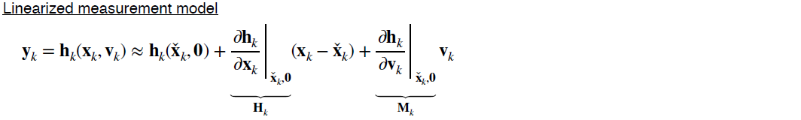

So, now we have a linear system in state space and the matrices $\mathrm{F}_{k-1}, \mathrm{L}_{k-1}, \mathrm{H}_{k,} \text { and } \mathrm{M}_{k}$ are called Jacobian matrices of the system. Computing these matrices correctly is the most important and difficult step in the Extended Kalman filter algorithm, and it's also the most common place to make mistakes. But what are these Jacobian matrix exactly? 

---

### 4. EKF | Computing Jacobian Matrices

> 假设有n维输入，m维输出，则雅克比矩阵维度是m*n。

In vector calculus, a Jacobian or Jacobian matrix is the matrix of all first-order partial derivatives of a vector valued function. 
$$
\frac{\partial \mathbf{f}}{\partial \mathbf{x}}=\left[ \begin{array}{ccc}{\frac{\partial \mathbf{f}}{\partial x_{1}}} & {\cdots} & {\frac{\partial \mathbf{f}}{\partial x_{n}}}\end{array}\right]=\left[ \begin{array}{ccc}{\frac{\partial f_{1}}{\partial x_{1}}} & {\cdots} & {\frac{\partial f_{1}}{\partial x_{n}}} \\ {\vdots} & {\ddots} & {\vdots} \\ {\frac{\partial f_{m}}{\partial x_{1}}} & {\cdots} & {\frac{\partial f_{m}}{\partial x_{n}}}\end{array}\right]
$$
Each column of the Jacobian contains the derivatives of the function outputs with respect to a given input. For example, if your function takes a three-dimensional vector and spits out a two-dimensional vector, the Jacobian would be a two by three matrix. Intuitively, the Jacobian matrix tells you how fast each output of your function is changing along each input dimension, just like how the derivative of a scalar function tells you how fast the output is changing as you vary the input. The Jacobian is really just a generalization of the first derivative to multiple dimensions. Here's a simple example of the Jacobian of a two-dimensional function with two inputs. 
$$
\mathbf{f}(\mathbf{x})=\left[ \begin{array}{c}{f_{1}} \\ {f_{2}}\end{array}\right]=\left[ \begin{array}{c}{x_{1}+x_{2}} \\ {x_{1}^{2}}\end{array}\right] \quad \rightarrow \quad \frac{\partial \mathbf{f}}{\partial \mathbf{x}}=\left[ \begin{array}{cc}{\frac{\partial f_{1}}{d x_{1}}} & {\frac{\partial f_{1}}{\partial x_{2}}} \\ {\frac{\partial f_{2}}{d x_{1}}} & {\frac{\partial f_{2}}{\partial x_{2}}}\end{array}\right]=\left[ \begin{array}{cc}{1} & {1} \\ {2 x_{1}} & {0}\end{array}\right]
$$
The Jacobian matrix captures the first derivatives of each of the two output variables with respect to each of the two input variables. The best way to get comfortable with driving Jacobian is just practice. Try deriving the Jacobian of this vector valued function. 

---

### 5. EKF | Putting It All Together

Now, we know how to compute the Jacobian matrices needed for the EKF, and all that's left is to plug them into our standard Kalman filter equations. 

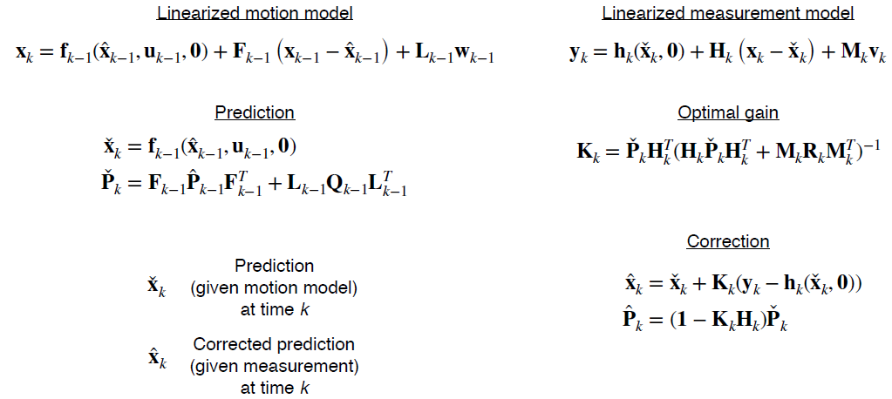

There are a couple of differences to notice in the EKF equations compared to the Kalman filter equations we saw in module two. First, in the prediction and correction steps, we're still using the nonlinear models to propagate the mean of the state estimate and to compute the measurement residual or innovation. That's because we linearized our motion model about the previous state estimate, and we linearized the measurement model about the predicted state. By definition, the linearized model exactly coincides with the nonlinear model at the operating points. The second difference is the appearance of the L and M Jacobians related to the process and measurement noise. In many cases, both of these matrices will be identity since noise is often assumed to be additive but this is not always the case. So far, this has all been very abstract. 

So, let's walk through a concrete example of actually using the EKF. 

We'll use the same example from module two but with a twist. We're going to track the position and velocity of a car moving along a rail. But now, instead of receiving periodic GPS measurements that tell us our position, we're going to use an on-board sensor like a camera to measure the altitude of distant landmarks relative to the horizon. We'll keep the same linear motion model as in the original example, and assume we know both the height of the landmark and its position in a global reference frame. Because our sensor is measuring an angle, our measurement model has a nonlinear dependence on the position of the car. We're going to need to linearize the measurement model and use it in our Extended Kalman Filter. 

The Jacobians for this problem look like this. Notice that the F matrix in this problem is exactly the same as the F matrix in the original problem. That's because our motion model is already linear in the state. Also notice that the noise Jacobians, L and M, are both identity since both the emotion and the measurement model have additive noise. 

Try using the data given here to estimate the position of the vehicle at time one using the EKF. 

Here is the result of the prediction step for the mean and co-variance of the state. 

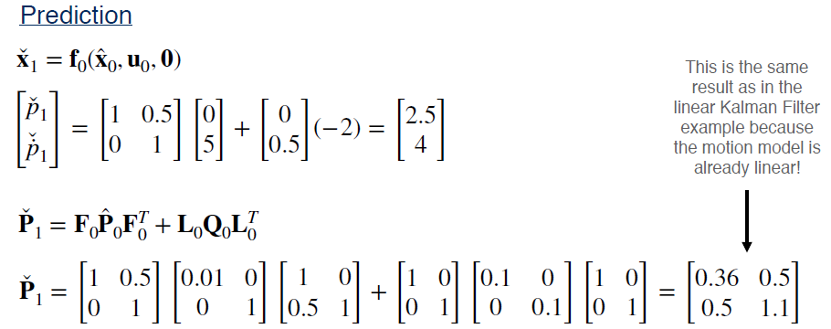

Notice that the result is identical to the linear Kalman filter case because the motion model actually is linear. For the correction step, this is what you should get. Keep in mind that you should use the nonlinear measurement model to compute the measurement residual, not the linearized model. Also note that in this case, even though the corrected mean at the state estimate is different from the predicted mean, the corrected co-variance didn't change that much from the predicted co-variance. 

This is because the Azimuth angle changes slowly at this distance and doesn't provide much information about the vehicle state compared to a GPS measurement. 

---

### 6. Summary

So, to recap

- The EKF uses linearization to adapt the Kalman filter to nonlinear systems
- Linearization works by computing a local linear approximation to a nonlinear function about a chosen operating point
- Linearization relies on computing Jacobian matrices, which contain all the firstorder partial derivatives of a function

In the next video, we'll discuss an alternative formulation of the EKF called the error state Extended Kalman Filter. This would be a useful tool later in the course when we talk about estimating the vehicle orientation in 3D space.

---

## Lesson 4 - An Improved EKF : The Error State Extended Kalman Filter

In the last video, we introduced the Extended Kalman Filter, which uses local linearization as a way to allow us to apply the Kalman filter equations to non-linear systems. In this video, we're going to look at a variant of the EKF called the Error-State Extended Kalman Filter, or ES-EKF, which has a couple of nice properties that will come in handy later in the course. By the end of this video, you'll be able to 

- **Describe the error state formulation of the Extended Kalman Filter**
- **Describe the advantages of the error state EKF over the vanilla EKF**

---

### 1. What's in a State

The idea behind the error state EKF is really very simple. We're going to start thinking about our vehicle state, x, as being composed of two parts; a large part called the nominal state, x hat, and a small part called the error state, Delta x. 

We can think of a simple example of tracking the position of a car over time. The green line shows the true position of the car, which is the quantity we're trying to estimate. The red line is the nominal state, or our best guess what the true state could be based on what we know about the car's motion model and acceleration and breaking inputs. 

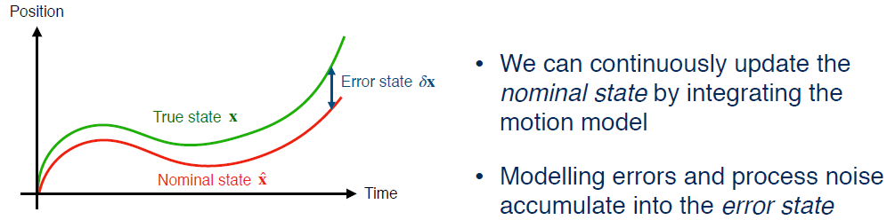

Of course, our motion model is never perfect, and there is always some random process noise. These errors build up over time as we integrate the motion model. We can think of the error state as the place where all of these modelling errors and process noise accumulate over time, so that the error state is just the difference between the nominal state and the true state at any given time. If we can figure out what the error state is, we can actually use it as a correction to the nominal state to bring us closer to the true state. 

---

### 2. The Error-State Extended Kalman Filter

So, in the error state EKF, instead of doing Kalman filtering on the full state which might have lots of complicated non-linear behaviors, we're going to use the EKF to estimate the error state instead, and then use the estimate of the error state as a correction to the nominal state. 

What this means mathematically is that we're going to rearrange our linearized motion model so that we now have an equation that can tell us how the difference between the true state at time, k, and our predicted state at time, k, is related to the same difference at time, k minus one. These differences are exactly the error states we just talked about; Delta x sub k and Delta x sub k minus one, and the equations relating them are called the error state kinematics. We can also re-express our linearized measurement model in terms of the error state directly. We can use this error state formulation of the EKF in a very similar way to the vanilla EKF. We start off by updating the nominal state using the non-linear motion model and our current best estimate of the state. 

We could do this a bunch of times before ever getting a measurement for the correction step. So, the current best estimate might be x check or x hat. We also need to keep track of the state covariance, which grows as we integrate more and more process noise from the motion model. Note that again, the previous covariance estimate could be P check or P hat depending on whether we used a measurement to do a correction step. 

We can repeat the loop updating the nominal state and the error state covariance for as long as we like until we receive the measurement and want to do a correction. 

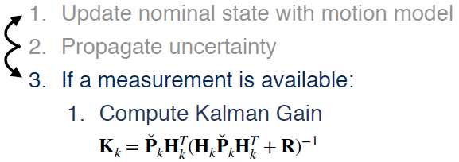

When this happens, we can compute the Kalman gain as usual, and then compute the best estimate of the error state using the Kalman gain, the measurement, and our nonlinear measurement model. 

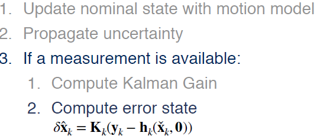

Now, here's where things are little different. Once we have an estimate for the mean of the error state, we want to use this to update the nominal state and correct the error. We can do that by just adding our estimate of the error state to the nominal state to get the correct state estimate for the full state. 

Finally, we can update the state covariance using the usual equations. 

That's it. This process goes on forever, or at least until the vehicle runs out of gas. 

---

### 3. Why Use the ES-EKF?

So, why would we actually want to use the error state EKF in practice? Well, there are two good reasons to use it. 

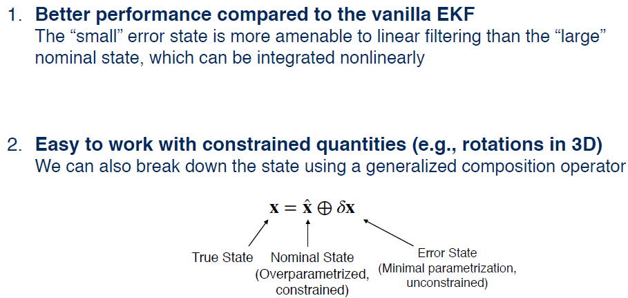

One reason is that it can often work better than the vanilla EKF because the small error state is more amenable to linear filtering than the large nominal state, which we can integrate non-linearly.  The other reason is that the error state formulation makes it much easier to work with constrained quantities like rotations, which will come in handy a bit later in the course. The reason for this is that we don't necessarily have to use plane vector addition to break down the state. In fact, we could use any generalized composition operation we like as long as it gives us a consistent way of incorporating small perturbations into the nominal state.If this all sounds a bit abstract right now, don't worry. Later in the course, we'll use the error state EKF to help us deal with rotations in 3D space, which are a very common type of constraint quantity. 

---

### 4. Summary | The Error-State EKF (ES-EKF)

> - **The error-state formulation separates the state into a “large” nominal state and a “small” error state.**
>
> - **The ES-EKF uses local linearization to estimate the error state and uses it to correct the nominal state.**
>
> - **The ES-EKF can perform better than the vanilla EKF, and provides a natural way to handle constrained quantities like rotations in 3D.**

The error state formulation of the EKF separates the vehicle state into a large nominal state and a small error state. The nominal state keeps track of what the motion model predicts the states should be, while the error state captures the modelling errors and process noise that accumulate over time. In the error state EKF, we estimate this small error state and use it as a correction to the nominal state. This is the main difference between the error state EKF and the vanilla EKF, which estimates the full state. Keep in mind that both formulations still rely on local linearization. The error state EKF has a couple of advantages over the vanilla EKF. 

The first is that it simply performs better because the evolution of the error state tends to be closer to linear. The other is that the error state formulation makes it easier to handle special quantities like 3D rotations as we'll see later in the course. 

In the next video, we'll discuss some of the shortcomings of the EKF, and how local linearization can break down creating a potentially dangerous situation for a self-driving car.

---

## Lesson 5 - Limitations of the EKF

In the last two videos, we learned about the extended Kalman filter or EKF and how we can use it to adapt the linear Kalman filter to non-linear systems. While the EKF works well for many practical problems, there are some important limitations to keep in mind when deciding if the EKF is the right algorithm for you. In this video, we'll discuss some of these limitations. 

---

### 1. Limitations of the EKF | Linearization error

Recall that the EKF works by linearizing our systems non-linear motion and observation models to update both the mean and covariance of our state estimate.

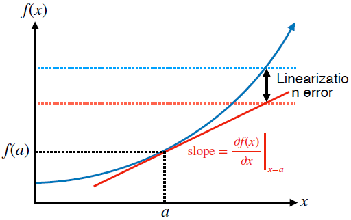
$$
f(x) \approx f(a)+\left.\frac{\partial f(x)}{\partial x}\right|_{x=a}(x-a)
$$
A linearized model is just a local linear approximation of the true non-linear model. We call the difference between the approximation and the true model, the linearization error. In general, the linearization error for any function depends on two things. 

The first thing is how non-linear the original function is to begin with. If our nonlinear function very slowly or is quite flat much of the time, linear approximation is going to be a pretty good fit. On the other hand, if the function varies quickly, linear approximation is not going to do a great job of capturing the true shape of the function over most of its domain. 

The second thing linearization error depends on is how far away from the operating point you are. The further away you move from the operating point, the more likely the linear approximation is to diverge from the true function. These properties of linearization error have important implications for the EKF. So, let's look at an example of how linearization error affects the mean and covariance of two random variables transformed by a common pair of non-linear functions. Specifically, let's look at the non-linear transformation from polar coordinates r and Theta to Cartesian coordinates, x and y. This kind of transformation is commonly used to work with laser scanners or LIDARs, to report range and bearing measurements, just as the scanners on many self-driving cars do. 

---

### 2. Linearization Error | Example

Let's take a number of samples from a uniform distribution over an interval of polar coordinates and consider what happens when we transform the samples into Cartesian coordinates. To illustrate what this looks like, we've plotted the random samples from the uniform distribution as blue dots you see on the left. 

When we transform each of these sample points into the corresponding Cartesian coordinates, we see that the transform distribution takes on a banana shape, shown on the right. Clearly, the shape of the banana distribution is not captured completely by using a mean and a covariance only. But let's see what happens to the mean and covariance of the original PDF. 

In the left-hand plot, the true mean of the uniform distribution is shown as the green dot in the middle, and the true covariance is represented by the green ellipse. After transforming the uniform distribution into Cartesian coordinates, the mean of the output distribution ends up here, and its covariance looks like this. Now, consider what happens if we linearize the polar to Cartesian transformation about the mean of the original distribution and then transform all the sample points again. The linearized transformation gives us an output distribution that looks like another uniform distribution and bears almost no resemblance to the banana-shaped distribution we saw before. 

If we look at the mean of this distribution, represented by a red dot, it lands somewhere up here, and the linearized covariance looks quite different as well. Let's compare the linearized and non-linear output distributions. You can see that the mean of the linearized distribution is in a very different place from the true mean, and the linearized covariance seriously underestimates the spread of the true output distribution along the y dimension. 

So, in this case, we can see that linearization error can cause our belief about the output distribution to completely miss the mark, and this can cause big problems in our estimator. For example, the estimated position of lane markers produced from a laser scanner might differ significantly from the actual positions, leading our car to drive over the center line. 

---

### 3. Limitations of the EKF | Linearization Error

> The EKF is prone to linearization error when
> 1. **The system dynamics are highly nonlinear**
> 2. **The sensor sampling time is slow relative how fast the system is evolving**

So when is linearization a problem for the EKF? There are two situations to watch out for. The first is when your system dynamics are highly nonlinear. If your emotion and measurement models are close to linear, linearization error won't be a big problem. But if they're not, your linearized estimator won't do a good job of capturing the true behavior of the system. The second situation is related to how far away from the operating point you're trying to use the linearized model. For self-driving cars moving very fast relative to the sampling time of your sensors, you're going to get more linearization error than if it's moving slowly. 

> Two important consequences:
> 1. **The estimated mean state can become very different from the true state**
> 2. **The estimated state covariance can fail to capture the true uncertainty in the state**

Mathematically speaking, there are two important consequences of linearization error in the EKF, both of which we saw in the previous example. One is that the estimated mean can become very different from the true state, and the other is that the estimated covariance may not accurately capture the true uncertainty in the state. **In other words, this means that linearization error can cause our estimator to be overconfident in a completely wrong answer.** 

In the worst case, the estimator may diverge, that is, become completely lost and fail to provide useful output. Worse, once an estimator such as the EKF has diverged, it can't be pulled back on track. Often, you're forced to re-initialize if you can. This is a huge problem for safety when we're dealing with self-driving cars. If your car's estimator diverges while driving, it could easily drive off the road into a ditch or cause a collision with another vehicle. 

---

### 4. Limitations of the EKF | Computing Jacobians

> Computing Jacobian matrices for complicated nonlinear functions is also a common source of error in EKF implementations!
>
> - **Analytical differentiation is prone to human error**
> - **Numerical differentiation can be slow and unstable**
> - **Automatic differentiation (e.g., at compile time) can also behave unpredictably**

So, linearization error is the main theoretical limitation of the EKF. But there are other common problems that we will encounter in our implementations. Probably the most common problem in practice is that it's very easy to make mistakes when we compute Jacobian matrices, especially if we're dealing with a complicated nonlinear system. I cannot tell you the number of times my students and I have missed a minus sign while deriving a Jacobian. This can lead to many many hours of debugging. Some people try to get around this problem by using numerical differentiation at runtime or automatic differentiation at compile time. But these had their own pitfalls and can sometimes behave unpredictably. 

On top of that, what happens if one or more of our models isn't even differentiable, like the step function response of a stepper motor. All of these drawbacks lead us to a question: Do we really need linearization to do nonlinear Kalman filtering? 

---

### 5. Summary | Limitations of the EKF

To summarize this video, the extended Kalman filter has several limitations based on its use of analytical local linearization. If the dynamics of the system being modeled are highly non-linear or the linearization error is large, the filter may diverge. The EKF requires Jacobian matrices to be computed which is often a tedious and error-prone process. Nonetheless, the EKF is a proven tool for state estimation and you will no doubt encounter it often as a self-driving car engineer. In the next video, we'll discuss another common filter variant called the unscented Kalman filter, which largely addresses these limitations of the EKF.

---

## Lesson 6 - An Alternative to the EKF : The Unscented Kalman Filter

In the previous video, we saw how linearization error can cause the EKF to produce state estimates that are very different from the true value of the state and covariances that don't accurately capture the uncertainty in the state. This can be a big problem when we're relying on the EKF in safety critical applications like self-driving cars. 

In this lesson, you'll learn about the unscented common filter, which is an alternative approach to non-linear common filtering that relies on something called the unscented transform to pass probability distributions through nonlinear functions. As we'll see, the unscented transform gives us much higher accuracy than analytical EKF style linearization for a similar amount of computation, and without needing to compute any Jacobians. So by the end of this video you'll be able to 

- **Use the unscented transform to pass a probability distribution through a nonlinear function**

- **Describe how the Unscented Kalman Filter or UKF uses the unscented transform in the prediction and correction steps**

- **Explain the advantages of the UKF over the EKF**

- **Apply the UKF to a simple nonlinear tracking problem.** 

---

### 1. The Unscented Transform

The intuition behind the unscented transform is simple. It's typically much easier to approximate a probability distribution than it is to approximate an arbitrary nonlinear function. 

*“It is easier to approximate a probability distribution than it is to approximate an arbitrary nonlinear function” — S. Julier, J. Uhlmann, and H. Durrant-Whyte (2000)*

Let's think about a simple example where a 1D Gaussian distribution like the one on the left gets transformed through nonlinear function into a more complicated 1D distribution like the one on the right. 

We already know the mean and the standard deviation of the input Gaussian and we want to figure out the mean and standard deviation of the output distribution using this information and the nonlinear function. The unscented transform gives us a way to do this. The basic idea in the unscented transform has three steps. 

First, we choose a set of sample points from our input distribution. Now these aren't random samples, they're deterministic samples chosen to be a certain number of standard deviations away from the mean. For this reason, these samples are called sigma points, and the unscented transform is sometimes called the sigma point transform. 

Once we have our set of carefully chosen sigma points, the second and easiest step is to pass each sigma point through our nonlinear function, producing a new set of sigma points belonging to the output distribution. 

Finally, we can compute the sample mean and covariance of the output sigma points with some carefully chosen weights, and these will give us a good approximation of the mean and covariance of the true output distribution. Now that you've seen the basic idea of the unscented transform, let's look at each of these steps in detail. The first thing you might be wondering is how many sigma points do we need and which points are, in fact, sigma points? 

---

### 2. The Unscented Transform | Choosing Sigma Points
In general, for an n dimensional probability distribution, we need 2n+1 sigma points, one for the mean and the rest symmetrically distributed about the mean. The diagrams in the left show the sigma points for one dimensional and two dimensional examples. In 1D we need three sigma points and in 2D we need five. 

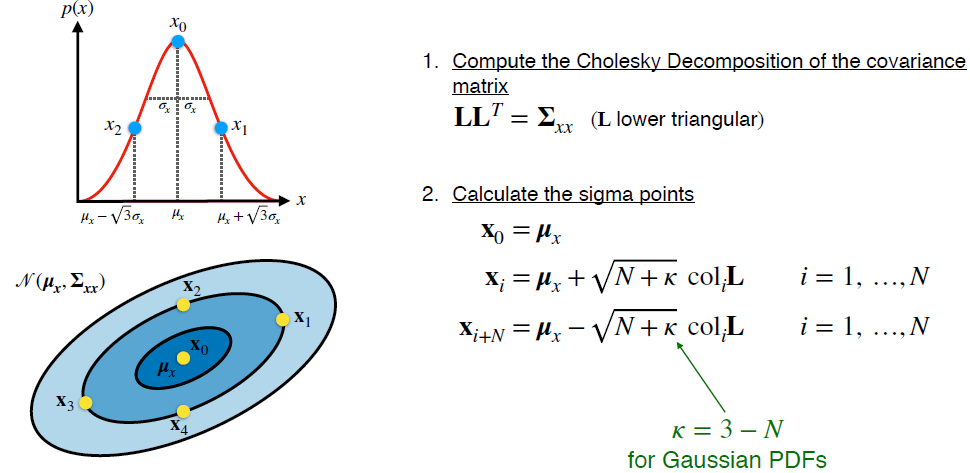

The first step in determining where the sigma point should be is taking something called the Cholesky decomposition of the covariance matrix associated with the input distribution. A Cholesky decomposition is basically a square root operation that operates on symmetric positive definite matrices, such as covariance matrices. In fact, if the input PDF is one dimensional the Cholesky decomposition really is just the square root of the variants, which is also known as the standard deviation. We won't go into the details of how to
compute a Cholesky decomposition but you can use the chole function in MATLAB or the Cholesky function in NumPy. 

Once we've decomposed the covariance matrix, we can choose our first sigma point to be the mean of the distribution and the remainder to be the mean plus or minus some factor times each column of the matrix L that we got from the cholesky decomposition. The value of N here again is a number of dimensions of the probability distribution. The parameter capa is a tuning parameter that you're free to set yourself. For Gaussian distributions, which is what we'll be working with, setting N plus capa equal to 3 is a good choice. 

---

### 3. The Unscented Transform | Transforming and Recombining
Okay, so now we have our set of sigma points. The next step is straightforward. Just pass each of the sigma points through our nonlinear function h(x) to get a new set of transformed sigma points. 
$$
\mathbf{y}_{i}=\mathbf{h}\left(\mathbf{x}_{i}\right) \quad i=0, \ldots, 2 N
$$
Now all that's left is to recombine the transformed sigma points to find our output mean and output covariance. 

We do this using the standard formulas for the sample means and covariance that you would have seen in your introductory statistics courses. The trick is that each of the points gets a specific weight in the mean and covariance calculations, and that weight depends on the parameter kappa and the dimension of the input distribution N. And that's really all there is to it. 

---

### 4. The Unscented Transform vs. Linearization

To see the unscented transform in action, lets come back to our example of the previous video where we nonlinearly transformed a uniform distribution in polar coordinates into Cartesian coordinates, and let's see how the unscented transform compares to the analytical linearization approach. So here, again, we have the true mean and covariance of the two distributions in green. 

Now let's apply the unscented transform. The dimension of our input distribution is two, so we need five sigma points which we've shown as orange stars. Passing these sigma points through our nonlinear function puts them here. And the mean and covariance we compute from the transformed sigma points look like this shown in orange. Note that our estimate for the mean using the unscented transform is almost exactly the same as the true nonlinear mean and our estimate for the covariance almost exactly matches the true covariance. 

Compare that to the analytically linearized transform mean and covariance in red, which are both very different from the true mean and true covariance. It's easy to see from this example that the unscented transform gives us a much better approximation of the output PDF without requiring much more work than the analytical linearization approach. 

---

### 5. The Unscented Kalman Filter (UKF)

Now that we've seen how the unscented transform works, we can easily use it in our Kalman Filtering framework to work with nonlinear models. 

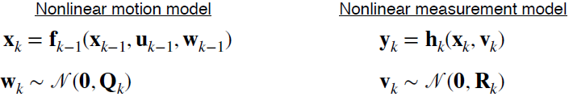

This variant of the common filter is called the Unscented Kalman Filter or UKF. You may also hear it called the sigma point common filter. The main idea of the UKF is that instead of approximating the system equations by linearizing them like the EKF does, we use the unscented transform to approximate the PDFs directly. Let's look at the prediction step of the UKF. 

#### 5.1 Prediction step

To propagate the state and covariance through the motion model from time k-1 to time k, we apply the unscented transform using the current best guess for the mean and covariance of the state. 

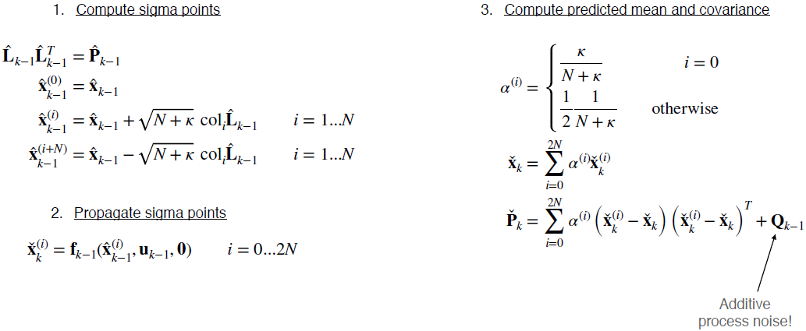

First, we decompose the estimated state covariance from time k- 1, then we calculate our sigma points centered around the estimated means state from time k- 1. Second, we propagate our sigma points through our nonlinear motion model to get a new set of sigma points for the predicted state at time k. And finally, we calculate the predicted mean and covariance for the state at time K. At this point it's important to account for the process noise by adding its covariance to the covariance of the transformed sigma points to get the final predicted covariance. 

This equation looks a bit different if the process noise is not additive, but most of the time you will be dealing with additive noise in your models unless there is a good reason not to. 

#### 5.2 Correction step

For the correction step, we're going to follow a similar procedure, this time with a non-linear measurement model. 

First, we will need to redraw our sigma points using the predicted covariance matrix. We need to do this a second time because we added process noise at the end of the last step, and this will modify the positions of some of the sigma points. 

Next, we're going to plug these new sigma points one by one into our nonlinear measurement model to get another set of sigma points for the predicted measurements, then we can estimate the mean and covariance of the predicted measurements using the sample mean and covariance formulas. Again, take note that we’re adding in the measurement noise covariance to get the final covariance of the predicted measurements, and also remember that this formula only applies to additive noise. To compute the common gain, we’re also going to need the cross covariance between the predicted state and the predicted measurements, which tells us how the measurements are correlated with the state. 

You can calculate this using the standard formula for the cross covariance and using the same weights as before. Then all that's left is to use the Kalman gain to optimally correct the mean and covariance of the predicted state. And that's it! The UKF follows the same prediction correction pattern as the EKF, but we've just replaced the analytical linearization step with the unscented transform. 

#### 5.3 Short Example

Let's try applying the UKF to the same example driving scenario we worked through with the EKF. We're again trying to track the position and velocity of a moving car that we're controlling by pressing on the gas pedal or the brake. 

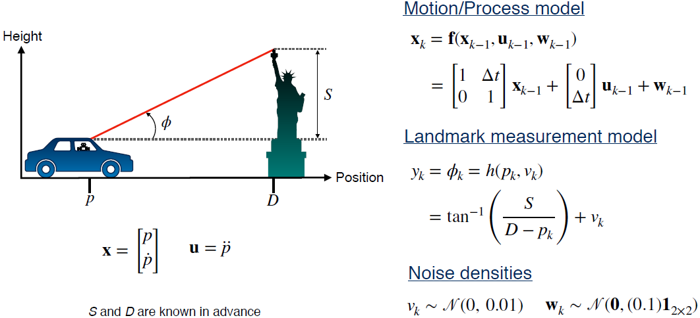

The car has a sensor on board that measures the angle between a distant landmark and the horizon. The motion model is linear but the measurement model is nonlinear. Try using the data given here to estimate the position of the vehicle at time one, using the UKF. 

Here is the Cholesky decomposition of the initial covariance matrix and the five sigma points we'll use to represent the state and its covariance. 

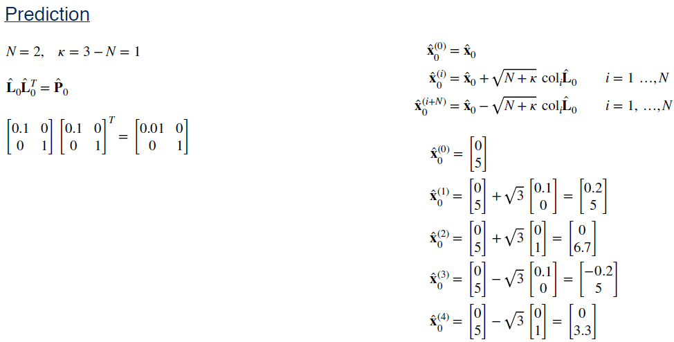

And here is the result of the prediction step for the mean of the state. 

And finally, the predicted covariance. 

Notice that the predicted mean and covariance are identical to what we would've found with the linear common filter and the extended common filter. This is because the motion model actually is linear. For the correction step, these are the sigma points for the predicted measurements and the mean and covariance of that distribution. 

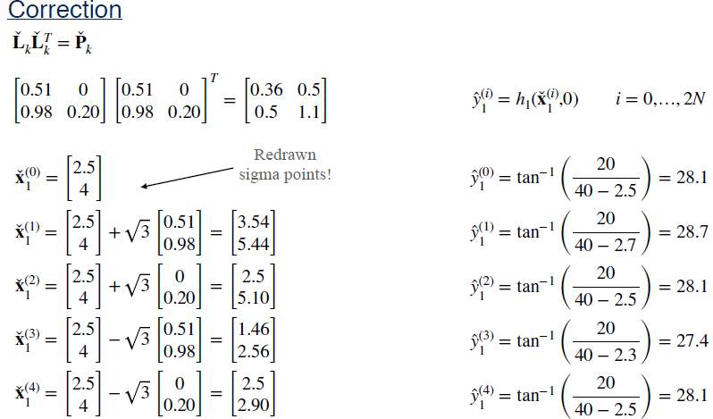

And finally, the cross covariance, common gain, and our final answer for the position of the vehicle at time k = 1. 

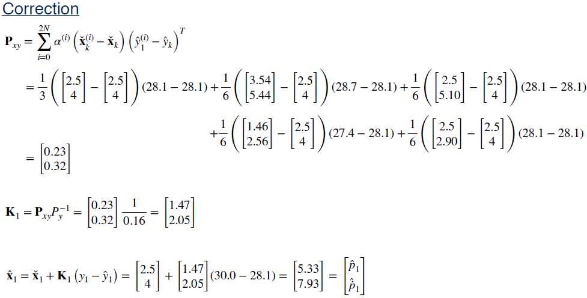

---

### 6. Summary

To summarize this video, we looked at the Unscented Kalman Filter or UKF, which uses the unscented transform to adapt the Kalman filter to nonlinear systems. As we saw, the unscented transform works by passing a small set of carefully chosen samples through a nonlinear system, and computing the mean and covariance of the outputs, and it often does a much better job of approximating the output distribution than the local analytical linearization technique used by the EKF for similar computational cost. 

---

## Module Summary

Let's recap what we learned in this module. We started off by discussing the linear Kalman filter, which is a form of recursive least squares estimation that allows us to combine information from a motion model with information from sensor measurements to estimate the vehicle state. The Kalman filter follows a prediction correction architecture. The motion model is used to make predictions of the state, and the measurements are used to make corrections to those predictions. 

We also saw that the Kalman filter is the best linear unbiased estimator, or BLUE. That is, the Kalman filter is the best unbiased estimator that uses only a linear combination of measurements. But, of course, linear systems don't really exist in reality, so we needed to develop techniques for handling nonlinear systems. 

In this module, we looked at three different approaches to nonlinear Kalman filtering, the Extended Kalman Filter or EKF, the error state formulation of the EKF and the Unscented Kalman Filter or UKF. As we've discussed the main difference is that the EKF relies on local analytical linearization to propagate PDFs through nonlinear functions whether using the full state or the error state formulation. 

In contrast, the UKF relies on the unscented transform to handle nonlinear functions. For most systems that are only mildly nonlinear, the EKF will give accurate results, but the UKF will be more accurate in cases where linearization error is a problem for the EKF. The error state Kalman filter performs somewhere in-between. One of the biggest advantages of the UKF over any EKF formulation is that the UKF doesn't require you to compute any derivatives of your non-linear models, which can be prone to human error or numerical instability. Finally, in terms of speed, the EKF wins out by a small margin for typical estimation problems, but in general, the EKF and the UKF require very similar amounts of computation. Because of its accuracy and simplicity, we recommend using the UKF over the EKF whenever possible in your projects. 

If you must use the EKF, our advice is to use the error state formulation, be wary of linearization error, and take extra care to ensure your Jacobians are correct, a good mantra to repeat. 

Now that you've learned about the basic tools we need for state estimation, we can start thinking about the types of sensors we might find on a self-driving car and how we can use them to localize the vehicle. In the next module, we'll discuss one common pair of sensors, the inertial measurement unit or IMU and the global navigation satellite system, or GNSS. 