# Module 3: GNSS/INS Sensing for Pose Estimation

> 主要介绍了GPS和IMU两种感知传感器及其性能

To navigate reliably, autonomous vehicles require an estimate of their pose (position and orientation) in the world (and on the road) at all times. **Much like for modern aircraft, this information can be derived from a combination of GPS measurements and inertial navigation system (INS) data.** 

This module introduces sensor models for inertial measurement units and GPS (and, more broadly, GNSS) receivers; performance and noise characteristics are reviewed. The module describes ways in which the two sensor systems can be used in combination to provide accurate and robust vehicle pose estimates.

### 学习目标

- Explain the operation of the two most common sensors used for pose estimation in autonomous driving, inertial meaurement units and GNSS receivers.
- Understand the concept of coordinate acceleration and the fundamental equation of inertial navigation.
- Apply gyroscope and accelerometer measurement models in the context of navigation.
- Describe the process of trilateration and justify why four satellites must be visible to obtain a 3D position fix from a GPS (GNSS) receiver.
- Understand why ionospheric delays and multipath effects can degrade the performance of GPS.

---

## Lesson 1: 3D Geometry and Reference Frames

### 1. Introduction

Welcome to module three of our state estimation course. In this module, we're going to introduce you to two sensors that you can use to help localize our self-driving car. To do this, we'll first review some 3D kinematics and several important reference frames, then discuss some details about how we can represent rotations, and finally, we'll present the inertial measurement unit and Global Navigation Satellite Systems. But first, it's useful to review a bit of 3D geometry. To track how our car moves, we'll need to know how we can express that motion using mathematical tools and notation. 

In this lesson, we'll 

- **Understand how reference frames affect vector coordinates**
- **Compare and contrast different rotation representations**
- **Understand the importance of the ECEF, ECIF and Navigation reference**
  **frames**

---

### 2. Coordinate Rotations

Recall that a vector is a geometric object that has a magnitude and a direction. Often, we treat the concept of a vector interchangeably with the concept of vector coordinates, or the set of numbers that represent the vector's direction and magnitude. This however is not necessarily correct. If we imagine that the vector is fixed in space, then its coordinates will change depending on the way in which we observe it. More precisely, the same vector quantity will have different coordinates depending on which coordinate frame or reference frame we choose to express it in. 

We will use the following notation: 

In frame a, the vector r has notation $r_a$. Likewise in frame b, it has the coordinates $r_b$. To convert from one set of coordinates to another, we will require a **rotation matrix** that tells us exactly how one frame is rotated with respect to the other. For this, we will use the **notation bold capital C** with the subscripts indicating the initial and final reference frames from right to left. 

---

### 3. Transformations

> 目前，描述两个坐标系之间关系的常用方法主要有**欧拉角法**、**方向余弦矩阵法**和**四元数法**

Often, it will also be useful for us to discuss how the coordinates of points change as we move from one reference frame to another. For example, we may know the position of a building in some frame, and now we'd like to know its position in our current vehicle frame. 

To compute this, we use vector addition making sure to express all of the coordinates in the same reference frame. We will use superscripts on the coordinates to indicate the start and end point of a 3D vector, again from right to left, and a subscript to indicate the frame in which this is expressed just as before. We can manipulate this expression to solve for the coordinates in the vehicle frame or an appropriate inertial frame, for example. 

A critical component of tracking reference frames is tracking their orientation or rotation with respect to some base reference frame. Rotations are particularly tricky mathematical objects and they can be the source of major bugs if not dealt with carefully and diligently. 

---

### 4. How Can We Represent a Rotation ?

> **方法1 ：** 方向余弦矩阵
>
> **解释：**有许多不同的方式来表示旋转。 最常见的是使用我们之前完成的**三乘三旋转矩阵**。 该矩阵根据**点积**定义两个参考帧的基矢量之间的关系。 因此，它通常被称为**方向余弦矩阵**。 要记住的一个重要特性是旋转矩阵的逆是它的转置。

There are many different ways to represent rotations. The most common is to use a three by three rotation matrix as we've done before. This matrix defines the relationship between the basis vectors of two reference frames in terms of dot products. For this reason, it's often called the **direction cosine matrix**. An important property to remember is that the inverse of a rotation matrix is just its transpose. 

> **方法2 ：** 四元数法

A second way to represent rotations is to use something called **unit quaternions**. Quaternions are an interesting mathematical topic in their own right, but for us, it's sufficient to note that a unit quaternion can be represented as a four-dimensional vector of unit length that parameterizes a rotation about an axis defined by the vector u, and an angle phi about that vector. We can convert a quaternion to a rotation matrix by using this somewhat tedious but straightforward algebraic expression. **Why would we ever want to use quaternions? Well, they don't suffer from singularities and they only need four parameters instead of nine.** 

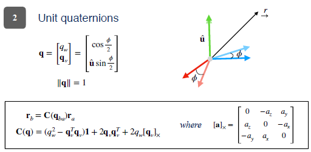

> **方法3 ：** 欧拉角

Finally, another way of representing a rotation is using three numbers called **Euler angles.** These angles represent an arbitrary rotation as the composition of three separate rotations about different principal axes. Euler angles are attractive in part because they are a parsimonious representation requiring only three parameters instead of nine for a full rotation matrix. Unfortunately, Euler angle representations are subject to what are called singularities. Singularities complicate state estimation because they represent particular rotations from which to Euler angles are indistinguishable. Neither quaternions nor rotation matrices suffer from this problem at the expense of using more parameters. 

---

### 5. Which Rotation Representation Should I Use ?

So, which of these representations do self-driving vehicle engineers use? Well, it depends. Each has advantages and disadvantages. 

**A rotation matrix can represent any rotation but requires nine parameters and had six constraints.** A unit quaternion can also be used to represent any rotation, but it also has a constraint. To use a unit quaternion to actually rotate a vector, we also require some additional algebra beyond simple matrix multiplication. Finally, Euler angles are unconstrained, intuitive to visualize and use only three parameters, but are subject to singularities. 

---

### 6. Reference Frames | ECIF | ECEF

> **地心惯性框架**

Finally, let's look at four important reference frames that we'll use when localizing our vehicle. The first frame is the Earth-Centered Inertial Frame or ECIF. 

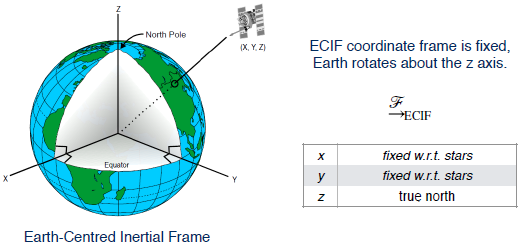

This frame has its origin at the center of the earth, the z axis points true north, and the x and y axis are fixed with respect to the very distant stars. This means that although the earth rotates about the z axis, the x and y axes do not move. Next, the Earth-Centered Earth-Fixed Frame, or ECEF is just like ECIF except that it's x axis is aligned with the Prime Meridian and spins with the earth. 

The y-axis is determined by the right-hand rule. Here, you can see an animation that shows the difference between the ECEF, which is fixed to the earth, and the ECIF, which is fixed with respect to the distance stars. 

---

### 7. Reference Frames | Navigtion

Although ECEF and ECIF are useful when we discuss satellites and inertial sensing onboard aircraft, for practical car applications, we'll usually want to use a frame that is fixed with respect to the ground. 

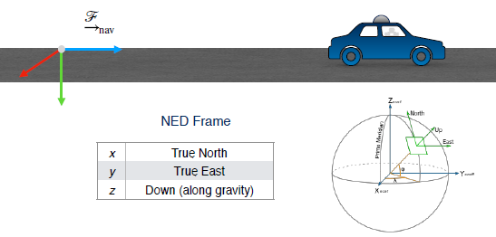

For this, we'll use what we referred to as the **navigation frame**. A very common navigation frame is one that is attached to some germane starting point and aligned with north, east, and down. Finally, we also often need to think about a sensor frame that is rigidly attached to a sensor like a LIDAR, a GPS receiver, or an inertial measurement unit. 

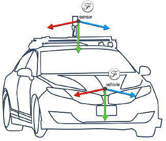

This frame will typically be distinct from the general vehicle frame, which can be placed anywhere on the vehicle that is convenient, at the center of mass for example. For localization, we will often ignore the distinction between the vehicle and sensor frame and assume that if we can track the sensor, we should be able to track any point on the vehicle given proper calibration, a topic we investigate later. 

---

### 8. Summary

To summarize, vector quantities can be expressed in different reference frames through rotations and translations. Rotations can be parameterized by rotation matrices, quaternions, or Euler angles, each of which has advantages and disadvantages. The Earth-Centered Earth-Fixed, Earth-Centered Inertial, and navigation frames are important reference frames for localization. In the next video, we'll discuss how we can use the tools we learned about in this lesson to track motion by using an inertial measurement unit.

---

## Lesson 2: The Inertial Measurement Unit (IMU)

In this lesson we are going to discuss the Inertial Measurement Unit or IMU. By the end of this lesson you will be able to 

- Describe the individual components (accelerometers and gyroscopes) of an inertial measurement unit and their basic operating principles.
- Define the measurement models used for accelerometers and gyroscopes.

This will be crucial when we incorporate an IMU into a full-state estimator. Let's begin. 

---

### 1. The Inertial Measurement Unit

The inertial measurement unit, or IMU measures the movement of a body in inertial space. Today a certain type of cheap, mass manufactured IMU, is found in nearly every smartphone, such as the iPhone X pictured here. 

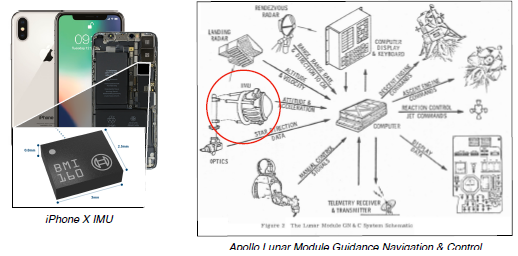

IMUs are often used tasks including, step counting for health tracking, and more recently as augmented reality devices. Despite their ubiquity today, the development of a sensor that could accurately track the motion of a moving body was a significant achievement of the 20th century. The IMU aided transoceanic flights long before GPS, and was crucial to the Apollo missions as part of the on board guidance, navigation, and control system. The Apollo spacecraft relied on an IMU to accurately track both the position, and orientation of the vehicle on the long voyage to the moon. In space there are few landmarks to rely on for guidance. One can track the fixed stars but this is not easy. The onboard IMU which operated without the need for such landmarks Enabled safe navigation to the Moon's surface. In modern self-driving cars, IMUs play a very similar role. Filling in during periods when navigation information from other sensors is either unavailable or unreliable. So what is an IMU? 

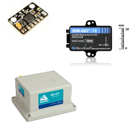

Well, generally, an inertial measurement unit is a composite sensor suite that combines three gyroscopes and three accelerometers to track the exterior free movement of a rigid body. Some IMUs also incorporate magnetometers, or a compass, to help track orientation. IMUs come in many shapes and forms. The sensors found in modern smartphones are relatively cheap, often costing less than a few dollars when purchased in bulk. They are lightweight and require relatively little power but produce quite noisy measurements. More expensive IMUs use more complex components and have more accurate calibration models that can remove the effects of temperature fluctuations, for example. Let's discuss the components of an IMU. The gyroscopes and the accelerometers in more detail. The gyroscope has a long history. 

---

### 2. The Gyroscope

The term gyroscope can be quite confusing, because it refers to several concepts all relating to the idea of measuring orientation or change in orientation. The word itself comes from the Greek words Guros, for circle, and skopeo, to look. Historically, a gyroscope was a spinning disk that due to its angular momentum resisted changes in orientation. In the late 19th and early 20th century, engineers realized that this spinning wheel could be used as an orientation reference for marine and aeronautical navigations. 

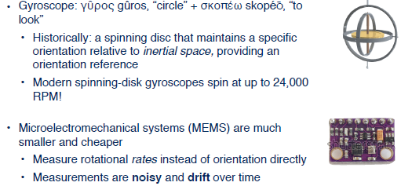

This required precise machining, and instead of gimbals, it used high quality jewel or numeric bearings. Although this type of spinning disc gyroscope can be very accurate, it's quite heavy, bulky and often very expensive to manufacture. Nevertheless, it is still using aeronautics and in ballistic applications and can spin it up to 24,000 RPM. 

In a modern gyroscope, the spinning wheel is typically replaced by a microelectromechanical system that consists of a small silicon tuning fork that changes its resonance properties based on an applied rotation or orientation change. These sensors are much cheaper and can fit in a tiny package. However, they produce noisy measurements and are sensitive to temperature based fluctuations. What's more, they measure rotation rates, and not orientation directly, and so the output signal must be numerically integrated to determine orientation change. This process can introduce additional errors into the final orientation estimate. 

A self driving car engineer should be aware need to account for issues such as drift and performance variation with temperature introduces substantial additional complexity in the sensor modeling process. One would normally think that a spinning mechanical device would be inferior to a silicon component but this is not always the case. 

---

### 3. The Accelerometer

An accelerometer measures acceleration along a single axis. Cheaper MEMS based accelerometers use a miniature cantilever beam with a proof mass attached to it. When the sensor is accelerated, the beam deflects. This deflection can be measured through a capacitive circuit for example, and converted into an acceleration value. 

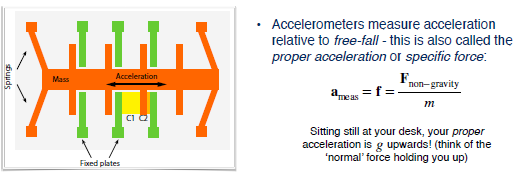

More expensive sensors may also use Piezoelectric materials. It's important to note that an accelerometer measures what's called proper acceleration, or specific force. This is the total non-gravitational force per unit mass. The proper acceleration is acceleration with respect to a reference frame in free fall. When you're sitting in your chair, stationary relative to the ground, the proper acceleration you feel will be the value of the gravitational acceleration at your location, but upwards. Another way to say this is that the only non gravitational force acting on you, the normal force, must be equal to the force of gravity. 

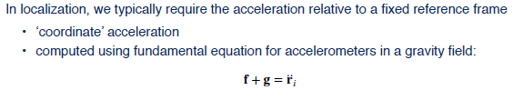

However, of course, for navigational purposes, we often don't care about our proper acceleration. What we care about is acceleration with respect to some fixed reference frame. To compute this acceleration, we need to use the fundamental equation for accelerometers in a gravity field. The second derivative opposition, computed in a fixed frame, is the sum of the specific force, and the acceleration due to gravity. Sometimes this could be sum up and intuitive concept. So let's explore it here .

An accelerometer in a stationary car measure g upwards, because the coordinate acceleration is zero, ignoring the rotation of the Earth. Since the force of gravity acts downwards its negative is the scalar constant g in the upward direction. Let's look at an example of this on the International Space Station or ISS. Is the value of g less in low Earth orbit? Well, it is, but only by about 10% when compared to the value on the surface of the Earth. The reason why we often hear the term 0 g is because the entire ISS is in free fall together with the astronauts inside it. An accelerometer rigidly attached to the station will have a coordinate acceleration equal to g. This means that the specific force measured by an accelerometer will be 0. 

Another way of saying this is that the proper acceleration with respect to free fall is 0. The ISS is in free fall. In reality residual atmospheric drag and structural vibrations will create some measured accelerations but they are typically as low as 10 to the -6 g's. Now, that we know about the basic principles of gyroscopes and accelerometers, let's discuss the measurement models we'll need to know in order to incorporate them into a state estimator.

---

### 4. IMU Measurement Models : Gyroscope

Using the notation we discussed in the previous lesson, let's define an expression for what a gyroscope measures. 

The angular rotation rate, derived from all three gyroscopes, is the angular velocity of the body frame relative to an inertial frame, expressed in the body frame. To it will be add a slowly varying bias term and a white Gaussian additive noise term to model sensor errors. Although gyroscopes do measure the rotation of the Earth, it's often safe to ignore this for applications where we care only about motion over a short duration. Our accelerometer measurement model will have similar noise and bias terms. But now instead of measuring body accelerations directly as we could do with rotational rates, we need to explicitly remove the effect of gravity using our fundamental equation for accelerometers in a gravity field. 

Since the accelerometers measure acceleration in the IMU body frame, we will need to keep track of the orientation at all times in order to be able to perform the necessary subtraction. 

---

### 5. Inertial Navigation : Important Notes

Finally, let's discuss a few important limitations of our models. 

First, an accurate orientation estimate is critical for accurate position estimates. When we convert the measured specific force into an acceleration we have to make sure that the direction of gravity is correct. Otherwise even a small error in orientation can cause us to think that we are accelerating when we're not. 

Second, both of the models we derived ignore the effects of the Earth's rotation. For longer distance navigation, this is in fact, important. 

Finally, the models we have derived are for strapdown IMUs. These are IMUs that are physically strapped down to the vehicle and do not incorporate a spinning wheel on gimbals. Although a latter can be much more accurate, they are rarely used in automotive applications because of their bulk and their cost. 

---

### 6. Summary

To summarize, in this video we learned that a 6 degree of freedom IMU is composed of three gyroscopes and three accelerometers. The gyroscopes measure rotational rates in the sensor frame. And accelerometers measure the non-gravitational specific force in the sensor frame as well. Since strapdown IMUs are tricky to calibrate and drift over time, we'll need another sensor to periodically correct our posed estimates. For this, we can use the modern system of global navigation satellites. We'll talk more about this in the next lecture.

---

## Lesson 3: The Global Navigation Satellite Systems (GNSS)

Welcome back. In this video, we'll talk about a particular type of sensor that most of you will be very familiar with, the Global Navigation Satellite Systems or GNSS receiver. We'll learn about why this navigation sensor is so important for a self-driving car. It's able to provide a position fix anywhere in the world with bounded error which is key. Specifically, we'll develop a model for GNSS based on the principles of pseudoranging and trilateration. We'll then familiarize ourselves with sources of GNSS positioning error and talk about some ways to improve one type of GNSS.

Just like the IMU discussed in a previous lecture, nearly every modern smartphone has at least one type of GNSS receiver. Although we take them for granted now, the first modern system of global positioning satellites, GPS, was built for military use during the 1980s. 

By the time the second version of the system was fully operational in 1995, GPS was made available to the public for free. This was in part due to the highly publicized crash of Korean Airlines flight 007 in 1983. Flight 007 was a 747 passenger jet that flew from New York City to Seoul with refueling stop in Anchorage Alaska. As it flew from Anchorage to Seoul, it deviated from its plan flight path and was shot down by a fighter jet after spending several hours in Soviet airspace. 

To cross the North Pacific Ocean, Flight 007 relied on an inertial navigation system for guidance. The pilots, failing to properly initialize the system, mistakenly maintained the aircraft on a specific magnetic heading. In turn, the plane deviated by more than 300 kilometers from its planned course. Shortly after Flight 007 was shot down, then President Ronald Reagan issued a directive to allow the US Global Positioning System to be freely available to the public once it was fully developed. 

---

### 1. GNSS | Accurate Global Positioning

Although GPS was the original system of navigation satellites used for global positioning, today, the term global navigation satellite system is used as a catch-all for several such satellite constellations that exist. The two that are fully operational as of 2018 are GPS and GLONASS, the Russian equivalent. 

Several other systems are nearing completion including the European Galileo constellation. For this video, we'll look at GPS more closely, though other GNSS systems operate on similar principles. The GPS constellation is composed of 24-32 satellites that are in six orbital planes. Satellites are decommissioned and replaced periodically. Each satellite isn't a medium Earth orbit an altitude of roughly 20,000 kilometers with an orbital period of just under 12 hours. 

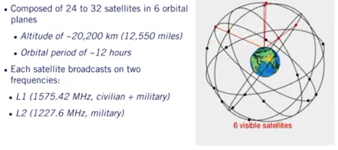

The constellation is designed such that at least four satellites are visible at any surface point on earth at all times. Each satellite broadcasts on two frequencies, one for civilian and one for military use. Each broadcast signal contains a pseudo-random code that identifies the satellite position and the time of transmission of the signal. 

---

### 2. GPS | Computing Position

The basic principle behind GPS is time of arrival ranging. The receiver computes a distance to each visible satellite by comparing its own internal clock with that of the time of transmission. The time difference is converted to a distance using knowledge that electromagnetic signals propagate at the speed of light. To compute a 3D position, the ranging equations require at least four visible satellites. If altitude is known and only a 2D position is required, only three satellites are needed. 

---

### 3. Trilateration

The process of recovering position from several distances to known landmarks is called trilateration. For each satellite,we measure the pseudorange as follows :
$$
\rho^{(i)}=c\left(t_{r}-t_{s}\right)=\sqrt{\left(\mathbf{p}^{(i)}-\mathbf{r}\right)^{T}\left(\mathbf{p}^{(i)}-\mathbf{r}\right)}+c \Delta t_{r}+c \Delta t_{a}^{(i)}+\eta^{(i)}
$$
Note that this is different from triangulation where we compute positions based off of angle measurements. A GPS receiver measures the pseudorange to each satellite using the following measurement model: The model accounts for receiver clock error, atmospheric propagation delays, and measurement noise. 

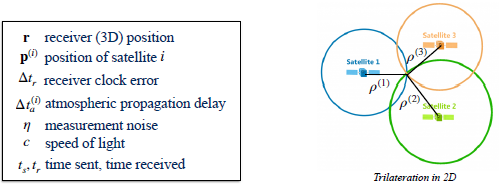

The term pseudorange refers to the fact that the range information is corrupted by the error sources above. Each pseudorange measurement defines a circle in 2D or a sphere in 3D. If we have exactly four satellites, we can solve for the receiver position and the receiver clock error explicitly. 

If we have more than four, we can use the method of least squares to find the maximum likelihood position assuming Gaussian noise. 

---

### 4. GPS | Error Sources

GPS suffers from multiple error sources. First, charged ions in the ionosphere can delay the signal by an unknown amount. Surrounding terrain and buildings may cause reflections that increase the distance traveled by the signal before reaching the receiver, these are called multi-path errors. 

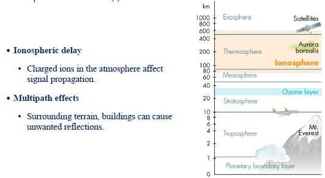

Any small error in clock synchronization or satellite position information can have catastrophic consequences. Even a one microsecond timing error can lead to a significant error in position, 300 meters. Both a Ephemeris data and satellite clocks are updated and recalibrated often, but the calibration can be out of date. 

Finally, the geometric configuration of visible satellites can also lead to variations in positioning accuracy. This is known as the geometric dilution of precision. For higher accuracy, a configuration with satellites spread across the sky is preferable. 

---

### 5. GPS | Improvements

Luckily, for some applications, we can improve GNSS accuracy by augmenting the system in various ways. Differential GPS can correct receiver positioning estimates by making use of the more accurately known positions of one or more fixed base stations. Corrections are broadcast on separate frequencies to the GNSS receiver in the moving vehicle. Real-Time Kinematic, or RTK GPS makes use of carrier phase information to improve positioning accuracy down to two centimeters in some cases.

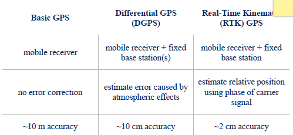

Although both of these techniques can significantly improve the accuracy of GPS, they're typically quite costly to implement. As we mentioned in the previous video, inertial sensors are very useful for navigation. However, they drift or accumulate unbounded error over time. The GPS system in contrast, provides bounded error positioning updates. A self-driving car equipped with GPS will maintain a guaranteed level of positioning accuracy at all times, unless the GPS receiver fails or loses track of at least four satellites. 

---

### 6. Summary

So to summarize this video, Global Navigation Satellite Systems work by combining pseudoranges from at least four satellites to determine a 3D position. GPS or GNSS error can come from several different sources including ionospheric delays, multi-path effects, and also possibly from the geometric dilution of precision. To improve GNSS accuracy, techniques like differential GPS or RTK GPS can be used. That's the end of this module. In module four, we'll describe how we confuse inertial measurements from IMUs with position measurements from a GPS to produce an accurate localization estimate for a self-driving car. The sensors are complementary and they're used together in practically all self-driving cars. See you in the next module.