Module 4: LIDAR Sensing

LIDAR (light detection and ranging) sensing is an enabling technology for self-driving vehicles. LIDAR sensors can ‘see’ farther than cameras and are able to provide accurate range information. This module develops a basic LIDAR sensor model and explores how LIDAR data can be used to produce point clouds (collections of 3D points in a specific reference frame). Learners will examine ways in which two LIDAR point clouds can be registered, or aligned, in order to determine how the pose of the vehicle has changed with time (i.e., the transformation between two local reference frames).

### 学习目标

- Explain how LIDAR sensors are able to generate range data from time-of-flight measurements
- Understand inverse and forward sensor models for a basic scanning LIDAR
- Apply standard transfomations (translation, rotation, and scaling) to LIDAR point cloud data
- Summarize how the problem of motion distortion can affect LIDAR scans acquired from a moving vehicle
- Utilize the iterative closest point (ICP) algorithm to align point clouds from consecutive LIDAR scans

---

## Lesson 1: Light Detection and Ranging Sensors

Welcome to module four of the course. In this module, we'll be talking about LIDAR, or light detection and ranging sensors. LIDAR has been an enabling technology for self-driving cars because it can see in all directions and is able to provide very accurate range information. In fact, with few exceptions, most self-driving cars on the road today are equipped with some type of LIDAR sensor. 

In this module, you'll learn about the operating principles of LIDAR sensors, basic sensor models used to work with LIDAR data and LIDAR point clouds, different kinds of transformation operations applied to point clouds, and how we can use LIDAR to localize a self-driving car using a technique called point cloud registration. 

In this video specifically, we'll explore how a LIDAR works and take a look at sensor models for 2D and 3D LIDARs. We'll also describe the sources of measurement noise and errors for these sensors. In future lessons, we'll discuss in more detail how we can use LIDAR data for state estimation of self-driving vehicles. 

---

### 1. Overview

If you've ever seen a self-driving car like the Waymo vehicle or an Uber car, you've probably noticed something spinning on the roof of the car. That something is a LIDAR, or light detection and ranging sensor, and its job is to provide detailed 3D scans of the environment around the vehicle. In fact, LIDAR is one of the most common sensors used on self-driving cars and many other kinds of mobile robots. LIDARs come in many different shapes and sizes, and can measure the distances to a single point, a 2D slice of the world, or perform a full 3D scan. Some of the most popular models used today are manufactured by firms such as Velodyne in California, Hokuyo in Japan, and SICK in Germany.In this video, we'll mainly focus on the Velodyne sensors as our example of choice, but the basic techniques applied to other types of LIDARs as well. 

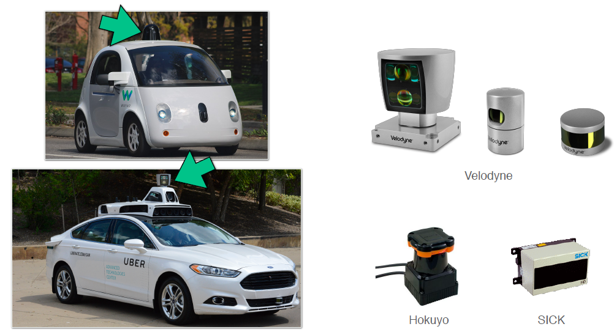

Before we get into the nitty-gritty of LIDAR sensing, let's take a quick look at the history of this important sensor. LIDAR was first introduced in the 1960s, not long after the invention of the laser itself. The first group to use LIDAR were meteorologists at the US National Center for Atmospheric Research, who deployed LIDAR to measure the height of cloud ceilings. These ground-based celiometers are still in use today not only to measure water clouds, but also to detect volcanic ash and air pollution. Airborne LIDAR sensors are commonly used today to survey and map the earth's surface for agriculture, geology, military, and other uses. 

But the application that first brought LIDAR into the public consciousness was Apollo 15, the fourth manned mission to land on the moon, and the first to use a laser altimeter to map the surface of the moon. So, we've seen that LIDAR can be used to measure distances and create a certain type of map, but how did they actually work, and how can we use them onboard a self-driving car? 

---

### 2. Techniques

To build a basic LIDAR in one dimension, you need three components; a laser, a photodetector, and a very precise stopwatch. The laser first emits a short pulse of light usually in the near infrared frequency band along some known ray direction. At the same time, the stopwatch begins counting. The laser pulse travels outwards from the sensor at the speed of light and hits a distant target. Maybe another vehicle in front of us on the road or a stationary object like a stop sign or a building. As long as the surface of the target isn't too polished or shiny, the laser pulse will scatter off the surface in all directions, and some of that reflected light will travel back along the original ray direction. The photodetector catches that return pulse and the stopwatch tells you how much time has passed between when the pulse first went out and when it came back. That time is called the round-trip time. 

Now, we know the speed of light, which is a bit less than 300 million meters per second. So, we can multiply the speed of light by the round-trip time to determine the total round trip distance traveled by the laser pulse. Since light travels much faster than cars, it's a good approximation to think of the LIDAR and the target as being effectively stationary during the few nanoseconds that it takes for all of this to happen. That means that the distance from the LIDAR to the target is simply half of the round-trip distance we just calculated. This technique is called time-of-flight ranging. 

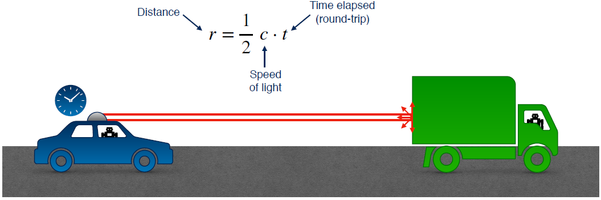

Although it's not the only way to build a LIDAR, it's a very common method that also gets used with other types of ranging sensors like radar and sonar. It's worth mentioning that the photodetector also tells you the intensity of the return pulse relative to the intensity of the pulse that was emitted. This intensity information is less commonly used for self-driving, but it provides some extra information about the geometry of the environment and the material the beam is reflecting off of. 

---

### 3. Measurement models

So, why is intensity data useful? Well in part, it turns out that it's possible to create 2D images from LIDAR intensity data that you can then use the same computer vision algorithms you'll learn about in the next course. Since LIDAR is its own light source, it actually provides a way for self-driving cars to see in the dark. So, now we know how to measure a single distance to a single point using a laser, a photodetector, a stopwatch, and the time-of-flight equation, but obviously it's not enough to stay laser focused on a single point ahead. So, how do we use this technique to measure a whole bunch of distances in 2D or in 3D? 

The trick is to build a rotating mirror into the LIDAR that directs the emitted pulses along different directions. As the mirror rotates, you can measure distances at points in a 2D slice around the sensor. If you then add an up and down nodding motion to the mirror along with the rotation, you can use the same principle to create a scan in 3D. For Velodyne type LIDARs, where the mirror rotates along the entire sensor body, it's much harder to use a knotting motion to make a 3D scan. Instead, these sensors will actually create multiple 2D scan lines from a series of individual lasers spaced at fixed angular intervals, which effectively lets you paint the world with horizontal stripes of laser light. 

Here's an example of a typical raw LIDAR stream from a Velodyne sensor attached to the roof of a car. 

The black hole in the middle is a blind spot where the sensor itself is located, and the concentric circles spreading outward from there are the individual scan lines produced by the rotating Velodyne sensor. Each point in the scan is colored by the intensity of the return signal. The entire collection of points in the 3D scan is called a **point cloud**, and we'll be talking about how to use point clouds for state estimation in the next few videos. 

But before we get to point clouds, we need to think about individual points in 3D. Now typically, LIDARs measure the position of points in 3D using spherical coordinates, range or radial distance from the center origin to the 3D point, elevation angle measured up from the sensors XY plane, and azimuth angle, measured counterclockwise from the sensors x-axis. 

This makes sense because the azimuth and elevation angles tell you the direction of the laser pulse, and the range tells you how far in that direction the target point is located. The azimuth and elevation angles are measured using encoders that tell you the orientation of the mirror, and the range is measured using the time of flight as we've seen before. For Velodyne type LIDARs, the elevation angle is fixed for a given scan line. 

---

### 4. Measurement models for 3D/2D LIDAR sensors

Now, suppose we want to determine the cartesian XYZ coordinates of our scanned point in the sensor frame, which is something we often want to do when we're combining multiple LIDAR scans into a map. To convert from spherical to Cartesian coordinates, we use the same formulas you would've encountered in your mechanics classes. This gives us an inverse sensor model. We say this is the inverse model because our actual measurements are given in spherical coordinates, and we're trying to reconstruct the Cartesian coordinates at the points that gave rise to them. Note that we haven't said anything about measurement noise yet, we'll come back to that in just a moment. 

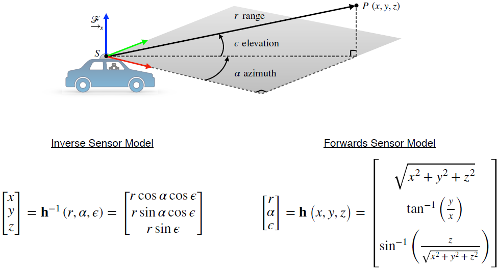

To go the other way from Cartesian coordinates to spherical coordinates, we can work out the inverse transformation given here. This is our forward sensor model for a 3D LIDAR, which given a set of Cartesian coordinates defines what the sensor would actually report. Now, most of the time the self-driving cars we're working with use 3D LIDAR sensors like the Velodyne, but sometimes you might want to use a 2D LIDAR on its own, whether for detecting  obstacles or for state estimation in more structured environments such as parking garages. Some cars have multiple 2D LIDARs strategically placed to act as a single 3D LIDAR, covering different areas with a greater or lesser density of measurements. 

For 2D LIDARs, we use exactly the same forward and inverse sensor models. But the elevation angle enhance the z component of the 3D point in the sensor frame are both zero. In other words, all of our measurements are confined to the XY plane of the sensor, and our spherical coordinates collapsed to the familiar 2D polar coordinates. We've seen now how to convert between spherical coordinates measured by the sensor and the cartesian coordinates that we'll typically be interested in for state estimation, but what about measurement noise? 

---

###  5. Measurement Noise

> - Uncertainty in determining the exact time of arrival of the reflected signal
> - Uncertainty in measuring the exact orientation of the mirror
> - Interaction with the target (surface absorption, specular reflection, etc.)
> - Variation of propagation speed (e.g., through materials)

For LIDAR sensors, there are several important sources of noise to consider. First, there is uncertainty in the exact time of arrival of the reflected signal, which comes from the fact that the stopwatch we use to compute the time of flight necessarily has a limited resolution. Similarly, there is uncertainty in the exact orientation of the mirror in 2D and 3D LIDARs since the encoder is used to measure this also have limited resolution. Another important factor is the interaction with the target surface which can degrade the return signal. For example, if the surface is completely black, it might absorb most of the laser pulse. Or if it's very shiny like a mirror, the laser pulse might be scattered completely away from the original pulse direction. 

In both of these cases, the LIDAR will typically report a maximum range error, which could mean there is empty space along the beam direction, or that the pulse encountered a highly absorptive or highly reflective surface. In other words, you simply can't tell if something is there or not, and this can be a problem for safety if your self-driving car is relying on LIDAR alone to detect and avoid obstacles. Finally, the speed of light actually varies depending on the material it's traveling through. The temperature and humidity of the air can also suddenly affect the speed of light in our time-of-flight calculations for example. 

These factors are commonly accounted for by assuming additive zero-mean Gaussian noise on the spherical coordinates with an empirically determined or manually tuned covariance. As we've seen before, the Gaussian noise model is particularly convenient for state estimation even if it's not perfectly accurate in most cases. 

---

### 6. Motion Distortion

> - Typical scan rate for a 3D LIDAR is 5-20 Hz
> - For a moving vehicle, each point in a scan is taken from a slightly different place
> - Need to account for this if the vehicle is moving quickly, otherwise motion distortion becomes a problem

Another very important source of error that can't be accounted for so easily is motion distortion, which arises because the vehicle the LIDAR is attached to is usually moving relative to the environment it's scanning. Now, although the car is unlikely to be moving at an appreciable fraction of the speed of light, it is often going to be moving at an appreciable fraction of the rotation speed of the sensor itself, which is typically around 5-20 hertz when scanning objects at distances of 10 to a 100 meters. This means that every single point in a LIDAR sweep is taken from a slightly different position and a slightly different orientation, and this can cause artifacts such as duplicate objects to appear in the LIDAR scans. This makes it much harder for a self-driving car to understand its environment, and correcting this motion distortion usually requires an accurate motion model for the vehicle provided by GPS and INS for example. 

---

### 7. Summary

To recap, LIDAR sensors measure distances by emitting pulse laser light and measuring the time of flight of the pulse. 2D or 3D LIDAR is extend this principle by using a mirror to sweep the laser across the environment and measure distances in many directions. In the next video, we'll look more closely at the point clouds created by 2D and 3D LIDARs, and how we can use them for state estimation on-board our self-driving car.

---

## Lesson 2: LIDAR Sensor Models and Point Clouds

In the last video, we talked about the basic operating principles of LIDAR, one of the most popular sensor choices for self-driving cars. In the next two videos we'll learn how we can use the point cloud generated by LIDAR sensors to do state estimation for our self-driving car. By the end of this video, you'll be able to 

- **Describe the basic point cloud data structure used to store LIDAR scans.** 

- **Describe common spatial operations on point clouds such as rotation and scaling.**

- **Use the method of least squares to fit a plane to a point cloud in order to detect the road or other surfaces.** 

---

### 1. LIDAR Point Clouds

To start us off, recall that a 3D LIDAR sensor returns measurements of range, elevation angle, and azimuth angle for every point that it scans. We know how to convert these spherical coordinates into Cartesian x, y, zed coordinates using the inverse sensor model so we can build up a large point cloud using all the measurements from a LIDAR scan. For some LIDAR setups, it's not uncommon for these point clouds to contain upwards of a million points or more. 

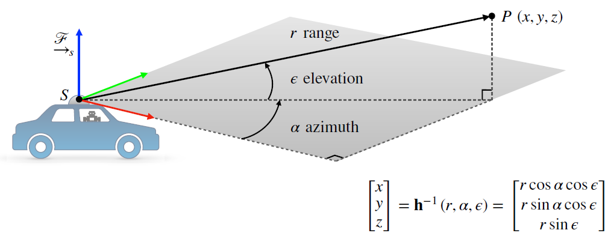

So what can we do these massive point clouds? Let's consider an example of a point cloud we might encounter in the real world. Let's say our LIDAR scans a nearby tree off on the side of the road, and produces a point cloud that looks like this. 

We only see points on the part of the tree that's facing us because the tree and the leaves reflect infrared light. The first question you might ask is how do we keep track of all of these points? What kinds of data structures should we use to work with them? One common solution is to assign an index to each of the points, say point 1 through point n, and store the x, y, zed coordinates of each point as a 3 by 1 column vector. 

From there, you could think about storing each of these vectors in a list, or you could stack them side by side into a matrix that we'll call big P. Doing it this way make it easier to work with the standard linear algebra libraries, like the Python NumPy library, which lets us take advantage of fast matrix operations rather than iterating over a list and treating each vector independently. So what kind of operations are we talking about? 

---

### 2. Operations on Point Clouds

There are three basic spatial operations that are important for carrying out state estimation with point clouds. **Translation, rotation, and scaling.** We'll talk about each of these in turn. 

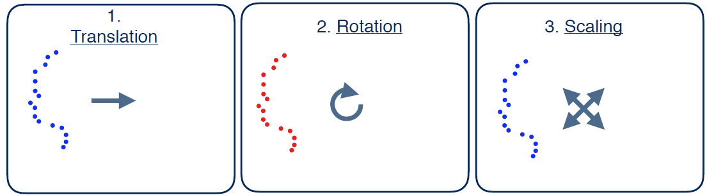

When we think about spatial operations on point clouds, our intuition might be to think in terms of physically manipulating the point cloud while our reference frame stays fixed. But for state estimation, it's more useful to think about things the other way around. Objects in the world mostly stay put while the reference frame attached to the vehicle moves and observes the world from different perspectives. So let's think about how translating our reference frame, say, by driving for a ten meters will affect our perception of a single point in point cloud. 

We can start by drawing the vector from the origin of our sensor frame, S, to a point, P. Now, consider a second frame, S-prime, whose origin has been translated relative to S due to motion of the vehicle. Note that the basis vectors of frame S-prime are the same as the basis vectors of frame S. Only the origin has moved. We can draw another vector from the origin of S-prime to the point P. Immediately, we notice the resulting vector, indicated here, is just the tip to tail sum of the other two vectors. And these vectors are just geometric objects until we express them in a coordinate system. 

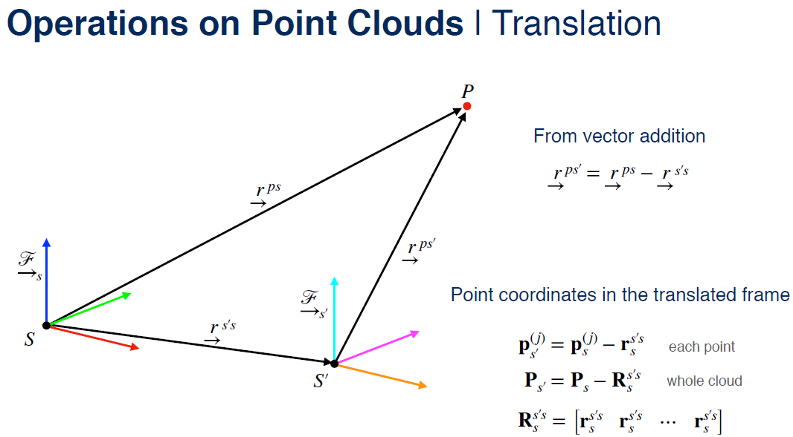

And what we're after are the coordinates of the point P in frame S-prime. We can get these easily by just subtracting the frame-to-frame translation vector from the coordinates of P in frame S. This extends easily to a batch operation on the full point cloud by simply tiling the frame-to-frame translation in a big matrix R, and subtracting it from the point cloud matrix. Depending on the language or linear algebra library you're using, you probably won't need to build this R matrix explicitly. In Python, for example, the NumPy library is smart enough to repeat the frame-to-frame translation implicitly using broadcasting semantics. 

---

Now, let's think about what happens if rotate our reference frame instead of translating it. 

Again, keep in mind that we're not changing the physical point P, only our view of it. So in this case, we only have to think about one vector from the origin of frame S to P. What does change in this case is actually the set of basis vectors we use to express the coordinates of the vector S to P. Remember that the rotation matrix C tells us how to find the coordinates of a vector in a rotated frame from the coordinates of the vector in the original frame. So if we know the rotation matrix from frame S to frame S-prime, all we have to do is multiply it against the coordinates of P in frame S to get the coordinates of P in frame S-prime. To determine the coordinates of the entire rotated point cloud, the operation is exactly the same, thanks to the properties of matrix multiplication. 

---

The last spatial operation to think about is scaling, which works very similarly to rotation. But instead of changing the direction of the basis vectors in our coordinate system, we're changing their lengths. Mathematically, this just means pre-multiplying the coordinates of each point by a diagonal matrix S whose non-zero elements are simply the desired scaling factors along each dimension. Often but not always these scaling factors are the same, and the matrix multiplication is equivalent to multiplying by a scaler. In these cases, we say that the scaling is isotropic or equal in every direction. 

We can use the same matrix multiplication for individual points or for the entire point cloud, just like we did for rotations. Usually, the transformations we're interested in are a combination of translation and rotation and sometimes scaling. 

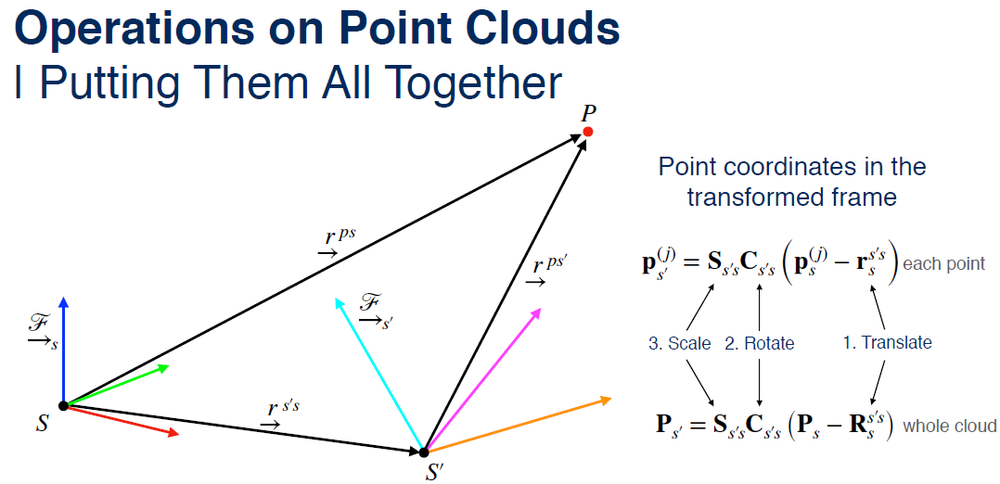

For example, we're often interested in estimating the translation and rotation that best aligns to point clouds so that we can estimate the motion of our self-driving car. We'll talk about how we can do this in the next video. Fortunately for us, it's easy to combine all three operations into a single equation By first translating each vector, then rotating into the new frame, and finally applying any scaling. And of course, this operation extends to the batch case as well. 

---

### 3. Finding the Road with 3D Plane Fitting

So we've seen how to apply basic spatial operations to point clouds. And we'll see in the next video how we can use these concepts to do state estimation for self-driving cars. But before we get there, there's one more important operation to discuss, and that's plane fitting. One of the most common and important applications of plane-fitting for self-driving cars is figuring out where the road surface is and predicting where it's going to be as the car continues driving. If you think back to your high school geometry classes, you might remember the equation of a plane in 3D. Zed equals a plus bx plus cy. 

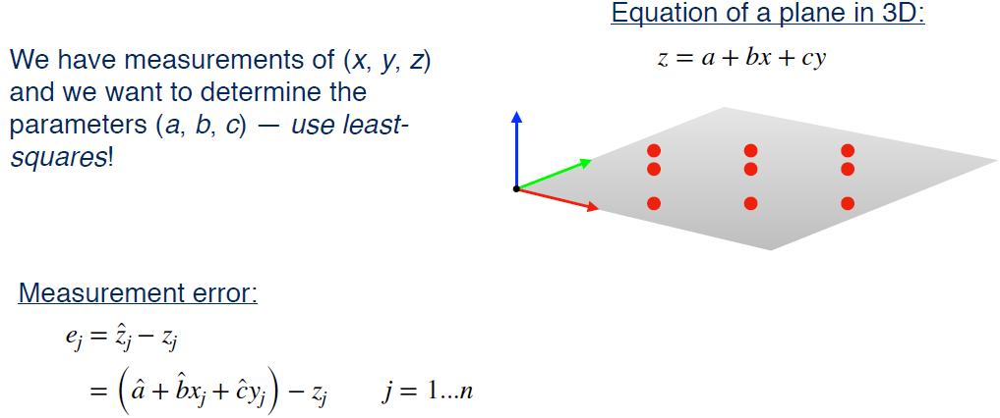

This equation tells you how the height of the plane z changes as you move around in the x and y directions. And it depends on three parameters, a, b, and c, which tells you the slope of the plane in each direction and where the zed axis intersects the plane. So in our case, we have a bunch of measurements of x, y and zed from our LIDAR point cloud, and we want to find values for the parameters a, b, and c that give us the plane of best fit through these points. To do this, we're going to reach back to Module One for our tool of choice, least-squares estimation. We'll start by defining a measurement error e for each point in the point cloud. And e is just going to be the difference between the predicted value of our dependent variable zed-hat and the actual observed value of zed. We get zed-hat simply by plugging our current guess for the parameters a-hat, b-hat, and c-hat, and the actual values of x and y in. 

In this case, the error, e, that we are considering, is for a bumpy road surface, for example. That is, a surface which is not exactly planar. For the moment, we're ignoring the actual errors in the LIDAR measurements themselves, which also have an effect. We can stack all of these error terms into matrix form so we have a big matrix of coefficients called a. 

Multiplied by our parameter vector x, minus our stack measurements b. You can work out the matrix multiplication yourself to see that we get back the same measurement error equations we started out with. Now, all we have to do is minimize the square of this error and we'll have our solution. 
$$
\hat{\mathbf{x}} =\arg \min _{\mathbf{x}} \mathscr{L}_{\mathrm{LS}}(\mathbf{x})\\
$$
This works exactly the same way as the resistor problem we worked through in module one. We can start by multiplying out the square to get a matrix polynomial in the parameter vector x. 
$$
\begin{aligned} \mathscr{L}_{\mathrm{LS}}(\mathbf{x}) &=\mathbf{e}^{T} \mathbf{e} \\ &=(\mathbf{A} \mathbf{x}-\mathbf{b})^{T}(\mathbf{A} \mathbf{x}-\mathbf{b}) \\ &=\mathbf{x}^{T} \mathbf{A}^{T} \mathbf{A} \mathbf{x}-\mathbf{x}^{T} \mathbf{A}^{T} \mathbf{b}-\mathbf{b}^{T} \mathbf{A} \mathbf{x}+\mathbf{b}^{T} \mathbf{b} \end{aligned}
$$
From there, we take the partial derivative of the squared error function with respect to the parameter vector x and set it to 0 to find the minimum. This gives us the linear system we'll need to solve to obtain the final least squares estimate. We can solve this linear system using an efficient numerical solver like Python NumPy's solve function. Or just use the pseudo inverse to get our final answer for the plane parameters. 
$$
\left.\frac{\partial \mathscr{L}_{\mathrm{LS}}(\mathbf{x})}{\partial \mathbf{x}}\right|_{\mathbf{x}=\hat{\mathbf{x}}}=2 \mathbf{A}^{T} \mathbf{A} \hat{\mathbf{x}}-2 \mathbf{A}^{T} \mathbf{b}=\mathbf{0} \quad \longrightarrow \quad \mathbf{A}^{T} \mathbf{A} \hat{\mathbf{x}}=\mathbf{A}^{T} \mathbf{b}
$$
One important thing to notice here is that we did not account for sensor noise in our x, y, zed measurements. All we've done is to find the plane of best fit through a set of points. 
$$
\hat{\mathbf{x}}=\left(\mathbf{A}^{T} \mathbf{A}\right)^{-1} \mathbf{A}^{T} \mathbf{b}
$$
It's certainly possible to set this problem up in a more sophisticated way that does account for sensor noise. You could use a batch approach similar to what we just discussed, or you could even think about including the road parameters in the column filter to estimate them on the fly as the sensor data comes in. The best solution for your self-driving application will depend on how much you trust your LIDAR data and how much thought you want to give to uncertainty in the road surface. 

Now, although all of the operations we've described here can be easily implemented with NumPy or any other linear algebra library, there is a fantastic open source tool called the Point Cloud Library, or PCL, that provides all sorts of useful functions for working with point clouds. 

In fact, it's so useful that you'll find it everywhere in industry. The core library is built with C++, but there are unofficial Python bindings available as well. If you want to learn more about the features PCL, I highly recommend visiting pointclouds.org and having a look around. 

---

### 4. Summary

So to recap, we've seen that point clouds are a way of capturing all of the measurements from a LIDAR scan. And they are often stored as a big matrix. We saw how we can use linear algebra to do useful operations on point clouds, like translating, rotating, and scaling. And we also saw how we can use the least squares algorithm to fit a 3D plane to a point cloud to find the road surface. The Point Cloud Library, or PCL, implements a bunch of useful tools for working with point clouds in C++. One of the most useful algorithms in PCL is called the iterative closest point algorithm, or ICP, which is a common method for estimating the motion of a self-driving car using two LIDAR point clouds. We'll talk about how ICP works in the next video. 

---

## Lesson 3: Pose Estimation from LIDAR Data

Now that you've learned how to translate, rotate and scale point clouds, it's time to talk about how we can actually use these operations with real point clouds to estimate the motion of a self-driving car. The way that we do this in general is by solving something called the point set registration problem, which is one of
the most important problems in computer vision and pattern recognition. By the end of this video, you'll be able to 

- **Describe the point set registration problem and how it can be used for state estimation**

- **Describe and implement the Iterative Closest Point or ICP algorithm for point set registration**

- **Understand some common pitfalls of using ICP for state estimation on self-driving cars**

---

### 1. State Estimation via Point Set Registration

Let's explore this problem by returning to our example of a self-driving car observing a tree from a LIDAR mounted on the cars roof. At time t equals one say, the LIDAR returns a point cloud that follows the contour of the tree as before. The coordinates of every point in the point cloud are given relative to the pose of the lidar at the time of the scan, we'll call this coordinate frame S. At time t equals two the car is driven a bit further ahead, but the LIDAR can still see the tree and return a second point cloud whose coordinates are again specified relative to the pose of the lidar at time t equals two, we'll call this coordinate frame S prime. 

Now, the point set registration problems says, given 2 point clouds in two different coordinate frames, and with the knowledge that they correspond to or contain the same object in the world, how shall we align them to determine how the sensor must have moved between the two scans? 

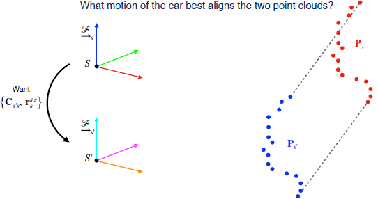

More specifically, we want to figure out the optimal translation and the optimal rotation between the two sensor reference frames that minimizes the distance between the 2 point clouds. We'll describe what we mean by distance shortly. To keep things simple, we're going to pretend that we have an ideal LIDAR sensor that measures the entire point cloud all at once, so that we can ignore the effects of motion distortion. Now, if we somehow knew that each and every point in the second point cloud corresponded to a specific point in the first point cloud, and we knew ahead of time which points corresponding to which, we could solve this problem easily. All we'd have to do is find the translation and rotation that lines up each point with its twin. 

In this example, our ideal rotation matrix would be the identity matrix, that is no rotation at all, and a ideal translation would be along the cars forward direction. The problem is that, in general we don't know which points correspond to each other. 

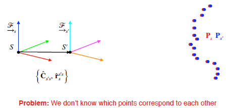

In the course on computer vision, you'll learn about feature matching which is one way of determining correspondences between points using cameraData. But for now let's think about how we might solve this problem without knowing any of the correspondences ahead of time. The most popular algorithm for solving this kind of problem is called the Iterative Closest Point algorithm or ICP for short. 

---

### 2. The Iterative Closest Point (ICP) Algorithm

> - **Intuition:** When the optimal motion is found, corresponding points will be closer to each other than to other points
> - **Heuristic:** For each point, the best candidate for a corresponding point is the point that is closest to it right now

The basic intuition behind ICP is this, when we find the optimal translation and rotation, or if we know something about them in advance, and we use them to transform one point cloud into the coordinate frame of the other, the pairs of points that truly correspond to each other will be the ones that are closest to each other in a Euclidean sense. This makes sense if you consider the simplified case where our LIDAR sensors scans exactly the same points just from two different vantage points. In this case, there's a one-to-one mapping between points in the two scans, and this mapping is completely determined by the motion of the sensor. So, that's the ideal case for when we found the best possible translation and rotation, but what if we don't have the optimal translation and rotation, how do we decide which points actually go together? 

Well, with ICP we use a simple heuristic, and say that for each point in one cloud, the best candidate for a corresponding point in the other Cloud is the point that is closest to it right now. The idea here is that this heuristic should give us the correspondences that let us make our next guess for the translation and rotation, that's a little bit better than our current guess. As our guesses get  better and better, our correspondences should also get better and better until we eventually converge to the optimal motion and the optimal correspondences. This iterative optimization scheme using the closest point heuristic is where ICP gets its name. It's important to note that the word closest implies that we will find points that lie close together after applying the frame to frame transformation only. That is, because the vehicle is moving it's almost never the case that a laser beam will hit exactly the same surface point twice. 

So, let's talk about the steps in the ICP algorithm. First and most important is that we need an initial guess for the transformation. We need this because there's no guarantee that the closest point heuristic will actually converge to the best solution. It's very easy to get stuck in a local minimum in these kinds of iterative optimization schemes. So, we'll need a good starting guess. Now, the initial guess can come from a number of sources. One of the most common sources for robotics applications like self-driving is a motion model, which could be supplied by an IMU as we saw in the previous module or by wheel odometry or something really simple like a constant velocity or even a zero velocity model. How complex the motion model needs to be to give us a good initial guess really depends on how smoothly the car is driving. 

If the car is moving slowly relative to the scanning rate of the LIDAR sensor, one may even use the last known pose as the initial guess. For our example, let's say we use a very noisy IMU and emotion model to provide the initial guess. The model tells us that the sensor translated forward a bit and also pitched upwards. In step two, we'll use this initial guess to transform the coordinates of the points in one cloud into the reference frame of the other, and then match each point in the second cloud to the closest point in the first cloud. 

Here we've shown the associations for the first four points and the last four points. Note that there's nothing stopping two points in one cloud from being associated with the same point in the other cloud. Step three is to take all of those match points and find the transformation that minimizes the sum of squared distances between the corresponding points. 

We'll talk about the math behind this step in a minute, but you can visualize it as wrapping an elastic band around each pair of matched points, and then letting go and waiting for the system to find its lowest energy configuration. The translation and rotation associated with this minimum energy configuration are the optimal solutions. Then, we repeat the process using the translation and rotation we just solved for as our new initial guess. 

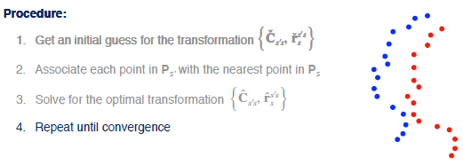

We keep going until the optimization converges. So in the next iteration, we use the new translation and rotation to transform the point cloud and then find the closest matches, solve for the optimal transformation, and keep going until we reach the optimum after a few iterations. 

---

### 3.  ICP | Solving for the Optimal Transformation

How do we actually solve for the optimal transformation in step three? Maybe you've already guessed that we're going to use our favorite tool, least-squares. Our goal here is to find the rotation and translation that best aligns the two point clouds. 

Specifically, you want to minimize the sum of squared euclidean distances between each pair of matched points, which is one of the loss function that we've defined here. This least squares problem is a little bit more complex than the ones we've encountered so far. That's because the rotation matrix is inside the loss function. It turns out the rotation matrices do not behave like vectors. If you add two vectors together, you get another vector. But if you add two rotation matrices together, the result is not necessarily a valid rotation matrix. In reality, 3D rotations belong to something called the special orthogonal group or SO3. We won't dig into what that means in this course, but it's important to remember that rotations needs special treatment. 

It turns out that there's a nice closed form solution to this least-squares problem which was discovered in the 1960s. We won't go through the derivation here, but the good news is that there is a simple four step algorithm you can follow to solve this problem. The first two steps are easy. 

First, we compute the centroid of each point cloud by taking the average over the coordinates of each point. This is exactly like calculating the center of mass in physics. 

Second, we work at a three-by-three matrix capturing the spread of the two point clouds. You can think of this W matrix as something like an inertia matrix you might encounter in mechanics. The W matrix is the quantity we are going to use to estimate the optimal rotation matrix. 

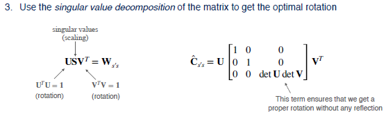

Step three is actually finding the optimal rotation matrix. This step is the most complex, and it involves taking something called the singular value decomposition or SVD of the W matrix. If you've never seen the SVD before, this step might look a bit magical. Let's spend a moment talking about what the singular value decomposition actually does. The SVD is a way of factorizing a matrix into the product of two unitary matrices, U and V, and a diagonal matrix S, whose non-zero entries are called the singular values of the original matrix. 

There are several ways to interpret the SVD. But for us, it's easiest to think about U and V as rotations and the S matrix as a scaling matrix. Since we're dealing with rigid body motion in this problem, we don't want any scaling in a rotation estimate, so we'll replace the S matrix with something like the identity matrix to remove the scaling. There's a trick though in the way we choose the bottom-right entry of the new scaling matrix. It turns out that in some cases, the SVD will give us rotation matrices that are not proper rotations. That is, they also have a reflection about the axis of rotation. 

To make sure that we get a proper rotation, we choose the bottom right term to be the product of the determinants of U and V. This number will be either plus one or minus one and will cancel out any reflection. 

Once we have this all we have to do is multiply out the three matrices. This gives us back the optimal rotation matrix. Now, that we have our rotation estimate, the last step is to recover the translation. This part is very straightforward and only involves rotating the centroid of one point cloud into the reference frame of the other and then taking the difference of the coordinate vectors to find the translation that will best align the two point clouds. One other important thing to think about, both from a safety standpoint and when we start talking about sensor fusion in a later module, is how confident we should be in the output of the ICP algorithm. 

---

### 4. ICP | Estimating Uncertainty

There are a number of different ways to estimate the uncertainty or the covariance of the estimated motion parameters. An accurate and relatively simple method is to use this equation here. This expression tells us how the covariance of the estimated motion parameters is related to the covariance of the measurements in the two point clouds using certain second-order derivatives of the least squares cost function. 

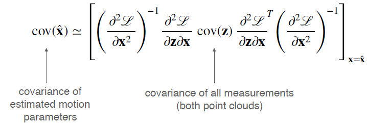

While its expression is accurate and fast to compute, it's a little tricky to derive these second-order derivatives when there's a constraint quantity like a rotation matrix in the mix. For our purposes, we're generally going to hand tune the ICP covariance matrix to give us acceptable results. 

---

### 5. ICP | Variants

You've now seen the basic vanilla algorithm for the iterative closest point method, but it's not the only way of solving a problem. In fact, this algorithm is just one variant of ICP called Point-to-point ICP, which derives its name from the fact that our objective function or loss function minimizes the distance between pairs of corresponding points. 

Another popular variant that works well in unstructured environments like cities or indoors is called Point-to-plain ICP. Instead of minimizing the distance between pairs of points, we fit a number of planes to the first point cloud and then minimize the distance between each point in the second cloud and its closest plane in the first cloud. These planes could represent things like walls or road surfaces. The challenging part of the algorithm is actually figuring out where all the planes are. We won't talk about how to do this in detail, but you can check out the documentation for Point-to-plain ICP in the point cloud library for more information. 

---

### 7.Outliers | Objects in Motion

Now, up until this point, we've been assuming that the objects seen by our LIDAR are stationary. What if they're moving? A common example of this is if our car is driving in traffic down a busy highway and scanning the vehicle in front of it. Both vehicles are traveling at the same speed while our self-driving car is happily collecting LIDAR data points. 

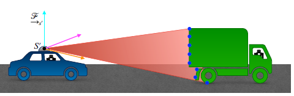

We ask ourselves again, what motion of the car best aligns the two point clouds? The answer we get is that we haven't moved at all. But, of course, we did move, just not relative to the vehicle directly ahead of us. This is obviously a contrived example. 

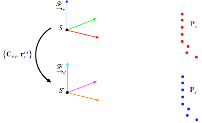

In reality, the point cloud would also include many stationary objects like roads, and buildings, and trees. But naively using ICP in the presence of moving objects will tend to pull our motion estimates away from the true motion. So we need to be careful to exclude or mitigate the effects of outlying points that violate our assumptions of a stationary world. One way to do this is by fusing ICP motion estimates with GPS and INS estimates. We'll talk about how to do this later in the course. 

Another option is to identify and ignore moving objects, which we could do with some of the computer vision techniques you'll learn about in the next course. But an even simpler approach for dealing with outliers like these is to choose a different loss function that is less sensitive to large errors induced by outliers than our standard squared error loss. The class of loss functions that have this property are called Robust Loss Functions or robust cost functions, and there are several to choose from. We can write this out mathematically by generalizing our least squares loss function so that the contribution of each error is not simply the square of its magnitude, but rather, some other function rho. 

Some popular choices for robust loss functions include the Absolute error or L1 norm, the Cauchy loss, and the Huber loss shown here. The key difference is that the slope of the loss function does not continue to increase as the errors become larger, but rather, it remains constant or it tapers off. Robust loss functions make the ICP problems slightly more difficult because we can no longer derive a nice closed form solution for the point cloud alignment step, and this means we need to add another iterative optimization step inside our main loop. However, the benefits cannot weigh the added complexity. 

---

### 8. Summary

> - **ICP is a way to determine the motion of a self-driving car by aligning point clouds from LIDAR or other sensors**
> - **ICP iteratively minimizes the distance between points in each point cloud**
> - **ICP is sensitive to outliers caused by moving objects, which can be partly mitigated using robust loss functions**

To recap, the Iterative Closest Point or ICP algorithm is a way to determine the motion of a self-driving car by aligning point clouds from LIDAR or other sensors. ICP works by iteratively minimizing the Euclidean distance between neighboring points in each point cloud which is where the algorithm gets its name. Moving objects can be a problem for ICP since they violate the stationary world assumption that ICP is based on. Outlier measurements like these can be mitigated with a number of techniques including Robust Loss Functions, which assign less weight to large errors than the usual squared error loss. 

---

## Module Summary

> - **LIDAR measures distances using laser light and the time-of-flight equation**
> - **LIDAR scans are stored as points clouds that can be manipulated using common spatial operations (e.g., translation, rotation, scaling)**
> - **The Iterative Closest Point (ICP) algorithm is one way of using LIDAR to localize a self-driving car**

Let's recap what we learned in this module. LIDAR or Light Detection and Ranging is a way of measuring distances by observing the time of flight of laser pulses. 2D and 3D LIDAR sensors can scan large swaths of the environment around the car, and the collection of points returned from each scan is stored as a point cloud, which can be manipulated using standard spatial operations such as translation, rotation, and scaling. These operations are an important part of the Iterative Closest Point or ICP algorithm, which is one common technique for using LIDAR to localize a self-driving car. In the next module, we'll discuss some practical aspects of state estimation and talk about how we can use LIDAR and ICP in conjunction with other sensors like IMUs and GPS to get an accurate and reliable state estimate for the vehicle.