# Module 5: Semantic Segmentation

The second most prevalent application of deep neural networks to self-driving is semantic segmentation, which associates image pixels with useful labels such as sign, light, curb, road, vehicle etc. The main use for segmentation is to identify the drivable surface, which aids in ground plane estimation, object detection and lane boundary assessment. Segmentation labels are also being directly integrated into object detection as pixel masks, for static objects such as signs, lights and lanes, and moving objects such cars, trucks, bicycles and pedestrians.

---

## Lesson 1: The Semantic Segmentation Problem

### Learning Objectives

> - Learn the semantic segmentation task problem formulation
> - Learn to determine how well a semantic segmentation model is performing with task relevant performance measures

Hello and welcome to the final technical module of the visual perception for self-driving course. This module will be dedicated to another important perception task for self-driving cars, semantic segmentation. Semantic segmentation is useful for a range of self-driving perception tasks such as identifying where the road boundaries are and tracking motion relative to lane markings. By the end of this module, you will also be able to use semantic segmentation results to aid in 2D object detection. Semantic segmentation is also very important for domains other than self-driving cars. Medical image segmentation is a rapidly growing field with recent methods using the models you will learn this week to perform tasks ranging from tumor segmentation in CAT scans to cavity segmentation in tooth x-ray images. In fact, during an international medical imaging segmentation challenge in 2017, ConvNets demonstrated abilities within one percent of human level performance. The semantic segmentation models we will learn about in this course are versatile and usually transfer well to tasks outside the domain of self-driving cars. 

In this lesson, you will learn how to formulate the problem of semantic segmentation. You will also learn how to evaluate semantic segmentation models using common evaluation metrics such as the class IOU. 

---

### 1. The Semantic Segmentation Probem

Let's begin by defining the semantic segmentation problem. Given an input image, we want to classify each pixel into a set of preset categories. The categories can be static road elements such as roads, sidewalk, pole, traffic lights, and traffic signs or dynamic obstacles such as cars, pedestrians, and cyclists. Also, we always have a background class that encompasses any category we do not include in our preset categories. 

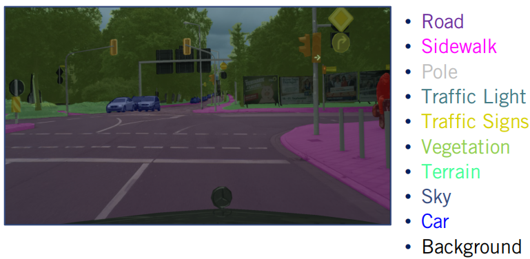

---

### 2. Mathematical Problem Formulation

As with object detection, we realize the semantic segmentation through a function estimator. So, how do we adapt our generic neural network to work for segmentation? Given an image, we take every pixel as an input and output a vector of class scores per pixel. A pixel belongs to the class with the highest class score. Therefore, we want our estimator to give the highest score to the correct class for every pixel in an image. 

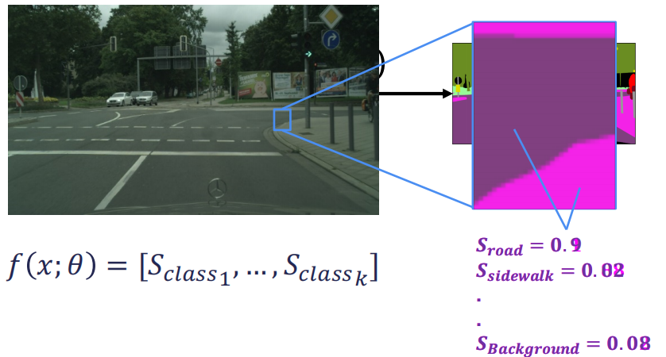

As an example, a road pixel should have a very high road score and much lower scores for other classes. 

---

### 3. Semantic Segmentation is Not Trivial

When we look at a pixel belonging to the sidewalk, the function estimator should provide a higher sidewalks score than all other class scores. When attempting to perform semantic segmentation, we usually face many of the same problems as object detection. As such, semantic segmentation is a non-trivial problem. Occlusion and truncation, for example, make it hard to accurately predict object boundaries. Scale is also a major issue as we need to handle both close-by objects with fine detail and far away objects captured by only a few pixels. We also need to be able to handle illumination changes in the scene. However, semantic segmentation also has a major problem specific difficulty. 

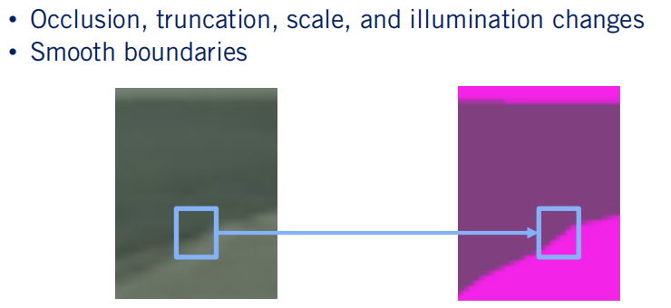

This difficulty is caused by an ambiguity of boundaries in image space, especially for thin objects such as poles, similar looking objects such as a road and a sidewalk and far away objects. Later on, we will see how to handle this problem when designing semantic segmentation algorithms. What algorithms do you think we can use to solve semantic segmentation? If you answered ConvNets, you are correct. 

---

### 4. ConvNets For Semantic Segmentation

Similar to object detection ConvNets have proven to be very efficient options for solving semantic segmentation problems. We will discuss the details of this solution in the next lesson, but first, let's determine how to measure the performance of a semantic segmentation network. 

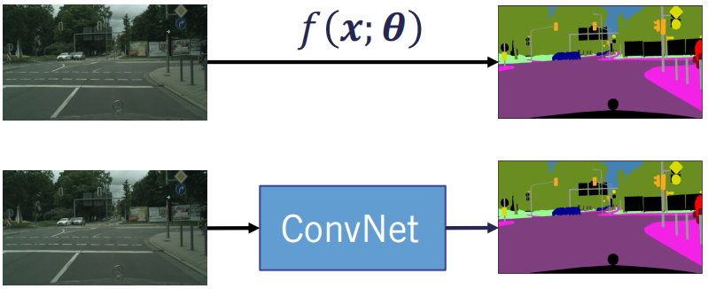

---

### 5. Evaluation Metrics

Let's begin by reviewing some basic classification metrics. The first metric to define is the true positives. The number of correctly classified pixels belonging to a certain class X. The second metric is the number of pixels that do not belong to the class X but are classified as that class. This metric is termed the false positives. Finally, the false negatives are computed as the number of pixels that belong to the class X but are not classified as that class. These terms are identical to those used in object detection. Using these three metrics, we can compute the most commonly used semantic segmentation evaluation metric, the class IOU. The class IOU is computed as the total true positives divided by the sum of the true positives, false positives, and false negatives. 

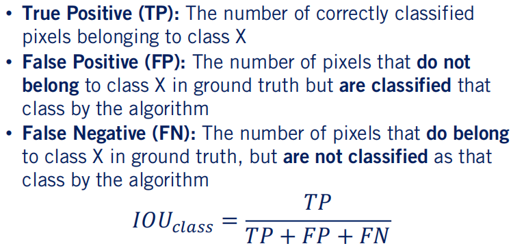

Let's take a look at a visual example of this calculation. The ground truth segmentation data is represented as a single class per pixel. Similarly, by taking the class with the maximum output score as our predicted class, the prediction can be put in a similar format. We now begin by computing the class IOU for the road class represented by R. The first metric to measure is the number of true positives. We can determine the true positives by counting the correctly classified road pixels in our prediction. 

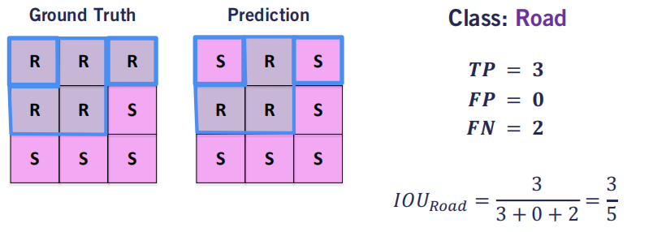

In this case, three. The second metric, the false positives is zero in our case as our algorithm did not classify any of the sidewalk pixels as road. Finally, our algorithm classified to road pixels as sidewalk, hence the false-negative count is two. Our final IOU for the road is then three-fifths. 

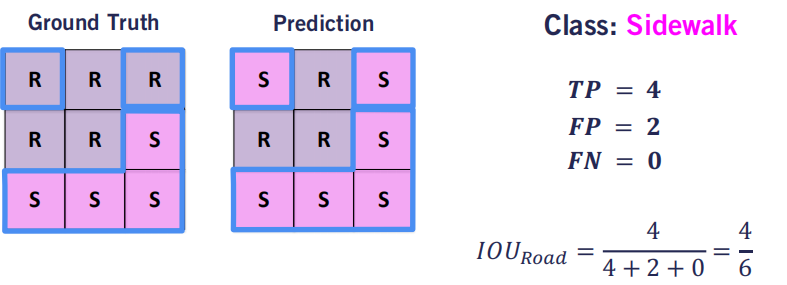

Let's follow this procedure for the sidewalk class. We can see that we have four correctly classified pixels, hence our true positive count as four. Furthermore, our algorithm mistakenly assigns two pixels to the sidewalk class where, in fact, they belong to the road class. Therefore, our false positive count is two. Finally, the algorithm did not miss any sidewalk pixels, so it's false-negative count is zero. 

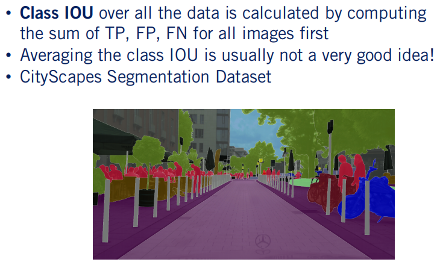

We can then compute the sidewalk class IOU as four-sixths. We have performed the class IOU computation over a single image. When performing this computation on multiple images, one has to keep in mind to compute the true positives, false positives, and false negatives over all of the images and then compute the IOU. Computing the IOU per image and then averaging will actually give you an incorrect class IOU score. Furthermore, it is usually a better idea to independently look at each class IOU score rather than averaging them. This is because a global IOU measure is biased towards object incidences that cover a large image area. In street scenes with their strong scale variation, this can be problematic. Other metrics such as per instance IOU are usually used to remedy this problem. The Cityscapes benchmark is one of the most used benchmarks for evaluating semantic segmentation algorithms for self-driving cars. The per class IOU is used as the main ranking metric for semantic segmentation models submitted to the Cityscapes benchmark. Although, the instance level IOU is also computed for each model. 

---

### 6. Summary

> - Semantic segmentation consists of providing a class label for every pixel in a 2D image
> - Semantic segmentation models can be evaluated using class IOU

In this lesson, you learned that semantic segmentation consists of providing a class label for every pixel in a 2D image. You also learned how to evaluate semantic segmentation models using the per class IOU. In the next lesson, we will learn how to use convolutional neural networks to solve the semantic segmentation problem. See you then.

---

## Lesson 2: ConvNets for Semantic Segmentation

### Learning Objectives

> - Learn how to use convolutional neural networks to perform the semantic segmentation task
> - Learn the different layers required for the good performance of semantic segmentation models

In the first lesson of this module, we define the semantic segmentation problem and saw how to evaluate the performance of semantic segmentation algorithm by calculating the class IOU. In this video, we will learn how to use convolutional neural networks to perform the semantic segmentation task. Using confidence for semantic segmentation is actually a little easier than using them for object detection. Unlike ConvNets for object detection, the training and inference stages are practically the same for semantic segmentation. However, there are some intricacies to semantic segmentation that we need to be aware of. 

---

### 1. Review

Let's begin with a quick review of the semantic segmentation problem. Semantic segmentation takes a camera images input and provides a category classification for every pixel in that image as output. This problem can be modeled as a function approximation problem, and ConvNets can once again be used to approximate the required function. What kind of ConvNet model can we use to perform this function approximation? 

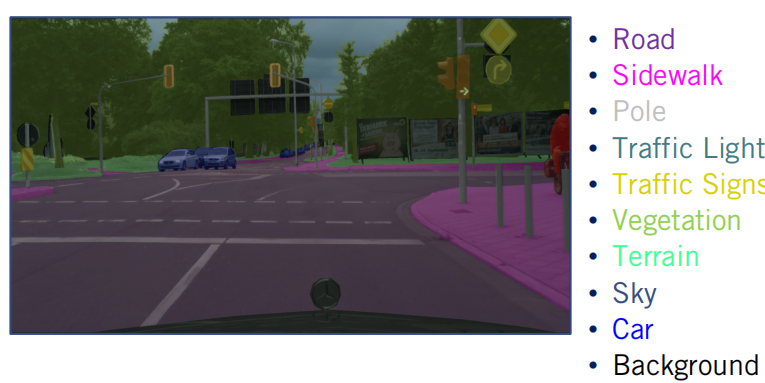

One idea is to use the same ConvNet model we used for object detection. That is, a feature extractor followed by an output layer. We do not need anchors here as we are not trying to localize objects. Let's see how effective this architecture is for performing semantic segmentation. You'll start by analyzing the feature extractor. As with the feature extractor used for object detections, we can use the VGG architecture. 

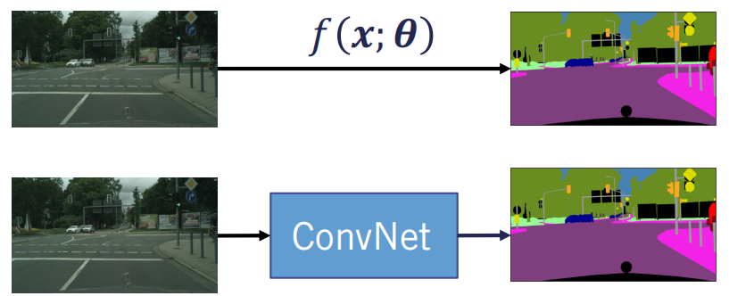

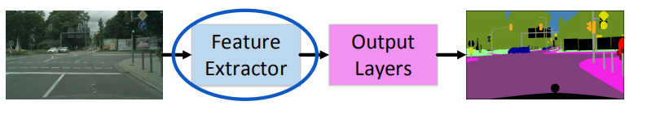Let's see what happens to the size of M by N by three input image, as we go through this feature extractor. As with object detection, our resolution will be reduced by half after every pooling layer. On the other hand, our depth will increase due to the convolutional layers. The output feature map of our convolutional feature extractor will be downsampled by 16 times. We can add as many convolutional pooling blocks as needed, but that will further shrink our feature map. However, we want our output to have a classification for every pixel in the image. 

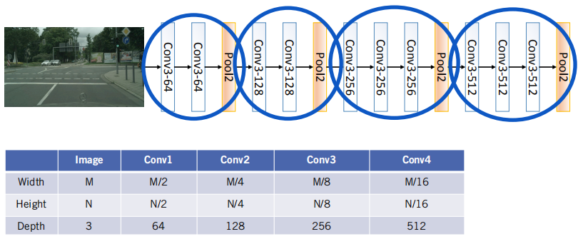

So how can we achieve this given a down sampled feature map that is 16 times smaller than our original input? 

---

### 2. Upsampling the Output

A simple solution would be the following. We can first compute the output by passing the 16 times downsampled output feature map through a softmax layer. We can then determine the class of every pixel in the subsampled output by taking the highest class score obtained by the softmax layer. The final step would be to proceed to upsample, the downsampled output back to the original image resolution. How well do you think the described approach will work? 

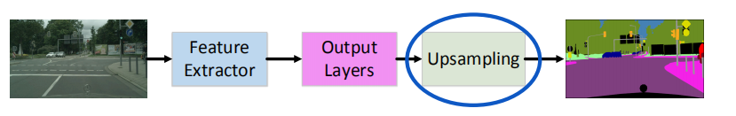

To understand why naive upsampling might produce inadequate results, let's take a look at how upsampling increases the image resolution. We want to use the nearest neighbor upsampling on a two-by-two image patch. The color of the pixels of the image patch represent different values of every pixel. We want to upsample our patch to double its original size. So have an upsampling multiplier S of two. 

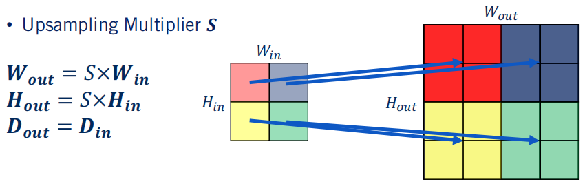

Nearest neighbor upsampling generates an empty initial upsampled grid by multiplying Win an Hin by the upsampling multiplier. Each pixel in the upsampled grid is then filled with the value of the nearest pixel in the original image patch. This process is repeated until all the pixels in the upsampled grid are filled with values from the image patch. The depth of the output upsampled grid remains the same as the input image patch. The problem induced by upsampling is that the upsampled output image has very coarse boundaries. 

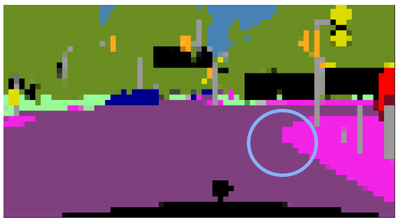

As you can remember from the last lesson, one of the most challenging problems in semantic segmentation is attaining smooth and accurate boundaries around the objects. Smooth boundaries are hard to attain as in general boundaries in the image space are ambiguous, especially for thin objects such as pools, similar looking objects such as roads and sidewalks, and far away objects. 

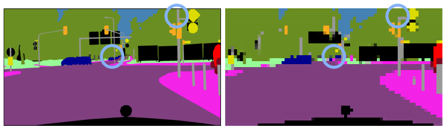

Naive upsampling also induces two additional problems. Any object less than 16 pixels in width or height usually fully disappears in their upsampled image. This affects both thin objects such as pools and far away objects. As they are below the minimum dimensions required for the pixels to appear from the original image. 

---

### 3. Learning Same Resolution Feature Maps

To remedy these problems, researchers have formulated what is commonly referred to as a feature decoder. The feature decoder can be thought of as a mirror image of the feature extractor. Instead of using the convolution pooling paradigm to downsample the resolution, it uses upsampling layers followed by a convolutional layer to upsample the resolution of the feature map. The upsampling usually using nearest neighbor methods achieves the opposite effect to pooling, but results in an inaccurate feature map. The following convolutional layers are then used to correct the features in the upsampled feature map with learnable filter banks. This correction usually provides the required smooth boundaries as we go forward through the feature decoder. 

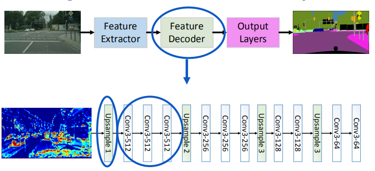

---

### 4. The Feature Decoder

Let's now go through an analysis of the dimensions of the feature map as it travels forward through the feature decoder. As a reminder, the input feature map is downsampled 16 times with a depth of 512. Similar to the feature extractor, each upsampling convolution block is referred to as a deconvolution. There is of course a debate among current researchers on whether this terminology is accurate. But we will use it here to refer to the reverse of the convolutional pooling block. As we go through the first deconvolution block, our input feature map is upsampled to twice the input resolution. The depth is controlled by how many filters are defined for each successive convolutional layer. 

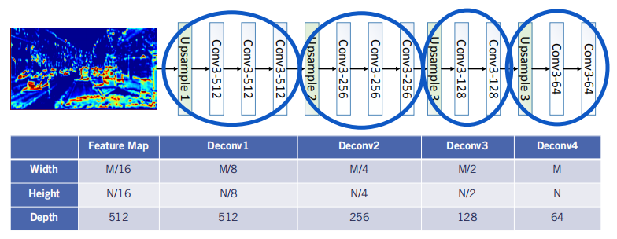

As we go forward through the rest of the decoder, we finally arrive at a feature map of similar resolution to the input image. For reduced computational complexity, we usually shrink the depth of the map as we go forward. But this is a design choice that depends on your application. Note, this upsampling mechanism is the simplest among many of the proposed methods for semantic segmentation. Please take a look at the supplementary material provided for more efficient, powerful, and complex upsampling models that have been proposed for semantic segmentation. 

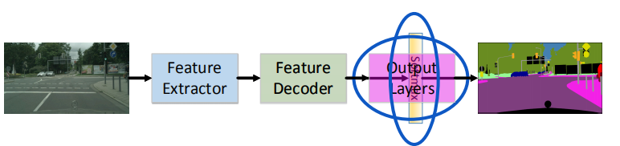

Now that we have a similar sized feature map to our input image, we need to generate the semantic segmentation output. We can perform semantic segmentation through a linear output layer, followed by a softmax function. This layer is very similar to the classification output layer we described in object detection. In fact, this layer provides a k-dimensional vector per pixel with the kth element being how confident the neural network is that the pixel belongs to the kth class. 

---

### 5. Output Representation

Let's investigate the expected output visually. Given an image patch and its corresponding ground truth label, we can represent each pixel as a k-dimensional one-hot vector. A one hot vector assigns the value of one to the correct class and zero to the remaining classes. Since only that one value is non-zero or hot. In this case, we have two classes and a background class, so we are working with a three-dimensional ground truth vector per pixel. The neural network drives the output of the softmax to be as close to one as possible for the correct class, and is close to zero as possible for the rest of the classes for each pixel. 

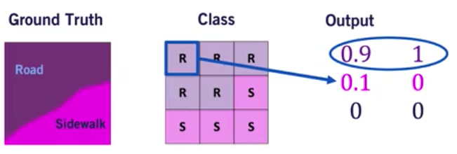

We then take the index of the maximum score to recover the required output representation. Note however, that we only perform this step during inference. 

---

### 6. Classification Loss

For training, we use the softmax output score directly. The problem of semantic segmentation by definition requires the neural network to provide a single class for every pixel classification. To learn how to perform this task, the cross entropy classification loss is used to train the neural network once again. This loss is similar to the one we used for the object detection classification hit. Cross entropy drives the neural network to learn a probability distribution per pixel that is closest to the ground truth class probability distribution. 

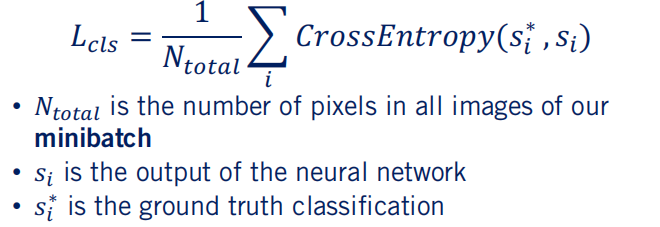

Here, N total is the total number of classified pixels in all the images of a mini-batch. Usually, a mini-batch would comprise of eight to 16 images, and the choice of this number depends on how much memory your GPU has. Finally, the cross entropy loss compares Si, the output of the neural network for every pixel with Si star, the ground truth classification for that pixel. 

---

### 7. ConvNets For Semantic Segmentation

In summary, we arrived at the following ConvNet model for semantic segmentation. The feature extractor takes the image as an input and provides an expressive, but low resolution feature map as an output. The decoder then takes this feature map and upsamples it to get a final feature map of equal resolution to the original input image. Finally, a linear layer followed by a softmax function generates the class ConvNets vector for each pixel in the input image. 

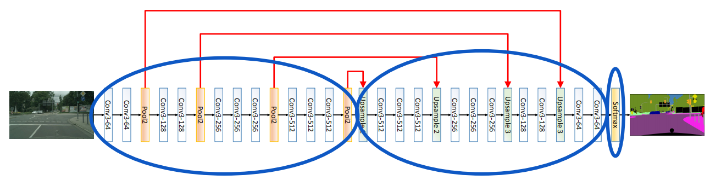

The architecture we described in this lesson is one of the simpler models that can be used for semantic segmentation. A lot of research on the optimal neural network model for semantic segmentation has been performed. Ideas such as propagating the indices from pooling layers in the extractor to upsampling layers in the decoder have shown to provide a boost in performance as well as computational speed for semantic segmentation models. We've included a list of recent manuscripts describing architecture used for semantic segmentation in the supplementary material. 

---

### 8. Summary

> - Convolutional Neural Networks can be used to solve the semantic segmentation problem
> - In a feature extractor and a feature decoder are required to provide the final output of semantic segmentation models

Congratulations, you should now have grasp the basics of using ConvNets to solve the semantic segmentation problem. Most state of the art segmentation networks share the structure we described in this video. With a feature extractor, a decoder and then an output layer as the main building blocks. We provide some links to recent methods as a reference if you're interested in diving deeper into current top performing algorithms. In the next lesson, we will describe how to use the semantic segmentation output to help self-driving cars perceive a road seen. See you next time.

---

## Lesson 3: Semantic Segmentation for Road Scene Understanding

### Learning Objectives

> - Learn how to use the output of semantic segmentation models to perform drivable space estimation
> - Learn how to use the output of semantic segmentation models to perform semantic lane estimation

Welcome to the final lesson for this week. In the previous lesson, we learned how to perform semantic segmentation using convolutional neural networks. In this video, we will learn how to use the output of these networks for scene understanding of road scenes. Specifically, you will learn how to use the output of semantic segmentation models to estimate the drivable space and lane boundaries. 

---

### 1. Review

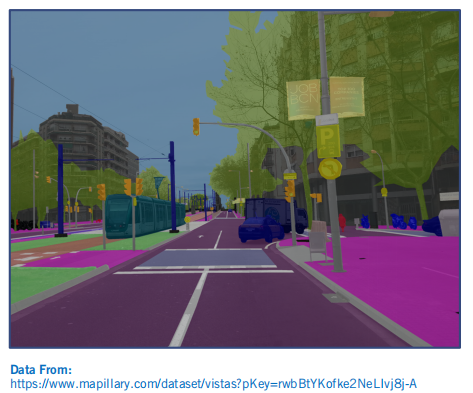

Let's quickly review what we expect as an output from a semantic segmentation model. A semantic segmentation model takes an image as an input, and provides us output, a category classification for every pixel. 

---

### 2. 3D Drivable Surface Estimation

Now let's use this output to perform some useful tasks for self-driving cars. The first task we will be discussing is the estimation of a drivable surface from semantic segmentation output in 3D. Drivable space is defined as the region in front of the vehicle where it is safe to drive. In the context of semantic segmentation, the drivable surface includes all pixels from the road, crosswalks, lane markings, parking spots, and even sometimes rail tracks. Estimating a drivable surface is very important as it is one of the main steps for constructing occupancy grids from 3D depth sensors. You will learn more about occupancy grids in course 4, where they will be used to represent where obstacles are located in the environment during collision avoidance. 

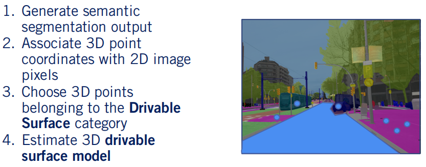

But for now, let's describe how to perform drivable surface estimation from the semantic segmentation output. First, we use a ConvNet to generate the semantic segmentation output of an image frame, we then generate 3D coordinates of some of the pixels in this frame, either from stereo data or by projecting a lighter point cloud to the image plane. With a known extrinsic calibration between sensors, we can project lidar points into the image plane and match them to the corresponding pixels. We then proceed to choose 3D points that belong to the drivable surface category. As we mentioned earlier, this category should at least include the road, lane markings, and pedestrian crossings. In certain scenarios, other classes such as railroad tracks for example might also be included, depending on the driving context. All other classes are excluded even if their height is similar to the drivable surface. Finally, we use this subset of 3D points to estimate a drivable surface model. The complexity of this model can range from a simple plane to more complex spline surface models. 

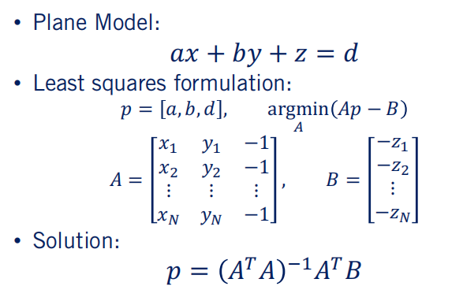

Let's describe how to robustly fits a planar drivable surface model given segmented image data and lidar points. We first define the model of a plane as ax plus by plus z equals d, where x, y, z is any point on the plane, the coefficients a, b, and 1 define the plane normal vector, and d is a constant offset. We can form a set of linear equations to estimate the parameters of this plane model using as measurements, each of the points identified as belonging to the drivable surface. The parameters of the model are now summarized by the vector p, and the measurements are separated into the matrices A and B. As formulated in course 2, we can find a solution for this system of linear equations using the method of least squares. As a result, our plane parameter vector p is equal to the pseudoinverse of A times B. 

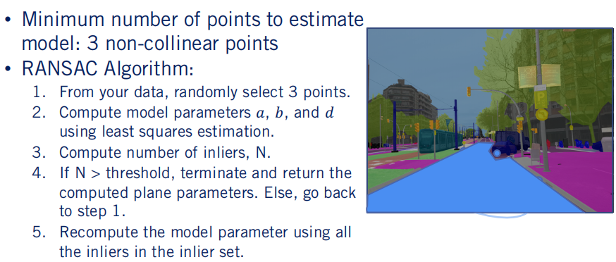

This model has three free parameters to be estimated, and as such, we need at least three non-colinear 3D points to fit the plane. In practice, we will have many more points than are necessary, so we can apply the method of least squares once again to identify parameters that minimize the mean square distance of all points from the plane. Of course, some points will be labeled incorrectly and may not truly belong to the drivable surface. So how can we avoid incorrect semantic labels negatively affecting the quality of a drivable surface plane estimation? Fortunately for us, we learned a very powerful and robust estimation method in week 2 of this course. Specifically, we can use the RANSAC algorithm to robustly fit a drivable surface plane model even with some errors in our semantic segmentation output. 

Let's go through the RANSAC algorithm for the drivable surface estimation as a refresher. First, we randomly select the minimum number of data points required to fit our model. In this case, we randomly choose three points in 3D. Second, we use these three points to compute the model parameters a, b, and d, and use the method of least squares to solve for our plane parameters. We then proceed to determine the number of 3D points that satisfy these model parameters. Usually for drivable surface estimation, most of the outliers are a result of the erroneous segmentation outputs located at the boundaries. If the number of outliers is low, we terminate and return the computed plane parameters. Otherwise, we sample three new points at random and repeat the process. Then once the algorithm meets its termination condition, we calculate the final planar surface model of the road from all of the inliers in the largest inlier set. The use of a planar surface model works well if the road is actually flat, a valid assumption in many driving scenarios. For more complex scenarios, such as entering a steeply climbing highway entrance from a flat roadway for example, more complex models are needed. 

---

### 3. Semantic Lane Estimation

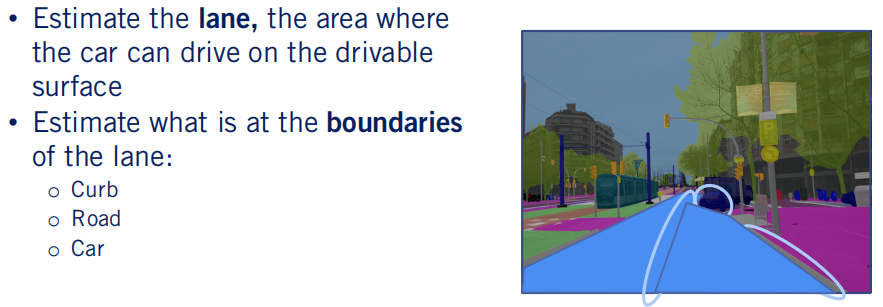

Although we estimate the drivable surface, we still have not determined where the car is allowed to drive on this surface. Usually, a vehicle should stay within its lane, determined by lane markings or the road boundaries. Lane estimation is the task of estimating where a self-driving car can drive given a drivable surface. Many methods exist in the literature to accomplish this task. For example, some methods directly estimate lane markings from ConvNets to determine where the car can drive. However, for higher-level decision-making, a self-driving car should also be aware of what is at the boundary of the lane. Classes at the boundary of the lame can range from a curb, a road, where opposite traffic resides or dynamic in parked vehicles. The self-driving car has to base its maneuvers on what objects occur at the boundary of the lane, especially during emergency pull overs. 

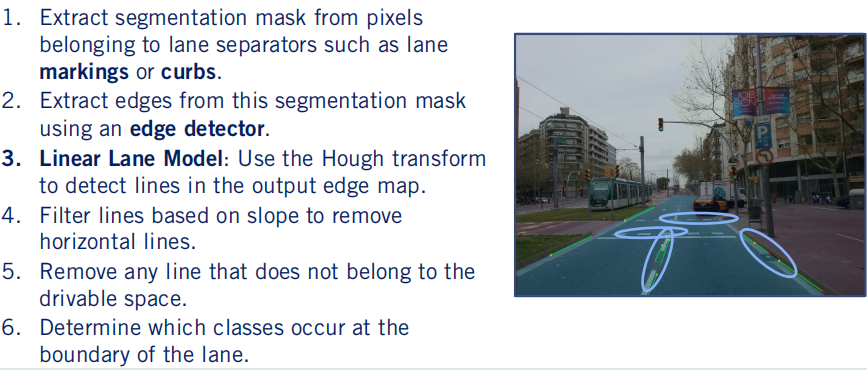

We will refer to the task of estimating the lane and what occurs at its boundaries as semantic lane estimation. Notice that if we estimate the lane using the output of semantic segmentation, we get boundary classification for free. Let's go through a simple approach to this problem to clarify the lane estimation task. Given the output of a semantic segmentation model, we first extract a binary mask of the pixels belonging to classes that occur as lane separators. Such classes can include curbs, lane markings, or rails for example. Then we apply an edge detector to the binary mask. As you remember from the first week of this course, edge detectors can be as simple as estimating gradients from convolutions. 

Here, we use a famous edge detector, the canny edge detector. The output are pixels classified as edges that will be used to estimate the lane boundaries. The final step is to determine which model is to be used to estimate the lanes. The choice of models defines what the next step will be. Here we choose a linear lane model, where each lane is assumed to be made up of a single line. To detect lines in the output edge map, we need aligned detector. The Hough transform line detection algorithm is widely used and capable of detecting multiple lines in an edge map. Given an edge map, the Hough transform can generate a set of lines that link pixels belonging to edges in the edge map. The minimum length of the required lines can be set as a hyperparameter to force the algorithm to only detect lines that are long enough to be part of lane markings. 

Further refinement can be applied based on the scenario at hand. For example, we know that our lane should not be a horizontal line if our camera is placed forward facing in the direction of motion. Furthermore, we can remove any line that does not belong to the drivable surface to get a final set of lane boundary primitives. The last step would be to determine the classes that occur at both sides of the lane, which can easily be done by considering the classes on both sides of the estimated lane lines. We will not discuss edge detectors and Hough transforms in detail, as these topics deserve a separate discussion outside the scope of this course. 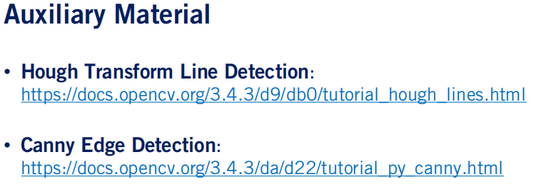

However, powerful computer vision libraries such as Open CV, have open-source implementations, and tutorials on how to detect lines using the Hough transform, and how to detect edges using the Canny edge detector. If interested, take a look at how these algorithms are used in practice using the links provided in the supplementary material. 

---

### 3. Summary

> - Semantic Segmentation Results can be used to estimate drivable space, and what classes occurs at its boundaries
> - Semantic Segmentation Results can be used to estimate lanes
> - Semantic Segmentation Results can be used to aid in 2D object detection

In summary, semantic segmentation can be used to estimate the drivable space, to determine what occurs at the boundary of the drivable space, and to estimate lanes on the drivable surface. The applications discussed so far are very active areas of research, and what you've learned during this lesson provides a solid starting point and competitive baselines for the task of semantic lane detection and drivable surface estimation. Furthermore, semantic lane detection and drivable surface estimation are the most prominent uses for semantic segmentation models in the context of self-driving cars. However, semantic segmentation has many more useful applications. 

Most importantly, aiding the self-driving car in performing both 2D object detection and localization. With information about which pixels to evaluate for objects or weather features are on static or moving objects, the robustness of the perception system can be significantly improved. It can act as a sanity check or a filter to avoid including incorrect information in other perception tasks. Semantic segmentation is a powerful tool for self-driving cars and a core component of the high level perception stack. You will have the chance to validate its usefulness next week when we discuss our final assignment. See you then.

