# Module 7  ：Putting it all together - Smooth Local Planning

Parameterized curves are widely used to define paths through the environment for self-driving. This module introduces continuous curve path optimization as a two point boundary value problem which minimized deviation from a desired path while satisfying curvature constraints.

## Learning Objectives

- Recall the definition of parametric curves, motion planning constraints, and motion planning boundary conditions.
- Understand the differences between spirals and splines, and the tradeoffs of using either.
- Design optimization objectives suited to particular motion planning tasks.
- Use Python libraries to solve optimization problems.
- Implement a conformal lattice planner based on polynomial spiral optimization.
- Compute a velocity profile constrained by curvature, speed limits, and dynamic obstacles.

---

## Lesson 1: Parametric Curves

### Learning Objectives

Hi everyone, and welcome to the final module of course four. In this module, we'll discuss the lowest level of our hierarchical motion planner, which is the local planner. **As a reminder, the local planner is the portion of the hierarchical planner that executes the maneuver requested by the behavior planner in a collision-free, efficient, and comfortable manner.** This results in either a trajectory, which is a sequence of points in space at given times or a path and velocity profile, which is a sequence of points in space with the required velocities at each point. This plan can then be given as the reference input to the controllers that you developed in course one. 

> - Understand the path planning problem, as well as its constraints and boundary conditions
> - Know what parametric curves are
> - Describe the advantages and drawbacks of using splines and spirals in a path planning context

In this module, we'll build upon the introductory reactive planner we developed back in module four, such that it is able to handle some of the nuances presence in the autonomous driving motion planning problem. In particular, we'll move from the discrete time to continuous time in order to produce smooth parameterized paths that are easy to track with our controllers. In this video, we'll introduce the path planning problem and its associated constraints and boundary conditions. As well, we'll discuss parametric curves and how they are useful for representing paths for this problem. In particular, you should understand the difference between splines and spirals in the context of motion planning, and the advantages and drawbacks of each. So let's get started. 

---

### 1. Boundary Conditions

The first step in understanding the path planning problem is to first understand its most fundamental requirements. For the path planning problem, this is given a starting position, heading, and curvature, find a path to an ending position heading and curvature that satisfies our kinematic constraints. In the context of an optimization, the starting and end values can be formulated as the boundary conditions of the problem, and the kinematic motion of the vehicle can be formulated as continuous time constraints on the optimization variables. 

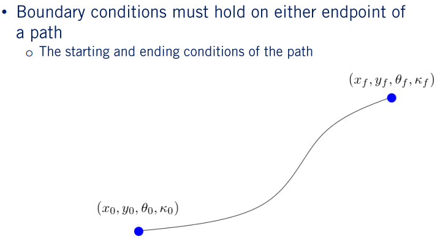

In this context, the boundary conditions are the conditions that must hold on either end point of the path for a given optimization solution to be considered feasible. If these boundary conditions are violated, no matter how great the path is, we haven't achieved our core objective of actually getting to the point we want to get to. So the path is not useful to us. These boundary conditions will influence how we decide to set up the underlying structure of the optimization problem. Let's look at why this is. 

---

### 2. Kinematic Constraints

For our path planner, our only kinematic constraint is going to be restricting the maximum curvature along the path. In general, this is not easy to satisfy since there are infinitely many points along a continuous path. 

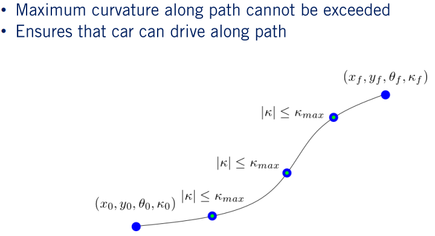

Instead, we will often take samples of the curvature at different points along the path, and constrain the curvature of each of these points. Assuming the path is relatively well-behaved, this will likely correspond to the curvature of the entire path satisfying the constraint. 

---

### 3. Parametric Curves

To simplify the representation of our optimization problem, we're going to define a path as a parametric curve. What is a parametric curve? A parametric curve is a curve that can be described as a set of equations with specific parameters. These parameters often denote path traversal, whether it will be through arc length or just varying from zero to one. 

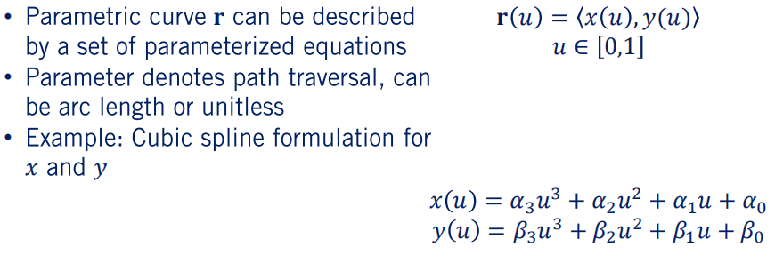

For example, here we have a cubic spline set of parametric equations for the x and y positions of a path. The parameter of the equations u varies from zero to one, as we traveled from the start of the path to the end of the path. The vector valued function r contains the x and y position at each point corresponding to a given u value. 

---

### 4. Path Optimization

For autonomous driving, we often but not always require the path to be a parametric curve. Why is this? 

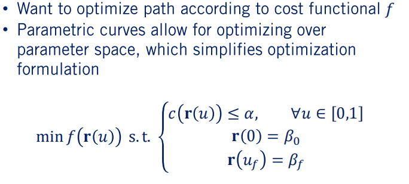

We often focus on planning methods that optimize a given path according to boundary conditions shown here by Beta naught and Beta f, kinematic constraints shown here by Alpha, and an objective functional shown here by f. Having a parametric representation of the path make setting up the optimization problem simpler, as we have a function we can directly give to our objective functional f. Note that the term functional refers to mappings that takes a function as their argument and return a real value, so it can be used to define a cost over a space of functions or parametrized curves. 

---

### 5. Non-Parametric Path

We can contrast this parametric curve approach with the reactive planner in module four, where we represented the trajectory and the path with a sequence of points in space. This is known as a non-parametric path since the curve we followed did not have a parametric representation. 

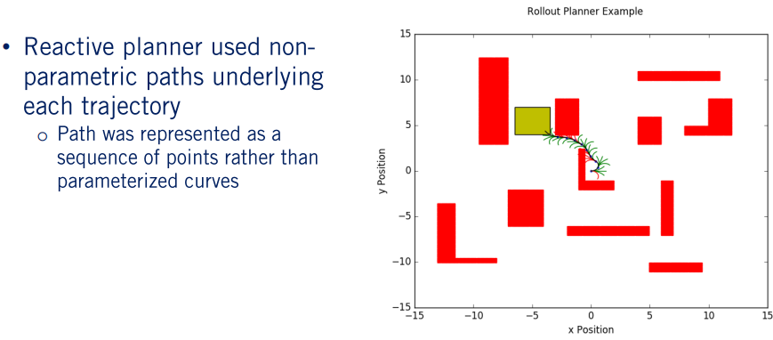

---

### 6. Path Parameterization Examples

In the field of autonomous driving, there are two common types of path parameterizations. The first are **quintic splines** which are fifth order polynomial functions of the x and y position of the car. The second type is the **polynomial spiral**, given by a polynomial curvature function with respect to arc length. 

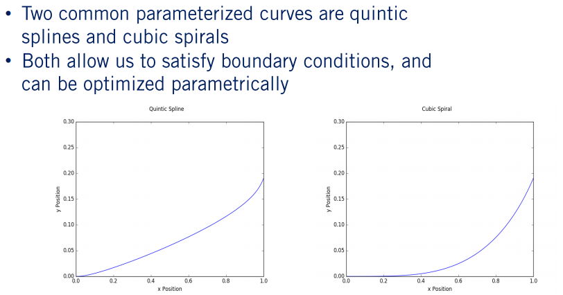

Pictured here is a third order polynomial spiral, a cubic spiral, both of these parameterized curves give us the means to satisfy the boundary conditions we just discussed, and also offer us parameters to use in objective functions to craft the paths according to our requirements. Selecting either of these has associated tradeoffs. So let's explore each more deeply. 

---

### 7. Quintic Splines & Quintic Splines Curvature

First, let's discuss the quintic spline. The quintic spline is given by two equations, one for the progression of x along the spline and one for y. Here we can see that the quintic spline has 12 parameters, six for the x equation and six for the y equation. These parameters correspond to the polynomial coefficients that form the shape of the curve. The traversal parameter u is fairly arbitrary here. For simplicity, we take it to be in the range of zero to one. What this means is that u equals zero corresponds to the start of the path, and u equals one corresponds to the end. 

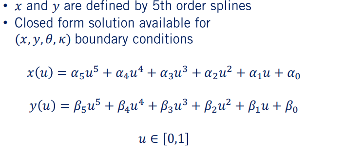

A nice property of the quintic spline is that for given position heading and curvature boundary conditions, there is an immediate closed form solution for the spline coefficients that satisfy them. The solution is quite long so we won't listed here, but it is still cheaper to evaluate than generating a path using an iterative optimization method. See the supplemental materials for a full listing. There are also additional degrees of freedom which can be further optimize depending on this application. This is desirable because it allows us to generate a feasible solution to the boundary conditions immediately, which can be further refined in anytime fashion. 

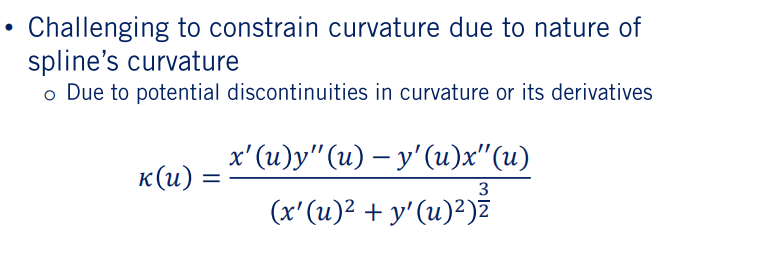

The downside with quintic splines is that it is often hard to constrain curvature within a certain set of bounds as is often required in autonomous driving. If we look at the curvature equation for a parametric curve, we can see that for our quintic splines, the curvature as a function of arc length will not in general be a polynomial. This has the potential to introduce cusps or even discontinuities of the curvature in the spline, which makes it difficult to approximately satisfy curvature constraints across the entire domain of the spline. We will discuss these curvature constraints in more detail in our next lesson, where we set up the optimization problem for path planning. 

---

### 8. Polynomial Spirals & Polynomial Spiral Position

As an alternative approach, we can also employ polynomial spirals to represent our path. These curves offer a closed form equation for the curvature of the curve along each point of its arc length. For autonomous driving, it is common to select a cubic polynomial as our curvature function of arc length. However, higher-order functions are also acceptable. 

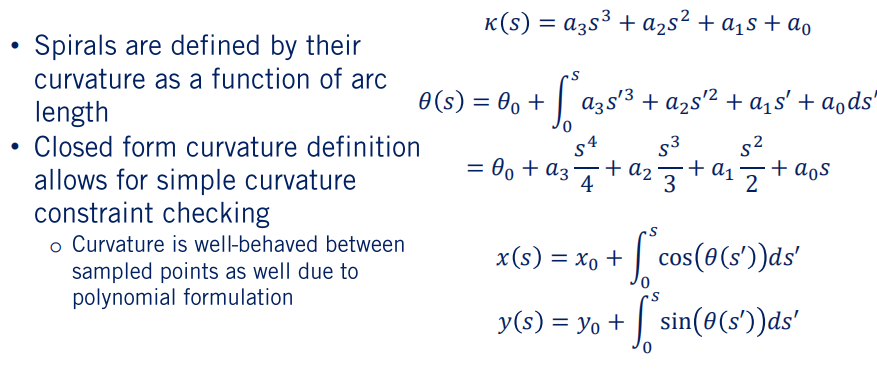

The main positive of using polynomial spirals is that their structure is highly conducive to satisfying the approximate curvature constraints that are often required by the path planning problem. **Since a spiral is a polynomial function of curvature, the curvature value will not change extremely quickly like it can in the case of quintic splines.** This means we can constrain the curvature of only a few points in the spiral and the spiral will very likely satisfy the curvature constraints across the entire curve. This is highly useful when performing path optimization, as the number of constraints greatly increases the computational effort of each optimization step. 

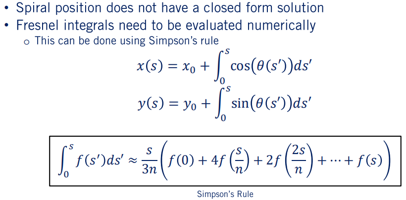

**The downside of using polynomial spirals is that there is no closed form solution of the position and heading of the spiral, unlike the case in the quintic spline.** Therefore, we must perform an iterative optimization in order to generate a spiral that satisfies our boundary conditions. As can be seen here, the position equations results in Fresnel integrals, which have no closed form solution. We therefore need to use numerical approximation techniques to compute the final end points of the spiral. **In this module, we will approximate these Fresnel integrals using Simpson's rule shown here on the third line.** Simpson's rule is more accurate with fewer points than other approximation methods, which will be useful when we setup our optimization problem. 

When it comes to the strengths and weaknesses of the spiral, we almost have a duality when compared to the spline, each has a weak point where the other is strong. The spline provides closed form solutions based on start and end points alone, whereas the spiral does not. The spiral ensures smooth curvature variation along the path, while the spline does not. You will therefore need to determine which method is appropriate depending on your specific application. As a brief shorthand, the spline leads to computational efficiency, while the spiral leads to easier implementation of curvature constraints. For this module, we will focus on the polynomial spirals as we develop our path planner, as we have a strong interest in ensuring the paths generated by our local planner can be executed smoothly and safely by the vehicle. However, many of the techniques described going forward can also be applied to quintic splines. 

---

### 9. Summary

> - Discussed boundary conditions and constraints in path planning problem
> - Introduced parametric curves
> - Discussed differences between spirals and splines in the context of path planning

Let's summarize this lesson. We gave you an overview of the boundary conditions and parametric curves used in autonomous driving path planning, and we introduced splines and spirals as alternative path representations, and discuss their differences in the path planning context. In our next lesson, we'll be discussing how to set up the path planning optimization problem using the cubic spiral parametrization we discussed in this lesson, as well as the constraints and objective functions we defined earlier in this course. We will see you there.

---

## Lesson 2: Path Planning Optimization

### Learning Objectives

> - Identify required boundary conditions and constraints for spiral path planning
> - Know how to approximate the constraints to improve optimization tractability
> - Know how to re-map parameters to improve optimization convergence speed

Hi everyone. In this lesson, we will discuss how to incorporate some of the objectives and constraints we discussed in module one with the cubic spirals in boundary conditions we introduced in the last lesson to create a path planning optimization problem. By solving this problem, we'll be able to generate smooth, feasible paths that satisfy all of our constraints. By the end of this video, you should be able to: Identify the boundary conditions and constraints required for smooth path planning using polynomial spirals, approximate some of the required constraints to improve the tractability of the optimization problem, and know how to map the required parameters in such a way that the optimization problem converges quickly to a feasible solution. Let's get started. 

---

### 1. Cubic Spiral and Boundary Conditions

If you recall from the previous lesson, our boundary conditions described the absolute minimum requirements for a path being planned between two points. **Essentially, they require that for a given starting position heading and curvature, our planned path ends at a specific position heading and curvature as well.** This will give us our first set of constraints on our optimization problem known as boundary conditions which we can see here. 

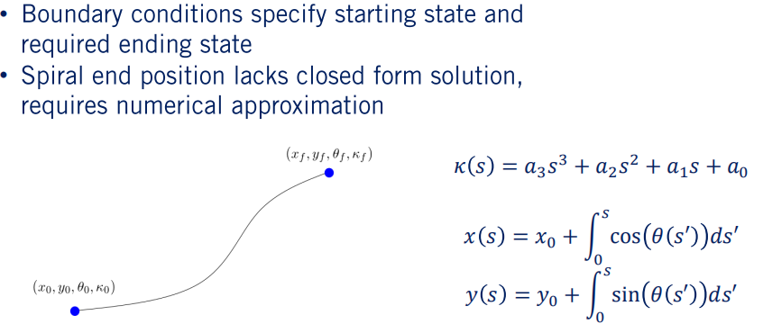

Unfortunately, as we discussed in the last lesson that cubic spiral does not have a closed form solution for the position at the end of the spiral. To write our constraints in terms of the parameters of the spiral, we will need to use a numerical integration technique. Many exist, but we'll apply Simpson's rule which we briefly mentioned in the previous lesson. 

---

### 2. Position Integrals and Simpson's  Rule

Let's look a bit more closely at Simpson's rule. Simpson's rule is a commonly used numerical integration technique that is generally more precise than other simpler numerical methods. This is because it evaluates the integral of the quadratic interpolation of the given function rather than the integral of the linear interpolation as in some methods such as midpoint and trapezoidal rules. 

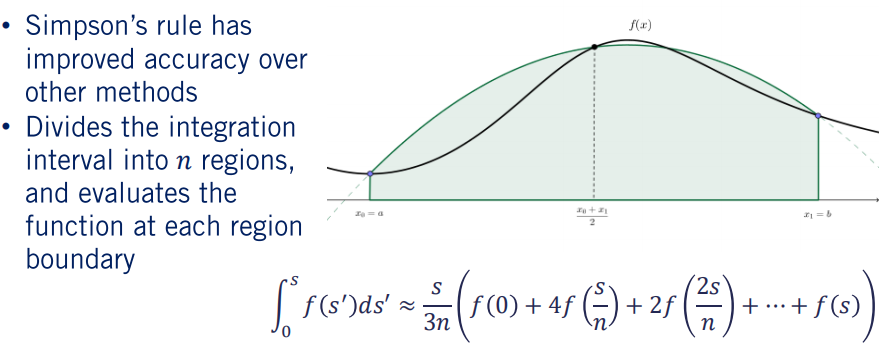

Simpson's rule proceeds by defining a number of equally spaced divisions of the integration domain defined by n, and then summing terms at each division and boundary point. For example, if we choose n equal to four, then we are splitting the integration domain into four equally sized segments, and we therefore have five points to include in our sum. Each term in the sum is the function evaluated at the division point multiplied by the appropriate coefficient. In the interior of the Simpson's rule equation, we can see that we have alternating coefficients of four and two for each term except for the endpoint terms which have a coefficient of one. As one would expect, as n increases, we get a more accurate approximation to our integral. 

---

### 3. Applying Simpson's Rule

Let's apply this to our specific planning problem. If we take n equals eight in the Simpson's rule approximation, our approximation will be accurate enough for the optimizations we'll be performing without being too computationally expensive. Since the heading Theta is just the integral of the cubic spiral function, we can explicitly define a closed form solution for it which is a fourth order polynomial which is shown here. 


We can then use the values of Theta at each division point in a Simpson's rule approximation to compute the x and y positions of the cubic spiral. The integrands to be integrated for x and y are cosine of Theta of s and sine of theta of s respectively, which are substituted in for f in the Simpson's rule to form the following expressions. We now have a useful approximation to the X and Y position of the spiral at any given arc length point defined by our arc length parameter s. We will denote the approximations to x and y as computed using Simpson's rule as x sub s and y sub s. 

---

### 4. Boundary Conditions via Simpson's Rule

Returning to our boundary conditions, we now have an approximation for the path ending location and we can write out the boundary conditions in terms of the known parameters of the spiral. 

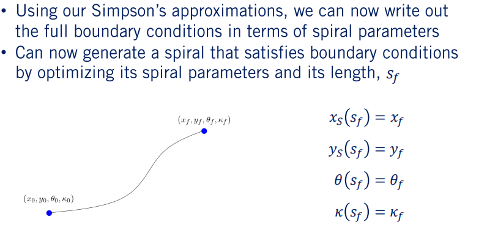

We can now generate a spiral from one point to another that satisfies the given boundary conditions by iteratively optimizing the parameters of the spiral as well as its total arc length Sf. Before we do that, however, let's go over the kinematic constraints we would like to enforce. 

---

### 5. Approximate Curvature Constraints

Specifically for autonomous driving path planning, we're going to be focusing on curvature constraints. Cars have an absolute minimum turning radius and need to stay within lateral acceleration limits to maintain wheel traction and ride comfort in the vehicle. We'll discuss these constraints in more detail in future lessons. For now, let's assume that our car can achieve a minimum turning radius of two meters. This corresponds to a maximum curvature of 0.5 arc meters. Now, it's quite difficult to write out this curvature constraint at every single point along the spiral. However, because of the polynomial nature of the spiral, we only have to constrain a few evenly spaced points. Because the polynomial function of curvature is continuous and well-behaved, we're likely to generate a spiral that satisfies our curvature requirements when performing the optimization. 

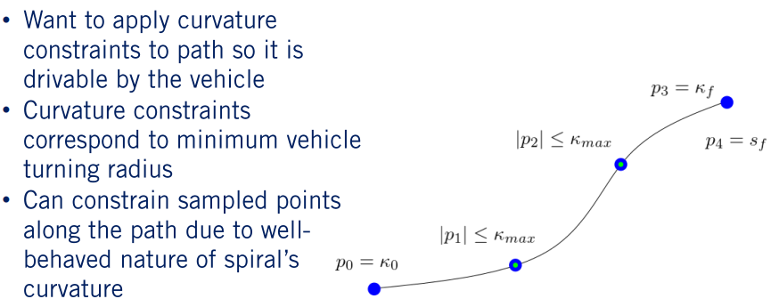

For simplicity, let's constrain the curvature at the one-third and two-third points of the curve. The start and end point curvatures were already constrained in the boundary conditions. Once we've done this, we now have our curvature constraints as a function of the parameters of the spiral, and we have all of our required constraints to solve the optimization problem. 

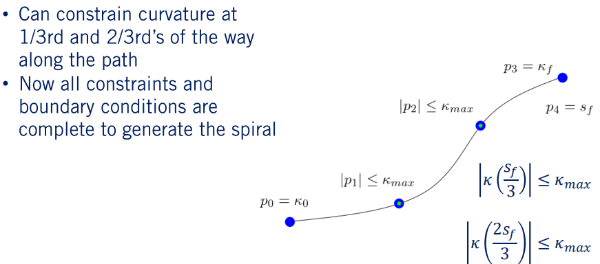

---

### 6. Bending Energy Objective

The final piece of the puzzle is the actual objective function we wish to minimize. We want to encourage smoothness and comfort along our planned path. One way to do so is to distribute the absolute curvature evenly along the path. This can be done by minimizing the bending energy of our planned parametric curve. 

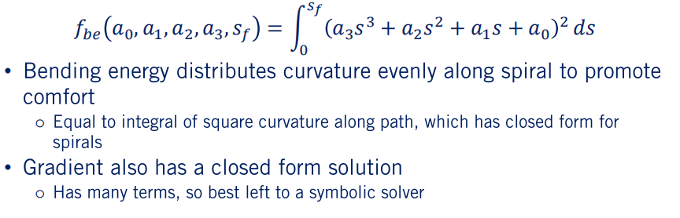

The bending energy of a curve is the integral of its squared curvature along the entire arc length of the path. Since we have a polynomial function of curvature describing our cubic spiral, the bending energy integral has a closed form solution in terms of the spiral's parameters. In addition, its gradient also has a closed form solution. Both of these expressions have many terms however so it's best left to a symbolic solver to create them. The fact that the objective function and its gradient have closed form solutions make it an objective function that is highly conducive to nonlinear programming which we will discuss in our next lesson. 

---

### 7. Initial Optimization Problem

Now that we have our objective function, we can put everything together into our path planning optimization problems shown here. For our purposes, we're going to assume the initial boundary conditions are zero, which means that we are defining our local planning problem in the vehicle frame and results in the simplified expressions for the heading and x and y approximations using Simpson's rule we've defined in this video. 

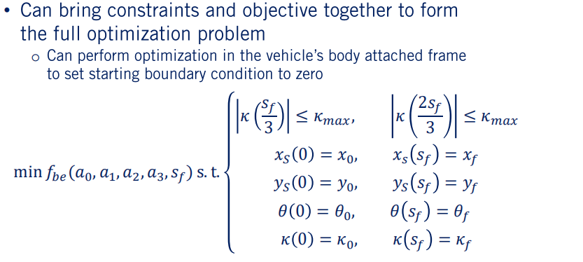

This means that the initial boundary value constraints can be removed since they are already accounted for in our integral calculations. Now we could very well stop here and use this as our path generating optimization problem. However, there is a practical issue with how this optimization problem is set up that may slow it down or cause it not to converge at all when solved using canonical non-linear programming solvers. Let's try to address this now. 

---

### 8. Soft Constraints

The main issue we can see here has to do with the equality constraints of the final position and heading. Because equality constraints must be satisfied exactly, it is quite hard for a numerical optimizer to generate a feasible solution from an infeasible starting point which is often what is given to the optimizer for an arbitrary problem instance. **To alleviate this issue, it is common in optimization to soft inequality constraints to improve optimizer performance.** Soft constraints convert a strict constraint into a heavily penalized term in the objective function. By heavily penalized, we mean that the constraint penalty term coefficient should be at least an order of magnitude larger than the general optimization objective. 

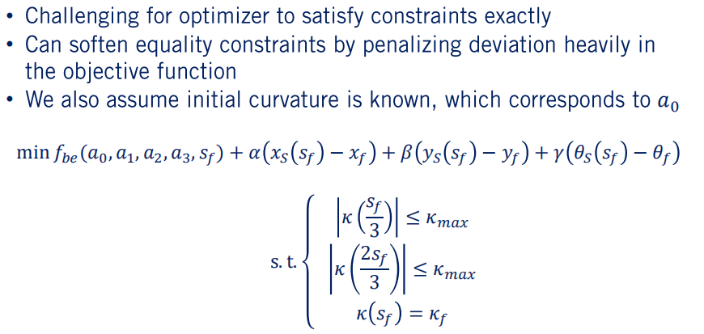

Although this allows the optimizer to violate the boundary condition equality constraints, the optimizer will be strongly encouraged to converge to a solution that is as close as possible to the boundary conditions before the bending energy penalty term will be large enough to influence the optimizer. We will also assume that our initial curvature is known and is usually set to zero which corresponds to a naught equal to zero. This reduces the number of optimization variables by one. After softening these constraints, our new optimization problem is as follows. We have one further issue we need to address before defining the final version of our optimization to be implemented. 

---

### 9. Parameter Remapping

The final issue we can address has to do with the **optimization parameters**. While there is more intuition to using the cubic spiral coefficients in our objective function, we can actually reduce the number of parameters we are searching over by taking the final curvature boundary constraint into consideration. vLet's redefine our cubic spiral using a different set of parameters denoted by the vector p where p has five elements. First, we have p naught through p3, which denote the curvature at the start, one-third point and two-thirds point and the endpoint. The final term p4 is the final arc length of the path. Conveniently, we have a closed form mapping between the curvature parameter and the spiral parameters as shown here. We can therefore easily compute all of our constraints and objective terms as a function of these new p variables instead of the coefficients of the spiral. 

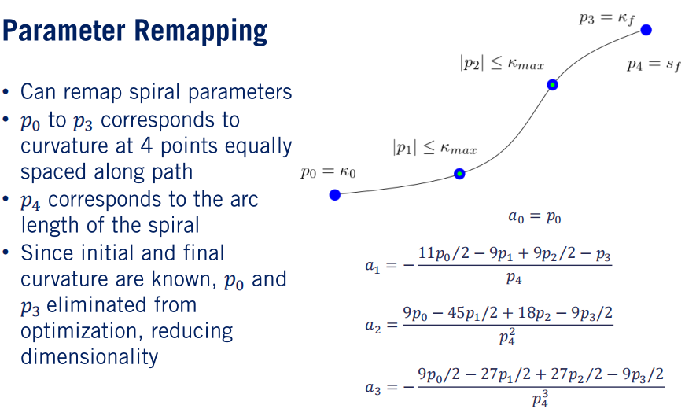

Once the optimization is solved, we can use the equations here to map the results back to the spiral coefficients. Since we already know the initial and final curvature, we can eliminate two of the variables, p naught and p3. This leaves us with only three variables in our optimization problem p1, p2, and p4. By using the boundary conditions, we've reduced the dimensionality of the optimization problem which will result in a significant computational speedup. 

---

### 10. Final Optimization Problem

The resulting final optimization problem is as follows. We've replaced the function of the spiral parameters by the equivalent functions after remapping to our p parameters. Note that the initial and final path curvature p naught and p3 are constants. So the optimization variables are now only p1, p2, and p4. 

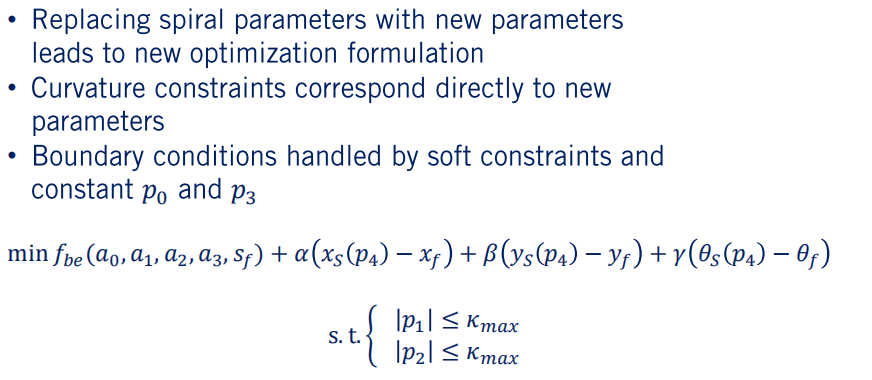

This simplification was possible due to the boundary conditions of the curvature being known at the start and the end of the path. Now that we've made these modifications, we can solve the path planning problem efficiently and with greatly reduced chance of getting stuck in poor local minima. 

---

### 11. Summary

> - Reviewed boundary conditions on state and curvature constraints
> - Introduced Simpson's rule to compute spiral end position
> - Devised optimization problem using bending energy
> - Developed method to re-map parameters to improve optimization convergence speed

Let's summarize what we've learned in this video. First, we reviewed the required boundary conditions and constraints for this problem. We then discussed how to numerically compute the n positions of a spiral using Simpson's rule. We then introduced the bending energy objective to encourage smoothness and formed a generic spiral optimization problem. Finally, we re-map the parameters of the optimization function to ensure fast convergence to a feasible solution. Well, that was a lot of new information to take in. We hope that this lesson has given you an in-depth look at how to perform smooth path planning. This lesson has tied together many of the topics that we discussed in modules one and four. So if you felt like some of this material was challenging, feel free to review those modules before working through this lesson again. In our next lesson, we will be discussing how to perform optimization in Python in order to prepare you to implement a full path planner. See you next time.

---

## Lesson 3: Optimization in Python

### Learning Objectives

> - Know how to setup and solve a constrained optimization problem using SciPy
> - Know how to pass user-defined Jacobians to the optimizer
> - Know how to add parameter bounds according to the problem constraints

Hello everyone. In this lesson, we're going to go over the basics of optimization in Python to help cement some of the optimization concepts we've discussed in the previous lessons of this module, and in fact, throughout this specialization. In particular, we're going to go through some of the functions required to solve a generic non-linear optimization problem using the SciPy optimize library. By the end of this video, you should know how to set up and call a constrained optimization problem using this library. In particular, you should know how to pass Jacobians to the optimizer, as well as any required parameter bounds defined in the optimization problem. So let's get started. 

---

### 1. Minimize Function

The field of optimization is a wonderfully rich area of study which we cannot explore in detail in this specialization. The SciPy optimized library covers a handful of some of the most popular optimization algorithms making them easily accessible and ensuring reasonable efficiency in their implementation. Many of the implemented optimization methods have a similar structure in terms of what type of parameters they require. So to abstract this away into a simple interface, the SciPy optimized library contains a generic minimize function. 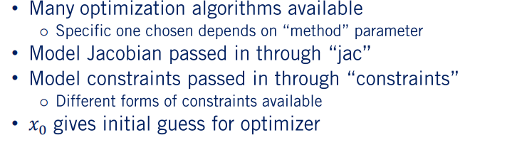

Some examples of the available optimization methods include `conjugate gradient`, `Nelder-Mead`, `dogleg`, and `BFGS`. For more details on these methods, see the links in the supplemental materials. The specific optimization algorithm run by the library will depend on the method parameter that you pass to this function. The method parameter will also determine which additional parameters the optimization algorithm requires. For example, in the `L-BFGS-B` algorithm that we'll use, we require not only the model to minimize, but also the models Jacobian and variable bounds. 

```python
result = sp.minimize(objective_function, x_0, method='L-BFGS-B',
					 jac=objective_jacobian, bounds=bounds,
					 options={'disp' : True})
```

In the case where the model is a single scalar valued function, the Jacobian reduces to the gradient. This Jacobian is passed to the minimize function through the jac parameter as shown in this function call. The actual function we wish to minimize is the first argument to the minimize function. The constraints are passed to the constraints variable as a list of constraint dictionaries or objects. In addition, there is also the optional options parameter which advanced users can use to customize things like what is output by the optimizer. **These optimization algorithms also require an initial guess for the optimization variables for the model or objective function, and this is given by x naught in the function call.** Let's look at the `BFGS `algorithm for a concrete example of how to implement an optimization with `SciPy`. 

---

### 2. Objective Function and Jacobian

Essentially for the `BFGS` algorithm, we are required to pass in the function pointer to the actual objective function we wish to minimize as well as a function pointer to a function that evaluates the Jacobian of the objective function. 

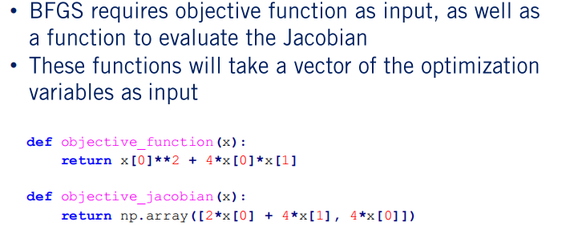

These functions will take in a vector of all of the optimization variables in order to evaluate the objective function and the Jacobian at a specific point. 

---

### 3. Result

Once the optimization is complete, the minimize function will return a result variable. The member variable of the results denoted by x will return the final vector of optimization variables where the local minima has been achieved. 

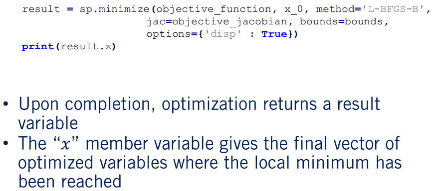

---

### 4. Bounds

As we mentioned earlier, we can also specify constraints for our optimization problems. For most algorithms, these constraints are given in the form of lists or dictionaries. The simplest type of constraints are inequality constraints on the objective variables called bounds. 

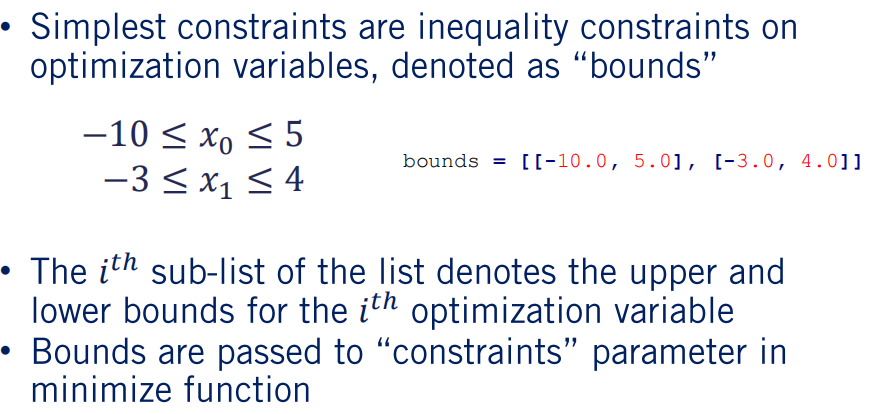

Bounds are specified by the `L-BFGS-B` algorithm as a list of lists, where each sub-list is of length two and contains the upper and lower bound for each optimization variable. In other words, the first sub-list corresponds to the bounds for x0, and the second sub-list for x1 etc. These bounds are then passed to the constraints optional parameter of the minimize function. 

---

### 5. Other Constraints

Linear and non-linear constraints can also be passed to the optimizer, but for now we will focus on using bounds for optimization constraints. 

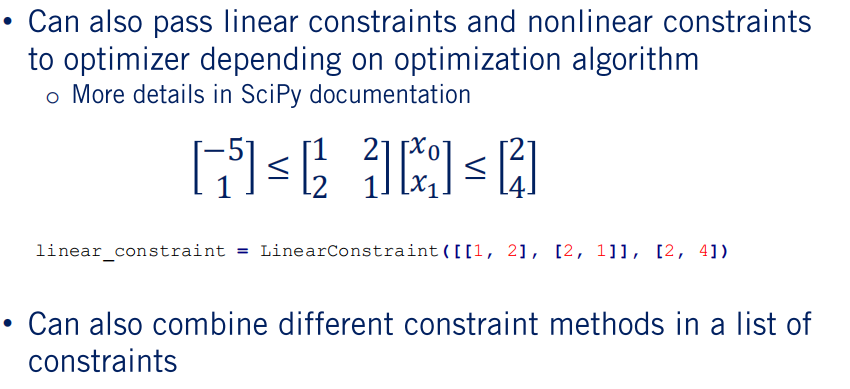

For more details, you can take a look at the SciPy optimization documentation online. You can also combine multiple types of constraints by passing in a Python list of each constraint object that you would like to use in the optimizer function. 

```python
#nlopt
import scipy.optimize as sp
import numpy as np

bounds = [[-10.0, 5.0], [-3.0, 4.0]]
x_0 = [1.0, 1.0]

linear_constraint = LinearConstraint([[1, 2],
[2, 1]], [2, 4])

def objective_function(x):
	return x[0]**2 + 4*x[0]*x[1]

def objective_jacobian(x):
	return np.array([2*x[0] + 4*x[1], 4*x[0]])

result = sp.minimize(objective_function, 
                     x_0,
					 method='L-BFGS-B', 
                     jac=objective_jacobian,
					 bounds=bounds, 
                     options={'disp' : True}
                     )

print(result.x)


Solution:
>>> [-8. 4.]
```

---

### 6. Summary

> - Introduced how to set up an optimization problem(`L-BFGS`) using `SciPy`
> - Showed how to pass Jacobians and parameter bounds to the library's optimizer

To summarize, in this video we introduced how to set up an optimization problem using the `SciPy` optimization library. In particular, we discussed how to pass in user-defined objective functions in Jacobian's as well as parameter bounds to the optimizer. You should now have a good idea of how to solve general optimization problems using a Python library. For more information, you can consult the `SciPy` optimization library documentation. After this lesson, we have a programming assignment to give you a chance to practice the concepts we've discussed here and to prepare you for the end of module project.

---

## Lesson 4: Conformal Lattice Planning

### Learning Objectives

> - Be able to implement a conformal lattice planner
> - Sample points along road and plan spiral paths to them
> - Perform collision checking on paths, select best path according to objective(following road centerline)

Hi everyone. In this lesson, we'll use the optimization techniques we've developed in the previous lessons, to derive a full-fledged path planner known as the conformal lattice planner. By the end of this video, you should be able to implement a conformal lattice planner, to solve our path planning problem. You should understand how to sample points along the road, and how to plan paths to each point using the optimization formulation we developed in lesson two. You should also be able to determine if paths are collision free, and select the path that best tracks the road we need to follow. Let's get started. 

---

### 1. Conformal Lattice

As an introduction, let's go over the high level objective and structure of the conformal lattice planner. As with all path planners, the goal is to plan a feasible collision-free path from the autonomous cars current position, to a given goal state. **The conformal lattice planner exploits the structured nature of roads, to speed up the planning process while avoiding obstacles.** By focusing on only those smooth path options that swerve slightly to the left or right of the goal path, the conformal lattice planner produces plans that closely resemble human driving. When planning paths over roadways, a car should typically never consider leaving the road, unless there is an emergency stop scenario. 

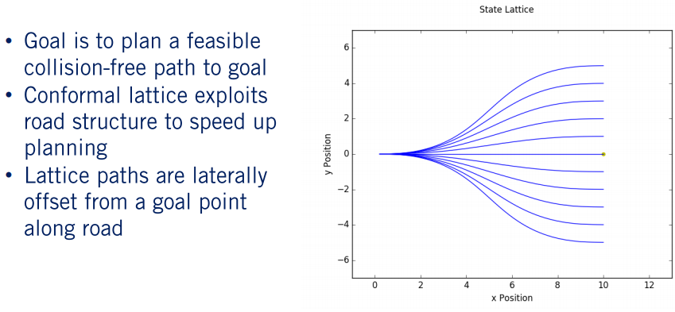

Because of this, the conformal lattice planner chooses a central goal state as well as a sequence of alternate goal states, that are formed by laterally offsetting from the central goal state, with respect to the heading of the road. This is illustrated here in this example of a conformal lattice. Where the end point of each path is laterally offset from the central path, which corresponds to a goal point on the road. This goal point is highlighted in gold. We can do this because in general, the car is supposed to make forward progress along the ego lane. We don't care as much about a path that wouldn't result in forward progress, so we can greatly reduce our search space keeping the conformal lattice planner computationally tractable. 

---

### 2. Goal Horizon

So how do we select this goal state? In general, there's a key trade off when selecting your goal state for path planning. If you choose a goal state that is close to the current ego vehicle position, you reduce the computational time required to find a path to the goal point. However, you also reduce the ability of the planner to avoid obstacles farther down a path, in a smooth and comfortable manner. This can be problematic at higher speeds where the car will cover more distance in between planning cycles. Usually, the goal horizon that we use in our plan is dynamically calculated, based upon factors such as the car speed and the weather conditions. 

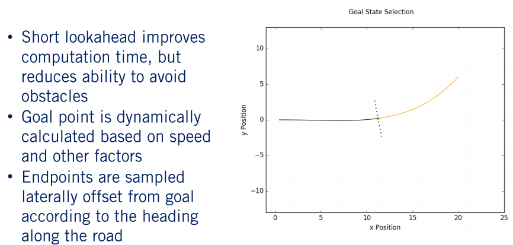

For simplicity in this module however, we will use a fixed goal horizon. We will take the goal point as the point along the center line of the lane, that is a distance ahead of us equal to our goal horizon. This is illustrated here along this path with the gold point corresponding to the selected goal location. The blue points correspond to the laterally offset goal points, which will be used as alternate endpoint constraints for each spiral in the lattice. The black portion of the lane central line has arc length equal to our selected goal horizon. At each planning step, we will recompute our goal point based on this same horizon, and we will make forward progress along the lane. 

---

### 3. Generating Spirals & Getting Spiral Parameters

Once these goals states have been found, we can then calculate the spirals required to reach each one of them. **At this point, we don't worry about whether the paths are collision free, we just want kinematically feasible paths to each of our goal states**. We can therefore use the optimization formulation we developed in lesson two, to solve for a cubic spiral, from our current location, to each end location. If any of the spirals are kinematically infeasible or are unable to reach the required goal state, we discard those spiral so that they are no longer considered as potential paths. 

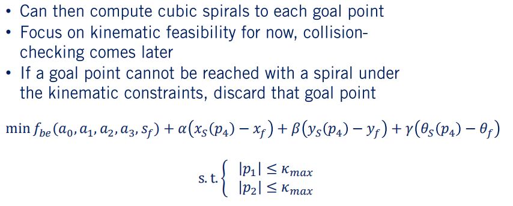

Note that once an optimization problem is solved, we only have the resulting parameter vector p. We then have to undo the transformation we initially performed on the spiral coefficients, in order to retrieve them from the p vector. Once we have our spiral coefficients, we can then sample the points along the spiral to get a discrete representation of the entire path. 

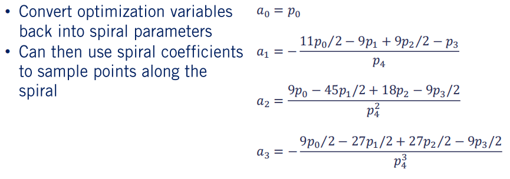

---

### 4. Trapezoidal Rule Integration

Since we don't have a closed form solution of the position along the spiral, we again need to perform numerical integration. However, since this time, we are evaluating the integral and numerous points along the entire spiral, a more efficient method is needed to solve these integrals. Here we apply a linear interpolation approach. The trapezoid rule. **The trapezoid rule is significantly more efficient than Simpson's rule in this context, because each subsequent point along the curve, can be constructed from the previous one.** So we only have to do one sweep through the spiral to get all of the required points. Simpson's rule, on the other hand, would require us to solve an integral approximation for each point, which is much less efficient. 

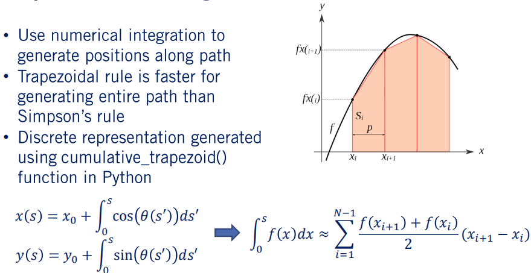

In Python, we can do this by using the cumulative trapezoid function. Once the trapezoid rule is applied, we now have a discrete representation of each spiral for each goal point. It will be important that we keep track of the curvature of each point along with the position and heading, as this will help us with our velocity profile planning later on. We have closed form solutions for the curvature and heading, so no numerical integration is required. 

---

### 5. Generated Path Set & Collision Checking

After using the trapezoid rule, we now have our generated set of paths for each goal states shown here. Now that we have a full set of paths, we need to see which ones are collision free. 

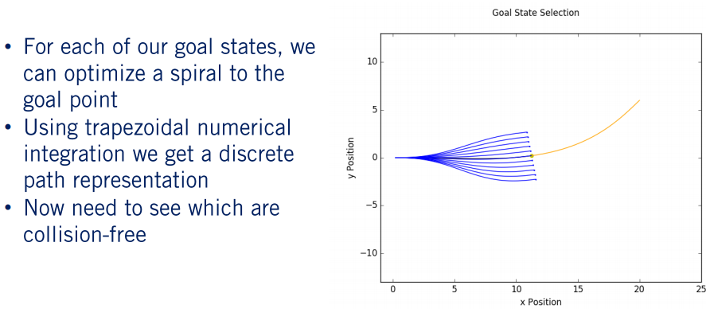

To do this, we can use either of the collision checking techniques we discussed in module four. Most generally, we can use a binary occupancy grid that contains one if a cell is occupied, and zero otherwise. We can then take our cars footprint in terms of the cells of the occupancy grid, and sweep the footprint out across each point in the spiral to generate the swath of the path. If the occupancy grid at a cell in the swath contains an obstacle, the path in question will collide with the obstacle, and should be marked as having a collision. If this never occurs for any of the cells in the swath along the entire path, the path is considered collision-free. Alternatively, we can use circle checks if both the ego vehicle and each obstacle in the ego lane, can be enclosed in a circle approximation. 

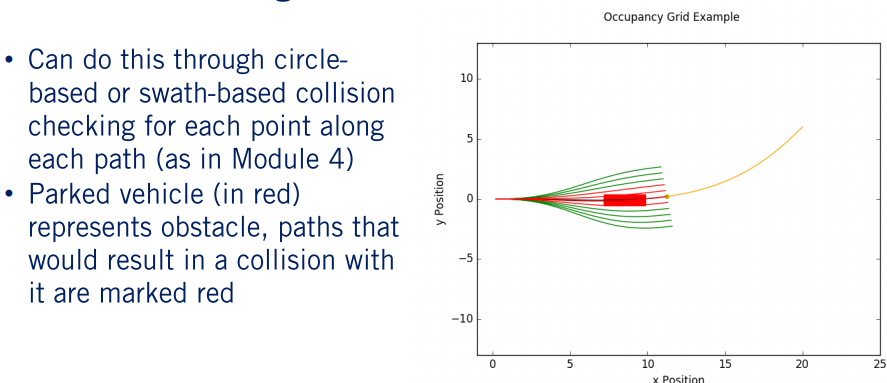

Then we place the circles for the ego vehicle at each point along the path, and check for collisions with each obstacle that falls within the ego lane. To illustrate the results of collision checking, we've added a parked vehicle to our path that we now need to plan around. After sweeping the swath out across each spiral, similar to how we did it in module four, we have marked the collision-free paths as green, and the paths that collide with the obstacles as red. 

---

### 6. Path Selection

At this point, we have a set of feasible and collision-free paths, but we need a method of selecting the best one to follow. The selection process is largely a design choice. As there may be multiple criteria that are useful for a given planning application. For example, we may want to choose paths that are as far from obstacles as possible. So we may add a penalty term for paths that come too close to obstacles, in the occupancy grid. We may also want to penalize terms that deviate too far from the nearest lane center line, as we do not want to split lanes for too long while performing a lane change. For now, we're going to use a simple metric where we bias the planner to select paths from the path set, that are as close to the center goal state as possible. 

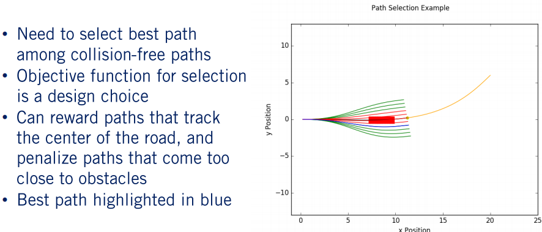

The actual penalty function doesn't matter as long as the penalty increases, the farther you get from the central goal. By biasing toward the center path, we are encouraging our planner to follow the reference path, and only letting it deviate from the reference when the reference path is infeasible, or if it collides with an obstacle. For simplicity, we can take this function to be the displacement from the center goal state to the goal state of the path we are checking. We can then iterate over every path in the path set, find the one that minimizes this penalty and select it to publish as our final path. In our example, the selected path is highlighted in blue. 

---

### 7. Full Path

If we now repeat this process for multiple time steps as the car moves along the path, our planner is able to plan a path that converges to the goal state, while also avoiding the obstacles. 

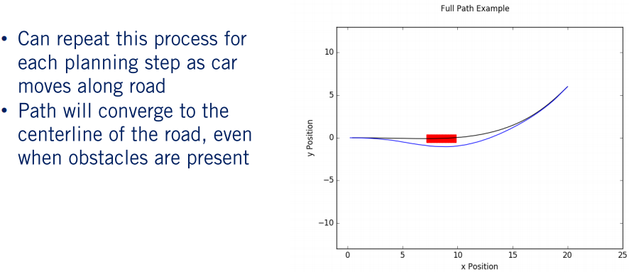

Similar to the reactive planner we developed in module four, this planner proceeds in a receding horizon fashion towards the goal at the end of the lane. We now have all the pieces necessary to form smooth, collision-free paths through the environment, that favor forward progress in the lane. 

---

### 8. Summary

> - Discussed how to select goal points along road
> - Discussed how to use spiral optimization to generate path set
> - Showed collision checking and path selection example

To summarize in this video, we first define the conformal state lattice planner approach, which selects points laterally offset from some goal point ahead of us along the road. We then planned paths to each of these points using our spiral optimization methods, developed in lesson two. Next, we discussed how to prune this set of paths to be collision-free,and how to select the best remaining path. Finally, we integrated a receding horizon approach to complete our path planner. Now that you've had an overview of the entire path planning algorithm, we hope that you're able to see how many of the lessons in this course have culminated, in a method that efficiently solves the path planning problem. In our next video, we'll discuss how to take an input path as calculated by our path planner, and generate a velocity profile for the car to follow, as it moves along the path. We'll then have a complete set of reference signals to pass to our controller to execute, completing all three stages of the hierarchical motion planning process.

---

## Lesson 5: Velocity Profile Generation

### Learning Objectives

> - Know how to use leading vehicle time-to-collision(TTC) to inform velocity profile generation
> - Know how to use reference velocities from behavioral planner in velocity profile generation
> - Integrate comfort constraints into velocity profile generation
> - Know how to implement a linear ramp and trapezoidal velocity profile

Hi everyone and welcome to our final video of the seventh module on motion planning for self-driving cars. In this lesson, we'll be introducing a method to generate a velocity profile for a given input path generated by our path planning algorithm. If you recall from Module one, there are many different factors that affect velocity profile generation. In particular, we will focus on the reference velocity provided by the behavior planner, the velocity of dynamic obstacles in front of us, and the velocity required to maintain passenger comfort and vehicle stability. By the end of this video, you should be able to construct velocity profiles along plan paths that take into account reference velocities from different behavior planning situations, time to collision to a leading dynamic obstacle, and comfort constraints. Finally, you should be able to implement a linear ramp velocity profile as well as a trapezoidal velocity profile. So let's get started. 

---

### 1. Behavioural Planner Reference Velocity

The first step in generating a velocity profile is determining our final required velocity. A good initial value for our final velocity is the reference velocity given to us by the behavior planner. This reference velocity will largely be influenced by the maneuver that the behavior plan selected based on the current driving scenario. 

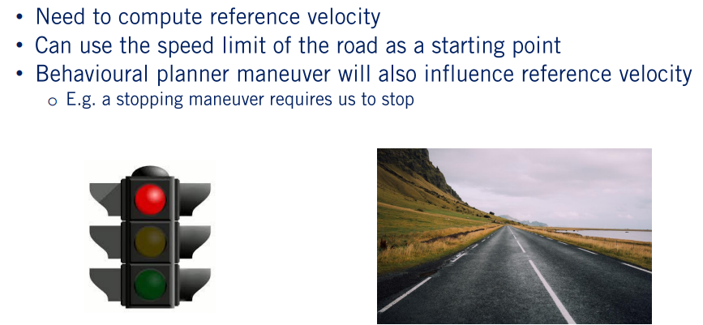

For example, if we are stopped at an intersection and the light is still red, the behavior planner will issue a stopped maneuver to the local planner which will include outputting a zero velocity reference. If we're currently driving straight along a given road, the reference velocity may just be the speed limit of that current road. We will denote this by V ref going forward. 

---

### 2. Dynamic Obstacles

The next input we take into consideration are the dynamic obstacle states. In particular, we focus on the lead vehicle in front of us. The lead vehicle speed regulates our speed, because if we exceed the lead vehicle speed, we will eventually collide with it. Recall that the time to collision is a function of our relative velocity to the lead vehicle as well as the length of the path to the lead vehicle given by s. Therefore, to preserve a safe time to collision, we will take our reference velocity to be the minimum of the lead vehicle speed and the behavior plan or reference speed. In addition, we need to make sure that we are below the lead vehicle speed before we reach their current location for this planning iteration because otherwise, we are still at risk for colliding with them. In general, when dealing with dynamic obstacles, it is good to leave space and time buffers in our calculations for safety. 

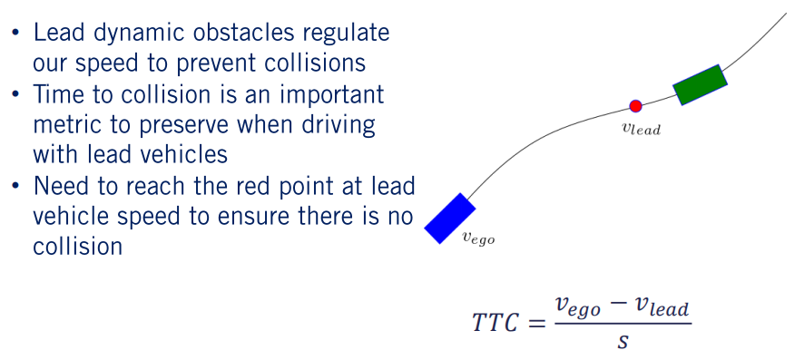

Therefore, if the end of our path lies ahead of the current position of the lead vehicle, we need to make sure that our final velocity is reached before that point including leaving a spatial buffer, as shown here by the red point along the path. By the time we reach the red point in our velocity profile, we will need to have reached the lead vehicle speed, if it is moving slower than us. The lead vehicle will move ahead by the time we reach the current position. At that point, we will have reached its speed preventing us from colliding with it. Note that we can also take lead vehicle tracking one step further and directly ensure a safe time to collision or separation distance given a lead vehicle speed, but this changes the control function to a relative distance tracking from a relative velocity tracking, so we'll stick to the velocity based approach in this video. 

---

### 3. Curvature and Lateral Acceleration

The final input we consider is the maximum curvature along our planned path. Recall from our last lesson that when we sampled the optimized path, we record the curvature of the spiral at each point denoted by capital I. In addition, we mentioned in Module one, that there is a maximum lateral acceleration required to remain inside the comfort rectangle. The lateral acceleration as a function of the instantaneous curvature as well as the longitudinal speed along the curve. Therefore, the curvature bounds the longitudinal velocity that we can take while traversing our path. We can enforce this by ensuring the velocity stays below the required limit at each point on the path. However, if the curvature changes rapidly, we may not be able to achieve the required velocity while remaining within our longitudinal acceleration bounds. We therefore also find the maximum curvature across all points in our path and then find the associated maximum speed for that point. 

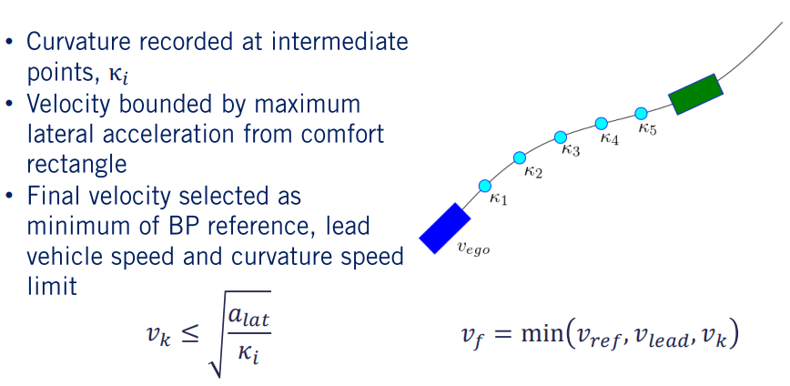

Our profile must then reach this required speed by the point in the path. We therefore define a deceleration to the required speed at the minimum point and an acceleration afterward. We can repeat this process for the next largest violation of the curvature constraint and so on until the velocity profile satisfies the curvature constraints along its length. A simpler approach that is useful for the assessments in this course is to identify the maximum curvature point, set the associated speed, and then simply maintain that speed until we pass the point. Since we are continuously re-planning in a receding horizon manner, once the high curvature point is reached, the new velocity profiles generated will naturally raise the speed based on the other objectives defined earlier. In essence, we can simplify the velocity profile generation process to the act of combining our curvature-based maximum speed with our previous two maximum speeds from the behavior planner and the lead vehicle by taking the minimum of all three as the desired final velocity of our profile. 

---

### 4. Linear Ramp Profile

Next, we need to discuss what the shape of our velocity profile is going to be. One possible simple option is to generate a linear ramp profile from our current velocity to our desired final velocity that we calculated earlier. When planning our profile, we know the total arc length of our path, denoted s, and our initial and final speed. 

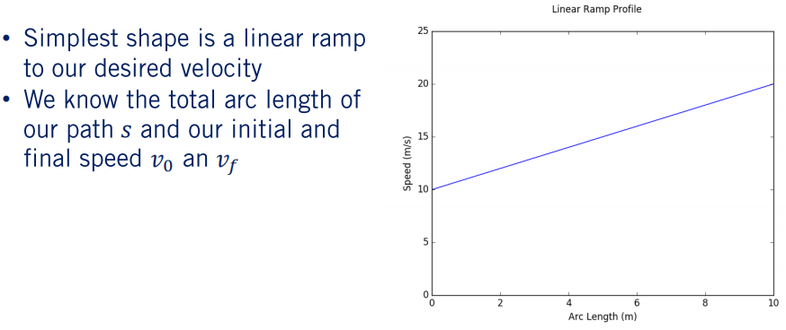

---

### 5. Linear Ramp - Acceleration Calculation

The first thing we need to calculate is our required acceleration, which we can solve for directly with our given inputs. We have to be careful to ensure that this calculated acceleration doesn't exceed our comfort rectangle as we discussed earlier in the course. If it does exceed the comfort rectangle, then we will need to clamp it. 

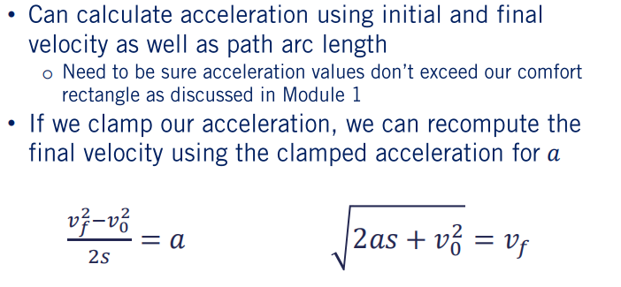

If an acceleration or deceleration is required that exceeds the comfort rectangle but is required due to safety concerns, such as during an emergency stop maneuver, then we can bypass this comfort rectangle to prevent a crash. If we do clamp our acceleration, then we need to update our final velocity accordingly using our maximum acceleration, a max, instead of our calculated acceleration, a. 

---

### 6. Linear Ramp - Velocity Calculation

Once we have our acceleration profile, we can then calculate the velocity at each point along the path by looking at the arc length to the ith point. By iterating through the entire path and calculating the required velocity for each point, we have completely generated a velocity profile along our path to get to our desired end velocity. An alternative profile is the trapezoidal profile. 

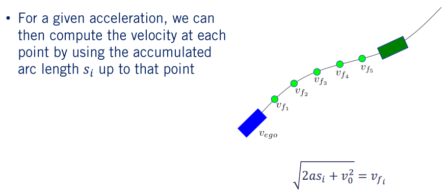

---

### 7. Trapezoidal Profile

It's useful when a car is approaching a stop sign, and we want to decelerate from our nominal speed to a lower transit speed before then decelerating again to a stop at the stop sign. For this velocity profile, we take as our input, our initial, and final velocities, our desired transit velocity, and our desired deceleration. This deceleration is usually chosen to be well within our comfort rectangle to make the profile as smooth as possible. 

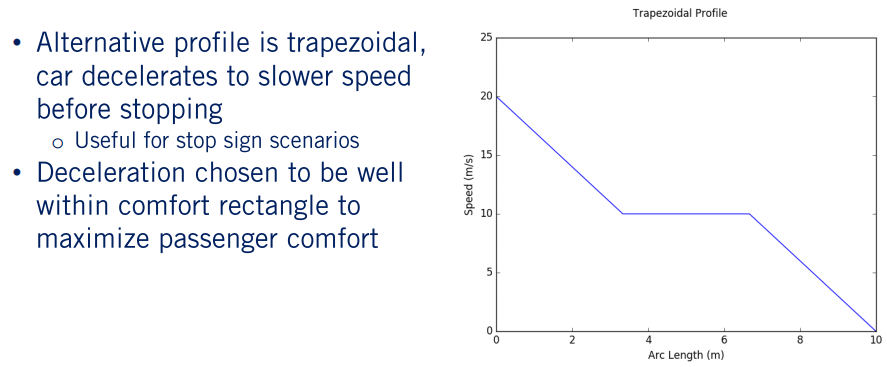

#### First Segment

The first step with this planner is to calculate the distance we will travel during our initial deceleration to our desired transit speed. This is the arc length traveled during the first segment of the trapezoidal profile and is given by the first equation here for $S_a$. From this, we know how much arc length along our initial path should be dedicated to our initial deceleration. The parameters for this initial calculation include our initial speed, $v_i$, the transit speed, $v_t$, and our gentle deceleration value, a naught. Once we have this arc length value, we can iterate through the points up to that arc length and use the second equation shown to calculate the required speed for the ith point. 

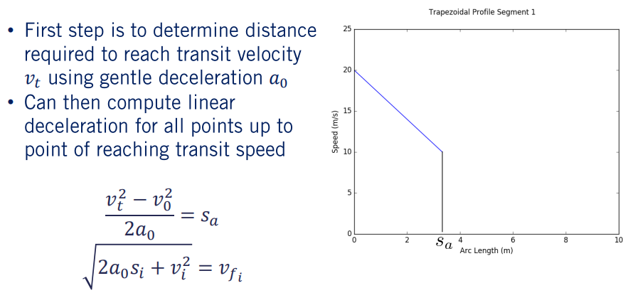

#### Third Segment

We can then repeat a similar process for the final deceleration from the transit velocity to rest at our stopped point. We will denote the entire arc length of our path as $S_f$. So the third segment of our profile has length $S_f$ minus $S_b$. We can then solve for $S_b$ as follows. Once we have Sb, we can then iterate through the points in this arc length range and assign them the required velocities for a gentle deceleration to a stop. The remaining points in the middle of the profile then take our constant transit speed, v sub t. 

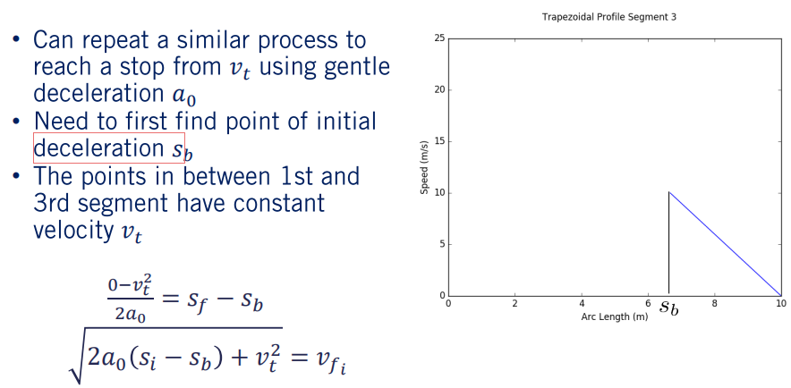

#### All Segments

Putting everything together, we have three regions in our velocity profile; an initial ramp down to our slow transit speed, a constant traversal at this transit speed, and a final ramp down to our stop point. We've shown you two methods here for generating a velocity profile, but there are many other options available as well. Using higher-order methods such as` biquadratic` velocity planners, we can minimize jerk along the trajectory as well. It's also possible to apply higher-order functions in our velocity ramp in the two methods we've shown here, which can generate smoother and more comfortable velocity profiles. 

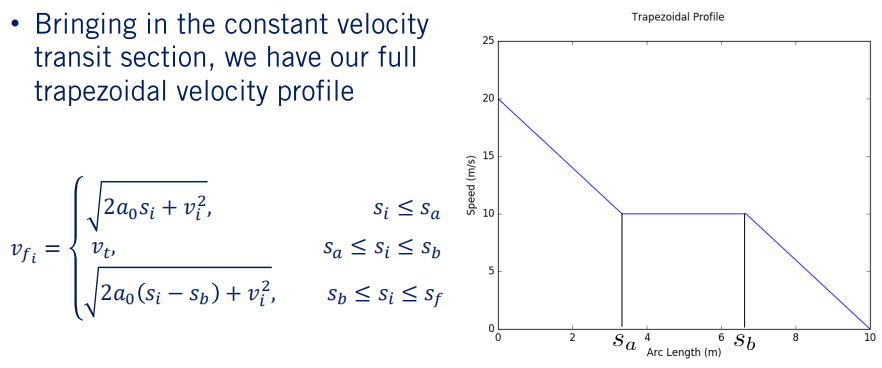

Ultimately, velocity profiles can be optimized to meet multiple objectives simultaneously while satisfying comfort and safety constraints depending on the behavior to be executed. In developing a velocity profile generator for the final assessment, you should feel free to expand on any of the concepts discussed in this video, as seems appropriate. 

---

### 8. Summary

> - Discussed how to incorporate behavioral planner reference velocity into velocity generation
> - Discussed how to use `TTC` to inform velocity profile generation
> - Integrated lateral acceleration constraints into velocity profile generation
> - Showed how to calculate linear and trapezoidal ramp velocity profiles

To summarize, in this video, we discussed how to incorporate the output reference velocity from our behavior planner into our velocity profile generation process. We also discussed how to use the time to collision to inform our velocity profile generation, and we incorporated lateral acceleration constraints as well. Finally, we discussed how to calculate linear ramp and trapezoidal velocity profiles to implement velocity transitions along a path. This completes the seventh module on motion planning. 

Let's summarize the main points. You first learn to work with two kinds of curves for path planning; splines and spirals. You then define the objectives and constraints needed to formulate the path planning problem. You developed experience with the psi pi optimize function and applied it to a conformal lattice planner to identify collision-free paths. Finally, you learned how to construct the velocity profile along the path to satisfy multiple constraints. You should now have enough knowledge to integrate a path planner and velocity profile planner to build your very own local planner from the ground up. You'll learn more about this in the final project in the next module. We'll see you there.

- A. Kelly and B. Nagy, “[Reactive Nonholonomic Trajectory Generation via Parametric Optimal Control,](https://journals.sagepub.com/doi/abs/10.1177/02783649030227008?casa_token=1eJaU-j-rQMAAAAA%3AkOxyZCACePcPX12nrkI9ytr-xQC0KY9nZ_TZ4m7ClMuSbHmpA8TOnlmNMDQVxa7-K_9bEtOFm820&)” The International Journal of Robotics Research, vol. 22, no. 7, pp. 583–601, 2003. This paper discusses the math behind generating spirals to desired terminal states.
- A. Piazzi and C. G. L. Bianco, “[Quintic G/sup 2/-splines for trajectory planning of autonomous vehicles](https://ieeexplore.ieee.org/abstract/document/898341),” Proceedings of the IEEE Intelligent Vehicles Symposium 2000 (Cat. No.00TH8511). This paper discusses the math behind generating quintic splines to desired terminal states.
- M. Mcnaughton, C. Urmson, J. M. Dolan, and J.-W. Lee, “[Motion planning for autonomous driving with a conformal spatiotemporal lattice](https://ieeexplore.ieee.org/abstract/document/5980223),” 2011 IEEE International Conference on Robotics and Automation, 2011. This paper introduces the concepts behind generating a conformal spatiotemporal lattice for on-road motion planning.

---

## Final Project Overview

### 1. Project Goals

> - Use spiral optimization to generate paths (most of the math is implemented for to you)
>   - Avoid static obstacles
> - Generate velocity profiles that avoid dynamic obstacles
> - Develop a state machine for behavioral planning

Congratulations. You've almost completed this specialization on self-driving cars. Now it's time to take everything you've learned in the fourth course on planning and apply it in a real-world project. In this project we'll be tying together many of the concepts we've discussed throughout this course to create a fully functional motion planner for an autonomous car. By doing this, you will have created a complete motion planner that is able to handle real-world scenarios that are consistently encountered by autonomous vehicles every day. In particular, by the end of this project you should be able to use the polynomial spiral optimization formulation we've covered in Module seven lectures to generate paths for an autonomous car. 

From these paths, you should be able to perform static obstacle avoidance using a circle-based collision checking method we developed in Module four. From a feasible collision-free path you should then be able to generate a velocity profile that takes a leading dynamic obstacles into consideration. Finally, you should be able to implement a state machine behavioral planner that can handle a stop sign scenario using the concepts discussed in Module six. 

---

### 2. Objective

> - Write a planner in Python to navigate the given scenario
>
> - Interface with the CARLA simulator
> - Build upon controller from Course 1 (given to you)
> - Assuming perfect information to simplify planning

The main objective of this project is to integrate the knowledge that we've discussed throughout the modules of this course to create a full motion planner for an autonomous vehicle. To do this, you will be writing Python code to interact with the CARLA simulator, and which we've prepared a scenario that you must navigate. We will be reusing the controller developed in course one for our autonomous vehicle, so we can focus solely on the planning aspects for the car. We will also be assuming that all relevant knowledge of our surroundings is available to us as the car traverses the scenario. This means we will not be integrating the sensing and image processing methods developed in course two on state estimation and localization, and in course three on visual perception. 

---

### 3. High Level Challenge

In this project, you will be following a set of way-points in a given road network until you reach a goal. There are three main challenges in this scenario that you will face before reaching the goal. 

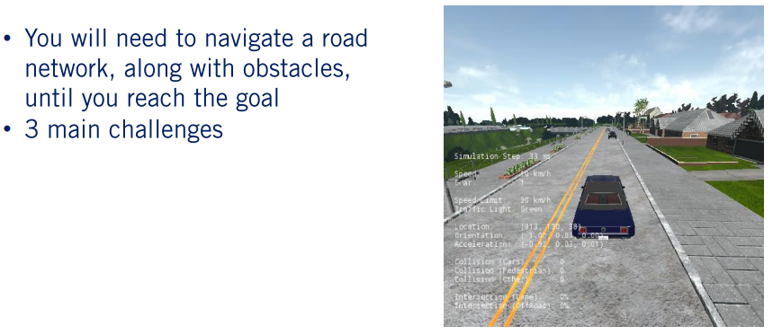

The first will be a static parked obstacle that will be blocking your current lane. You'll be given discrete samples of the footprint of the obstacle, and you will need to use circles to approximate the footprint of the ego vehicle along each plan path in order to quickly compute whether or not the path is in collision with the obstacle. By removing the paths in collision with this obstacle from our planning process, you will be able to avoid the obstacle entirely. 

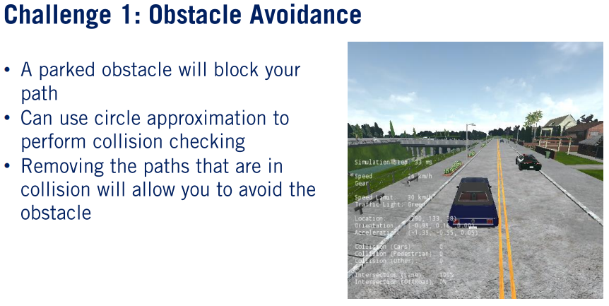

Next, you will encounter a lead vehicle. This vehicle will be moving below the speed limit, and as such you will have to regulate your velocity profile accordingly to prevent a collision. 

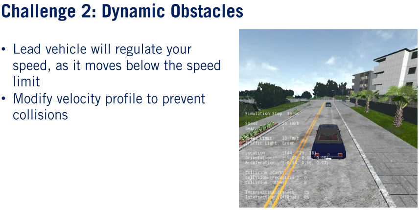

Finally, you will reach a stop-sign controlled intersection. You will need to develop a state machine that can handle the stop sign, which means it must have the ability to decelerate to a stop, briefly weight once stopped, and then proceed through the intersection. 

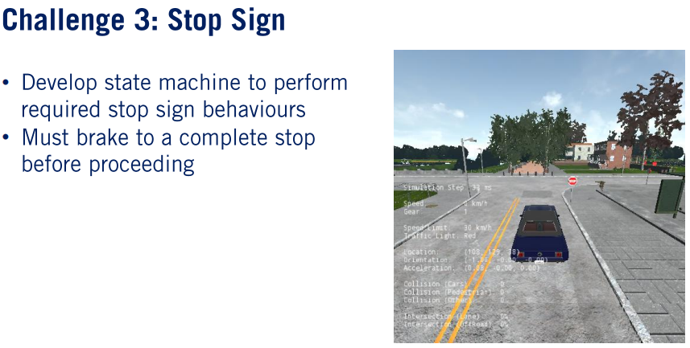

---

### 4. Scenario Completion

> - After completing the final turn from the stop sign,the simulation is complete
> - Try to think of other scenarios to handle based on the content in Course 1 and 4
> - Further detailed instructions available with the Programming Assignment

Once this is complete, you will have fully progressed through our simulation scenario, and you will have constructed emotion planner that can handle many of the challenges that are present in autonomous driving. Your vehicle will be operating in one of CARLA tests environments, so don't hesitate to build out your planning solution to handle vehicles at other intersections, or to navigate from a start to a goal location, or even to pass a lead vehicle if the roadway is clear ahead. There are many more scenarios that you can consider based on what you've learned in this course, and we encourage you to explore as many of the concepts from this specialization as you wish. If you have any questions that I didn't answer in this video, there are further instructions in the programming assignment itself, and you can always ask in the discussion forums as well. I hope you have fun with this final project. I'll see you again once it's completed to close out the course and the overall specialization. Best of luck on this final project of this specialization.